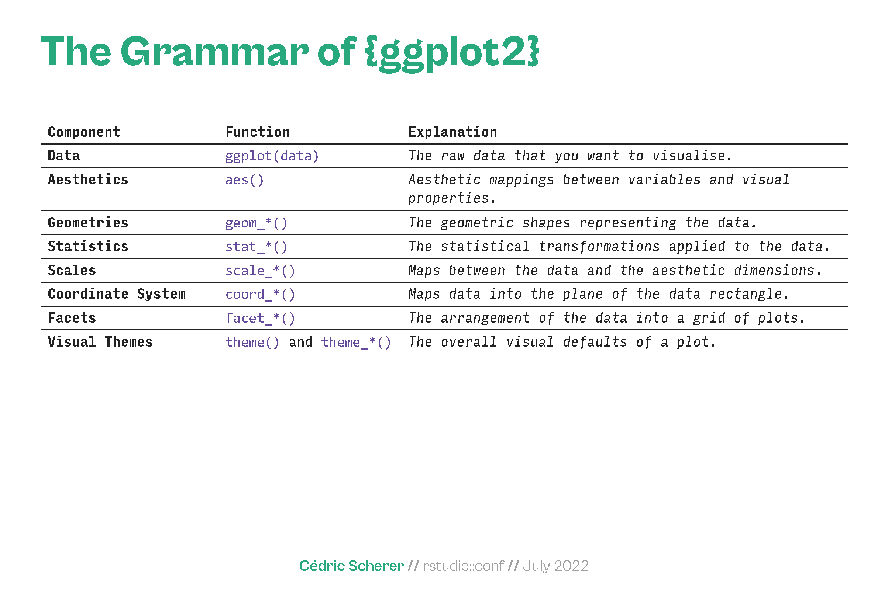

```{r, include=FALSE}
## By default, show code for all chunks in the knitted document,
## as well as the output. To override for a particular chunk
## use echo = FALSE in its options.
knitr::opts_chunk$set(
   echo=TRUE, message=FALSE, warning=FALSE
)
```

```{r, echo=FALSE}
# CONFIG
user_name <- "fernandomillanvillalobos" # your Git username (only needed if
# you want to deploy to GH pages)
project_name <- "r-data-visualization" # adapt!
package_date <- "2022-06-01" # date of the CRAN snapshot that
# the checkpoint package uses
r_version <- "4.2.0" # R-Version to use
options(Ncpus = 4) # use 4 cores for parallelized installation of packages
if (r_version != paste0(version$major, ".", version$minor)) {
  stop("ERROR: specified R version does not match currently used.")
}
```

# Notes

This report was generated on `r Sys.time()`. R version: `r paste0(version$major, ".", version$minor)` on `r version$platform`. For this report, CRAN packages as of `r package_date` were used.

...

## R-Script & data

The preprocessing and analysis of the data was conducted in the [R project for statistical computing](https://www.r-project.org/). The RMarkdown script used to generate this document and all the resulting data can be downloaded [under this link](http://`r user_name`.github.io/`r project_name`/). Through executing `main.Rmd`, the herein described process can be reproduced and this document can be generated. In the course of this, data from the folder `input` will be processed and results will be written to `output`. The html on-line version of the analysis can be accessed through this [link](https://`r user_name`.github.io/`r project_name`/). 

## GitHub

The code for the herein described process can also be freely downloaded from [https://github.com/`r user_name`/`r project_name`](https://github.com/`r user_name`/`r project_name`). 

## License

...

## Data description of output files

#### `abc.csv` (Example)

| Attribute | Type | Description |
|-------|------|-----------------------------------------------------------------------------|
| a | Numeric | ... |
| b | Numeric | ... |
| c | Numeric |  ... |

#### `xyz.csv` 

...

# Set up

```{r, echo=FALSE}
detach_all_packages <- function() {
  basic_packages_blank <-  c("stats",
                             "graphics",
                             "grDevices",
                             "utils",
                             "datasets",
                             "methods",
                             "base")
  basic_packages <- paste("package:", basic_packages_blank, sep = "")

  package_list <- search()[
    ifelse(unlist(gregexpr("package:", search())) == 1, TRUE, FALSE)]

  package_list <- setdiff(package_list, basic_packages)

  if (length(package_list) > 0)  for (package in package_list) {
    detach(package, character.only = TRUE, unload = TRUE)
    print(paste("package ", package, " detached", sep = ""))
  }
}

detach_all_packages()

# this allows multiple persons to use the same RMarkdown
# without adjusting the working directory by themselves all the time
source("scripts/csf.R")
path_to_wd <- csf() # if this - for some reason - does not work,
# replace with a hardcoded path, like so: "~/projects/rddj-template/analysis/"
if (is.null(path_to_wd) | !dir.exists(path_to_wd)) {
  print("WARNING: No working directory specified for current user")
} else {
  setwd(path_to_wd)
}

# suppress scientific notation
options(scipen = 999)

# suppress summarise info
options(dplyr.summarise.inform = FALSE)

# unload global rstudioapi and knitr again to avoid conflicts with checkpoint
# this is only necessary if executed within RStudio
# outside of RStudio, namely in the knit.sh script, this causes RMarkdown
# rendering to fail, thus should not be executed there
if (Sys.getenv("RSTUDIO") == "1") {
  detach_all_packages()
}
```

## Define packages

```{r, echo=TRUE, message=FALSE, warning=FALSE}
# from https://mran.revolutionanalytics.com/web/packages/\
# checkpoint/vignettes/using-checkpoint-with-knitr.html
# if you don't need a package, remove it from here (commenting not sufficient)
# tidyverse: see https://blog.rstudio.org/2016/09/15/tidyverse-1-0-0/
cat("
library(rstudioapi)
library(tidyverse)
library(scales) 
library(lintr)
library(rmarkdown)
library(cowplot)
library(extrafont)
library(sf)
library(ggrepel)
library(gapminder)
library(socviz)
library(RColorBrewer)
library(ggforce)
library(dichromat)
library(ggridges)
library(viridis)
library(palmerpenguins)
library(lubridate)
library(ggthemes)
library(nycflights13)
library(broom) 
library(ggiraph) 
library(hexbin)
library(patchwork)
library(distributional) 
library(psych)
library(ggalluvial)
library(ggdist)
library(ds4psy)
library(unikn)
library(ISLR)
library(MASS)
library(introdataviz)
library(nlme)
library(gganimate)",
file = "manifest.R")
```

## Install packages

```{r, echo=TRUE, message=FALSE, warning=FALSE}
# if checkpoint is not yet installed, install it (for people using this
# system for the first time)
if (!require(checkpoint)) {
  if (!require(devtools)) {
    install.packages("devtools", repos = "http://cran.us.r-project.org")
    require(devtools)
  }
  devtools::install_github("RevolutionAnalytics/checkpoint",
                           ref = "v0.3.2", # could be adapted later,
                           # as of now (beginning of July 2017
                           # this is the current release on CRAN)
                           repos = "http://cran.us.r-project.org")
  require(checkpoint)
}
# nolint start
if (!dir.exists("~/.checkpoint")) {
  dir.create("~/.checkpoint")
}
# nolint end
# install packages for the specified CRAN snapshot date
checkpoint(snapshot_date = package_date,
           project = path_to_wd,
           verbose = T,
           scanForPackages = T,
           use.knitr = F,
           R.version = r_version)
rm(package_date)
```

## Load packages

```{r, echo=TRUE, message=FALSE, warning=FALSE}
source("manifest.R")
unlink("manifest.R")
sessionInfo()
```

## Load additional scripts

```{r, echo=TRUE, message=FALSE, warning=FALSE}
# if you want to outsource logic to other script files, see README for 
# further information
# Load all visualizations functions as separate scripts
knitr::read_chunk("scripts/dviz.supp.R")
source("scripts/dviz.supp.R")
knitr::read_chunk("scripts/themes.R")
source("scripts/themes.R")
knitr::read_chunk("scripts/plot_grid.R")
source("scripts/plot_grid.R")
knitr::read_chunk("scripts/align_legend.R")
source("scripts/align_legend.R")
knitr::read_chunk("scripts/label_log10.R")
source("scripts/label_log10.R")
knitr::read_chunk("scripts/outliers.R")
source("scripts/outliers.R")
```

# ggplot2

## Introduction

ggplot2 is an R package for producing statistical, or data, graphics. Unlike most other graphics packages, ggplot2 has an underlying grammar, based on the Grammar of Graphics, that allows you to compose graphs by combining independent components. This makes ggplot2 powerful. Rather than being limited to sets of pre-defined graphics, you can create novel graphics that are tailored to your specific problem. While the idea of having to learn a grammar may sound overwhelming, ggplot2 is actually easy to learn: there is a simple set of core principles and there are very few special cases. The hard part is that it may take a little time to forget all the preconceptions that you bring over from using other graphics tools.

ggplot2 provides beautiful, hassle-free plots that take care of fiddly details like drawing legends. In fact, its carefully chosen defaults mean that you can produce publication-quality graphics in seconds. However, if you do have special formatting requirements, ggplot2’s comprehensive theming system makes it easy to do what you want. Ultimately, this means that rather than spending your time making your graph look pretty, you can instead focus on creating the graph that best reveals the message in your data.

ggplot2 is designed to work iteratively. You start with a layer that shows the raw data. Then you add layers of annotations and statistical summaries. This allows you to produce graphics using the same structured thinking that you would use to design an analysis. This reduces the distance between the plot in your head and the one on the page.

Learning the grammar will not only help you create graphics that you’re familiar with, but will also help you to create newer, better graphics. Without a grammar, there is no underlying theory, so most graphics packages are just a big collection of special cases. For example, in base R, if you design a new graphic, it’s composed of raw plot elements like lines and points so it’s hard to design new components that combine with existing plots. In ggplot2, the expressions used to create a new graphic are composed of higher-level elements, like representations of the raw data and statistical transformations, that can easily be combined with new datasets and other plots.

### What is the grammar of graphics?

Wilkinson created the grammar of graphics to describe the fundamental features that underlie all statistical graphics. The grammar of graphics is an answer to the question of what is a statistical graphic? ggplot2 builds on Wilkinson’s grammar by focussing on the primacy of layers and adapting it for use in R. In brief, the grammar tells us that a graphic maps the data to the aesthetic attributes (colour, shape, size) of geometric objects (points, lines, bars). The plot may also include statistical transformations of the data and information about the plot’s coordinate system. Facetting can be used to plot for different subsets of the data. The combination of these independent components are what make up a graphic.

All plots are composed of the data, the information you want to visualise, and a mapping, the description of how the data’s variables are mapped to aesthetic attributes. There are five mapping components:

- A __layer__ is a collection of geometric elements and statistical transformations. Geometric elements, geoms for short, represent what you actually see in the plot: points, lines, polygons, etc. Statistical transformations, stats for short, summarise the data: for example, binning and counting observations to create a histogram, or fitting a linear model.

- __Scales__ map values in the data space to values in the aesthetic space. This includes the use of colour, shape or size. Scales also draw the legend and axes, which make it possible to read the original data values from the plot (an inverse mapping).

- A __coord__, or coordinate system, describes how data coordinates are mapped to the plane of the graphic. It also provides axes and gridlines to help read the graph. We normally use the Cartesian coordinate system, but a number of others are available, including polar coordinates and map projections.

- A __facet__ specifies how to break up and display subsets of data as small multiples. This is also known as conditioning or latticing/trellising.

- A __theme__ controls the finer points of display, like the font size and background colour. While the defaults in ggplot2 have been chosen with care, you may need to consult other references to create an attractive plot.

It’s also important to note what the grammar doesn’t do:

- It doesn’t suggest which graphics to use. While this book endeavours to promote a sensible process for producing plots, the focus is on how to produce the plots you want, not on which plot to produce.

- It doesn’t describe interactive graphics, only static ones. There is essentially no difference between displaying ggplot2 graphs on a computer screen and printing them on a piece of paper.

### How does ggplot2 fit in with other R graphics?

There are a number of other graphics systems available in R: base graphics, grid graphics and trellis/lattice graphics. How does ggplot2 differ from them?

- __Base graphics__ were written by Ross Ihaka based on experience implementing the S graphics driver and partly looking at Chambers et al. Base graphics has a pen on paper model: you can only draw on top of the plot, you cannot modify or delete existing content. There is no (user accessible) representation of the graphics, apart from their appearance on the screen. Base graphics includes both tools for drawing primitives and entire plots. Base graphics functions are generally fast, but have limited scope. If you’ve created a single scatterplot, or histogram, or a set of boxplots in the past, you’ve probably used base graphics.

- The development of __“grid” graphics__, a much richer system of graphical primitives, started in 2000. Grid is developed by Paul Murrell, growing out of his PhD work. Grid grobs (graphical objects) can be represented independently of the plot and modified later. A system of viewports (each containing its own coordinate system) makes it easier to lay out complex graphics. Grid provides drawing primitives, but no tools for producing statistical graphics.

- The __lattice package__, developed by Deepayan Sarkar, uses grid graphics to implement the trellis graphics system of Cleveland and is a considerable improvement over base graphics. You can easily produce conditioned plots and some plotting details (e.g., legends) are taken care of automatically. However, lattice graphics lacks a formal model, which can make it hard to extend. Lattice graphics are explained in depth in Deepayan Sarkar.

- __ggplot2__, started in 2005, is an attempt to take the good things about base and lattice graphics and improve on them with a strong underlying model which supports the production of any kind of statistical graphic, based on the principles outlined above. The solid underlying model of ggplot2 makes it easy to describe a wide range of graphics with a compact syntax, and independent components make extension easy. Like lattice, ggplot2 uses grid to draw the graphics, which means you can exercise much low-level control over the appearance of the plot.

-  **htmlwidgets**, http://www.htmlwidgets.org, provides a common framework for accessing web visualisation tools from R. Packages built on top of htmlwidgets include leaflet (https://rstudio.github.io/leaflet/, maps), dygraph (http://rstudio.github.io/dygraphs/, time series) and networkD3 (http://christophergandrud.github.io/networkD3/, networks).

- __plotly__, https://plotly-r.com, is a popular javascript visualisation toolkit with an R interface. It’s a great tool if you want to make interactive graphics for HTML documents, and even comes with a ggplotly() function that can convert many ggplot2 graphics into their interactive equivalents.

## Layers

The layered structure of ggplot2 encourages you to design and construct graphics in a structured manner. It is useful to think about the purpose of each layer before it is added. In general, there are three purposes for a layer:

- To display the __data__. We plot the raw data for many reasons, relying on our skills at pattern detection to spot gross structure, local structure, and outliers. This layer appears on virtually every graphic. In the earliest stages of data exploration, it is often the only layer.

- To display a statistical __summary__ of the data. As we develop and explore models of the data, it is useful to display model predictions in the context of the data. Showing the data helps us improve the model, and showing the model helps reveal subtleties of the data that we might otherwise miss. Summaries are usually drawn on top of the data.

- To add additional __metadata__: context, annotations, and references. A metadata layer displays background context, annotations that help to give meaning to the raw data, or fixed references that aid comparisons across panels. Metadata can be useful in the background and foreground.

A map is often used as a background layer with spatial data. Background metadata should be rendered so that it doesn’t interfere with your perception of the data, so is usually displayed underneath the data and formatted so that it is minimally perceptible. That is, if you concentrate on it, you can see it with ease, but it doesn’t jump out at you when you are casually browsing the plot.

Other metadata is used to highlight important features of the data. If you have added explanatory labels to a couple of inflection points or outliers, then you want to render them so that they pop out at the viewer. In that case, you want this to be the very last layer drawn.


### Individual geoms

#### Basic plot types

These geoms are the fundamental building blocks of ggplot2. They are useful in their own right, but are also used to construct more complex geoms. Most of these geoms are associated with a named plot: when that geom is used by itself in a plot, that plot has a special name.

__Each of these geoms is two dimensional and requires both x and y aesthetics__. All of them understand `colour` (or `color`) and `size` aesthetics, and the filled geoms (bar, tile and polygon) also understand `fill`.

- `geom_area()` draws an area plot, which is a line plot filled to the y-axis (filled lines). Multiple groups will be stacked on top of each other.

- `geom_bar(stat = "identity")` makes a _bar chart_. We need `stat = "identity"` because __the default stat automatically counts values__ (so is essentially a 1d geom. The __identity stat leaves the data unchanged__. Multiple bars in the same location will be stacked on top of one another.

- `geom_line()` makes a _line plot_. The group aesthetic determines which observations are connected; `geom_line()` connects points from left to right; `geom_path()` is similar but connects points in the order they appear in the data. Both `geom_line()` and `geom_path()` also understand the aesthetic `linetype`, which maps a categorical variable to solid, dotted and dashed lines.

- `geom_point()` produces a _scatterplot_. `geom_point()` also understands the shape aesthetic.

- `geom_polygon()` draws polygons, which are filled paths. Each vertex of the polygon requires a separate row in the data. It is often useful to merge a data frame of polygon coordinates with the data just prior to plotting.

- `geom_rect()`, `geom_tile()` and `geom_raster()` draw _rectangles_. `geom_rect()` is parameterised by the four corners of the rectangle, xmin, ymin, xmax and ymax. `geom_tile()` is exactly the same, but parameterised by the center of the rect and its size, x, y, width and height. `geom_raster()` is a fast special case of `geom_tile()` used when all the tiles are the same size.

```{r}
# getting the data
df <- data.frame(
  x = c(3, 1, 5), 
  y = c(2, 4, 6), 
  label = c("a","b","c")
)

# basic geoms
p <- ggplot(df, aes(x, y, label = label)) + 
  labs(x = NULL, y = NULL) + # Hide axis label
  theme(plot.title = element_text(size = 12)) # Shrink plot title

p + geom_point() + ggtitle("point")
p + geom_text() + ggtitle("text")

# these geoms take up space outside the range of the data, and so push the axes out
p + geom_bar(stat = "identity") + ggtitle("bar") 
p + geom_tile() + ggtitle("raster")
p + geom_area() + ggtitle("area")

p + geom_line() + ggtitle("line")
p + geom_path() + ggtitle("path")
p + geom_polygon() + ggtitle("polygon")
```

### Collective geoms

Geoms can be roughly divided into individual and collective geoms. An __individual__ geom draws a distinct graphical object for each observation (row). For example, the point geom draws one point per row. A __collective__ geom displays multiple observations with one geometric object. This may be a result of a statistical summary, like a boxplot, or may be fundamental to the display of the geom, like a polygon. Lines and paths fall somewhere in between: each line is composed of a set of straight segments, but each segment represents two points. How do we control the assignment of observations to graphical elements?  This is the job of the `group` aesthetic.

By default, the `group` aesthetic is mapped to the interaction of __all discrete variables__ in the plot. This often partitions the data correctly, but when it does not, or when no discrete variable is used in a plot, you'll need to explicitly define the grouping structure by mapping group to a variable that has a different value for each group.

There are three common cases where the default is not enough, and we will consider each one below. In the following examples, we will use a simple longitudinal data set, `Oxboys`, from the nlme package.  It records the heights (`height`) and centered ages (`age`) of 26 boys (`Subject`), measured on nine occasions (`Occasion`). `Subject` and `Occassion` are stored as ordered factors.

```{r}
head(Oxboys)
```

#### Multiple groups, one aesthetic

In many situations, you want to separate your data into groups, but render them in the same way. In other words, you want to be able to distinguish individual subjects, but not identify them. This is common in longitudinal studies with many subjects, where the plots are often descriptively called spaghetti plots. For example, the following plot shows the growth trajectory for each boy (each `Subject`). If a group isn't defined by a single variable, but instead by a combination of multiple variables, use `interaction()` to combine them, e.g. `aes(group = interaction(school_id, student_id))`.

```{r}
# grouping a variable
ggplot(Oxboys, aes(age, height, group = Subject)) + 
  geom_point() + 
  geom_line()

# not grouping
ggplot(Oxboys, aes(age, height)) + 
  geom_point() + 
  geom_line()
```

#### Different groups on different layers

Sometimes we want to plot summaries that use different levels of aggregation: one layer might display individuals, while another displays an overall summary. Building on the previous example, suppose we want to add a single smooth line, showing the overall trend for *all* boys. If we use the same grouping in both layers, we get one smooth per boy. Instead of setting the grouping aesthetic in `ggplot()`, where it will apply to all layers, we set it in `geom_line()` so it applies only to the lines. There are no discrete variables in the plot so the default grouping variable will be a constant and we get one smooth. The group aesthetic is usually only needed when the grouping information you need to tell ggplot about is not built into the variables being mapped.

```{r}
# wrong! we have inadvertently added a smoothed line for each boy. Grouping controls both the display of the geoms, and the operation of the stats: one statistical transformation is run for each group
ggplot(Oxboys, aes(age, height, group = Subject)) + 
  geom_line() + 
  geom_smooth(method = "lm", se = FALSE)

# applying ONLY to geom_line
ggplot(Oxboys, aes(age, height)) + 
  geom_line(aes(group = Subject)) + 
  geom_smooth(method = "lm", size = 2, se = FALSE)

# another example
p <- ggplot(
  data = gapminder,
  mapping = aes(
    x = year,
    y = gdpPercap
  )
)
p + geom_line(aes(group = country))

```

#### Overriding the default grouping

Some plots have a discrete x scale, but you still want to draw lines connecting *across* groups. This is the strategy used in interaction plots, profile plots, and parallel coordinate plots, among others. There is one discrete variable in this plot, Occasion, so we get one boxplot for each unique x value. Now we want to overlay lines that connect each individual boy. Simply adding `geom_line()` does not work: the lines are drawn within each occassion, not across each subject.

```{r}
# drawing boxplots of height at each measurement occasion
ggplot(Oxboys, aes(Occasion, height)) + 
  geom_boxplot()

# not work!
ggplot(Oxboys, aes(Occasion, height)) + 
  geom_boxplot() +
  geom_line(colour = "#3366FF", alpha = 0.5)

# overriding the grouping to say we want one line per boy
ggplot(Oxboys, aes(Occasion, height)) + 
  geom_boxplot() +
  geom_line(aes(group = Subject), colour = "#3366FF", alpha = 0.5)
```

#### Matching aesthetics to graphic objects

A final important issue with collective geoms is how the aesthetics of the individual observations are mapped to the aesthetics of the complete entity. What happens when different aesthetics are mapped to a single geometric element?

In ggplot2, this is handled differently for different collective geoms. Lines and paths operate on a __“first value”__ principle: each segment is defined by two observations, and ggplot2 applies the aesthetic value (e.g., `colour`) associated with the first observation when drawing the segment. That is, the aesthetic for the first observation is used when drawing the first segment, the second observation is used when drawing the second segment and so on. The aesthetic value for the last observation is not used. An additional limitation for paths and lines is worth noting: the line type must be constant over each individual line. In R there is no way to draw a line which has varying line type.

What about other collective geoms, such as polygons? Most collective geoms are more complicated than lines and path, and a single geometric object can map onto many observations. In such cases it is not obvious how the aesthetics of individual observations should be combined. Due to this ambiguity ggplot2 adopts a simple rule: the aesthetics from the individual components are used only if they are all the same. If the aesthetics differ for each component, ggplot2 uses a default value instead. These issues are most relevant when mapping aesthetics to continuous variables. For discrete variables, the default behaviour of ggplot2 is to treat the variable as part of the `group` aesthetic, as described above. This has the effect of splitting the collective geom into smaller pieces. This works particularly well for bar and area plots, because stacking the individual pieces produces the same shape as the original ungrouped data.

If you try to map the `fill` aesthetic to a continuous variable (e.g., hwy) in the same way, it doesn’t work. The default grouping will only be based on class, so each bar is now associated with multiple colours (depending on the value of hwy for the observations in each class). Because a bar can only display one colour, ggplot2 reverts to the default grey in this case. To show multiple colours, we need multiple bars for each class, which we can get by overriding the grouping.

```{r}
# getting the data
df <- data.frame(x = 1:3, y = 1:3, colour = c(1,3,5))

# where colour is discrete
ggplot(df, aes(x, y, colour = factor(colour))) + 
  geom_line(aes(group = 1), size = 2) +
  geom_point(size = 5)

# where colour is continous (even though the colour variable is continuous, ggplot2 does not smoothly blend from one aesthetic value to another. If this is the behaviour you want, you can perform the linear interpolation yourself)
ggplot(df, aes(x, y, colour = colour)) + 
  geom_line(aes(group = 1), size = 2) +
  geom_point(size = 5)

# default value
ggplot(mpg, aes(class)) + 
  geom_bar()

# variable as a part of the group aesthetic
ggplot(mpg, aes(class, fill = drv)) + 
  geom_bar()

# hwy = continous variable
ggplot(mpg, aes(class, fill = hwy)) + 
  geom_bar()

# overriding the grouping
ggplot(mpg, aes(class, fill = hwy, group = hwy)) + 
  geom_bar()

# creating a factor with levels ordered
ggplot(mpg, aes(class, fill = factor(ordered(hwy)), group = hwy)) + 
  geom_bar()
```

### Statistical summaries

#### Revealing uncertainty

If you have information about the uncertainty present in your data, whether it be from a model or from distributional assumptions, it’s a good idea to display it. There are four basic families of geoms that can be used for this job, depending on whether the x values are discrete or continuous, and whether or not you want to display the middle of the interval, or just the extent.

- Discrete x, range: `geom_errorbar()`, `geom_linerange()`
- Discrete x, range & center: `geom_crossbar()`, `geom_pointrange()`
- Continuous x, range: `geom_ribbon()`
- Continuous x, range & center: `geom_smooth(stat = "identity")`

These geoms assume that you are interested in the distribution of y conditional on x and use the aesthetics `ymin` and `ymax` to determine the range of the y values. Most statistics and geoms assume you are interested in y values conditional on x values (e.g., smooth, summary, boxplot, line): in most statistical models, the x values are assumed to be measured without error. If you are interested in x conditional on y (or you just want to rotate the plot 90 degrees), you can use `coord_flip()` to exchange the x and y axes.

Because there are so many different ways to calculate standard errors, the calculation is up to you. For very simple cases, ggplot2 provides some tools in the form of summary functions described below, otherwise you will have to do it yourself.

```{r}
# getting the data
y <- c(18, 11, 16)
df <- data.frame(x = 1:3, y = y, se = c(1.2, 0.5, 1.0))

# geoms to show uncertainty
base <- ggplot(df, aes(x, y, ymin = y - se, ymax = y + se))
base + geom_crossbar()
base + geom_pointrange()
base + geom_smooth(stat = "identity")

base + geom_errorbar()
base + geom_linerange()
base + geom_ribbon()
```

#### Weighted data

When you have aggregated data where each row in the data set represents multiple observations, you need some way to take into account the weighting variable. There are a few different things we might want to weight by:

- Nothing, to look at numbers of counties.
- Total population, to work with absolute numbers.
- Area, to investigate geographic effects.

The choice of a weighting variable profoundly affects what we are looking at in the plot and the conclusions that we will draw. There are two aesthetic attributes that can be used to adjust for weights. Firstly, for simple geoms like lines and points, use the `size` aesthetic. For more complicated geoms which involve some statistical transformation, we specify weights with the `weight` aesthetic. These weights will be passed on to the statistical summary function. Weights are supported for every case where it makes sense: smoothers, quantile regressions, boxplots, histograms, and density plots. You can’t see this weighting variable directly, and it doesn’t produce a legend, but it will change the results of the statistical summary.

When we weight a histogram or density plot by total population, we change from looking at the distribution of the number of counties, to the distribution of the number of people.

```{r}
# Unweighted
ggplot(midwest, aes(percwhite, percbelowpoverty)) + 
  geom_point()

# Weight by population
ggplot(midwest, aes(percwhite, percbelowpoverty)) + 
  geom_point(aes(size = poptotal / 1e6)) + 
  scale_size_area("Population\n(millions)", breaks = c(0.5, 1, 2, 4))

# Unweighted
ggplot(midwest, aes(percwhite, percbelowpoverty)) + 
  geom_point() + 
  geom_smooth(method = lm, size = 1)

# Weighted by population
ggplot(midwest, aes(percwhite, percbelowpoverty)) + 
  geom_point(aes(size = poptotal / 1e6)) + 
  geom_smooth(aes(weight = poptotal), method = lm, size = 1) +
  scale_size_area(guide = "none")

# unweighted histogram
ggplot(midwest, aes(percbelowpoverty)) +
  geom_histogram(binwidth = 1) + 
  ylab("Counties")

# weighted histogram
ggplot(midwest, aes(percbelowpoverty)) +
  geom_histogram(aes(weight = poptotal), binwidth = 1) +
  ylab("Population (1000s)")
```

#### Displaying distributions

There are a number of geoms that can be used to display distributions, depending on the dimensionality of the distribution, whether it is continuous or discrete, and whether you are interested in the conditional or joint distribution. For 1d continuous distributions the most important geom is the histogram, `geom_histogram()`. It is important to experiment with binning to find a revealing view. You can change the `binwidth`, specify the number of bins, or specify the exact location of the breaks. Never rely on the default parameters to get a revealing view of the distribution. When publishing figures, don’t forget to include information about important parameters (like bin width) in the caption.

If you want to compare the distribution between groups, you have a few options:

- Show small multiples of the histogram, `facet_wrap(~ var)`.
- Use colour and a frequency polygon, `geom_freqpoly()`.
- Use a “conditional density plot”, `geom_histogram(position = "fill")`.

Both the histogram and frequency polygon geom use the same underlying statistical transformation: `stat = "bin"`. This statistic produces two output variables: `count` and `density.` By default, count is mapped to y-position, because it’s most interpretable. The density is the count divided by the total count multiplied by the bin width, and is useful when you want to compare the shape of the distributions, not the overall size. An alternative to a bin-based visualisation is a density estimate. `geom_density()` places a little normal distribution at each data point and sums up all the curves. It has desirable theoretical properties, but is more difficult to relate back to the data. Use a density plot when you know that the underlying density is smooth, continuous and unbounded. You can use the `adjust` parameter to make the density more or less smooth. Note that __the area of each density estimate is standardised to one__ so that you lose information about the relative size of each group.

The histogram, frequency polygon and density display a detailed view of the distribution. However, sometimes you want to compare many distributions, and it’s useful to have alternative options that sacrifice quality for quantity. Here are three options:

1. `geom_boxplot()`: the box-and-whisker plot shows five summary statistics along with individual “outliers”. It displays far less information than a histogram, but also takes up much less space. You can use boxplot with both categorical and continuous x. For continuous x, you’ll also need to set the `group` aesthetic to define how the x variable is broken up into bins. A useful helper function is `cut_width()`.

2. `geom_violin()`: the violin plot is a compact version of the density plot. The underlying computation is the same, but the results are displayed in a similar fashion to the boxplot.

3. `geom_dotplot()`: draws one point for each observation, carefully adjusted in space to avoid overlaps and show the distribution. It is useful for smaller datasets.

```{r}
# showing distribution (default binwidth)
ggplot(diamonds, aes(depth)) + 
  geom_histogram()

# choosing binwidth
ggplot(diamonds, aes(depth)) + 
  geom_histogram(binwidth = 0.1) + 
  xlim(55, 70)

# comparing distribution between groups
# frequency polygon
ggplot(diamonds, aes(depth)) + 
  geom_freqpoly(aes(colour = cut), binwidth = 0.1, na.rm = TRUE) +
  xlim(58, 68) + 
  theme(legend.position = "none")

# conditional density plot
ggplot(diamonds, aes(depth)) + 
  geom_histogram(aes(fill = cut), binwidth = 0.1, position = "fill",
    na.rm = TRUE) +
  xlim(58, 68) + 
  theme(legend.position = "none")

# geom density
ggplot(diamonds, aes(depth)) +
  geom_density(na.rm = TRUE) + 
  xlim(58, 68) + 
  theme(legend.position = "none")

ggplot(diamonds, aes(depth, fill = cut, colour = cut)) +
  geom_density(alpha = 0.2, na.rm = TRUE) + 
  xlim(58, 68) + 
  theme(legend.position = "none")

# boxplot
ggplot(diamonds, aes(clarity, depth)) + 
  geom_boxplot()

ggplot(diamonds, aes(carat, depth)) + 
  geom_boxplot(aes(group = cut_width(carat, 0.1))) + 
  xlim(NA, 2.05)

# violin plot
ggplot(diamonds, aes(clarity, depth)) + 
  geom_violin()

ggplot(diamonds, aes(carat, depth)) + 
  geom_violin(aes(group = cut_width(carat, 0.1))) + 
  xlim(NA, 2.05)

# dot plot
ggplot(mtcars, aes(mpg)) +
  geom_dotplot(dotsize = 1.5, stackdir = "up")
```
#### Dealing with overplotting

The scatterplot is a very important tool for assessing the relationship between two continuous variables. However, when the data is large, points will be often plotted on top of each other, obscuring the true relationship. In extreme cases, you will only be able to see the extent of the data, and any conclusions drawn from the graphic will be suspect. This problem is called __overplotting__.

There are a number of ways to deal with it depending on the size of the data and severity of the overplotting. The first set of techniques involves tweaking aesthetic properties. These tend to be most effective for smaller datasets:

- Very small amounts of overplotting can sometimes be alleviated by making the points smaller, or using hollow glyphs.

- For larger datasets with more overplotting, you can use alpha blending (transparency) to make the points transparent. If you specify alpha as a ratio, the denominator gives the number of points that must be overplotted to give a solid colour. Values smaller than ~ 1/500 are rounded down to zero, giving completely transparent points.

- If there is some discreteness in the data, you can randomly jitter the points to alleviate some overlaps with `geom_jitter()`. This can be particularly useful in conjunction with transparency. By default, the amount of jitter added is 40% of the resolution of the data, which leaves a small gap between adjacent regions. You can override the default with width and height arguments.

Another approach to dealing with overplotting is to add data summaries to help guide the eye to the true shape of the pattern within the data. For example, you could add a smooth line showing the centre of the data with `geom_smooth()` or use one of the summaries below.

```{r}
# getting the data
df <- data.frame(x = rnorm(2000), y = rnorm(2000))

# making the points smaller 
norm <- ggplot(df, aes(x, y)) + xlab(NULL) + ylab(NULL)
norm + geom_point()
norm + geom_point(shape = 1) # Hollow circles
norm + geom_point(shape = ".") # Pixel sized

# setting alpha (the denominator gives the number of points that must be overplotted to give a solid colour)
norm + geom_point(alpha = 1 / 3)
norm + geom_point(alpha = 1 / 5)
norm + geom_point(alpha = 1 / 10)

# setting geom_jitter()
norm + geom_point() +
  geom_jitter()
norm + geom_point() +
  geom_jitter(width = 0.7, height = 0.7)
```

#### Statistical summaries

`geom_histogram()` and `geom_bin2d()` use a familiar geom, `geom_bar()` and `geom_raster()`, combined with a new statistical transformation, `stat_bin()` and `stat_bin2d()`. `stat_bin()` and `stat_bin2d()` combine the data into bins and count the number of observations in each bin. But what if we want a summary other than count? So far, we’ve just used the default statistical transformation associated with each geom. Now we’re going to explore how to use `stat_summary_bin()` to `stat_summary_2d()` to compute different summaries. You can control the size of the bins and the summary functions. `stat_summary_bin()` can produce `y`, `ymin` and `ymax` aesthetics, also making it useful for displaying measures of spread.

```{r}
# counting
ggplot(diamonds, aes(color)) + 
  geom_bar()

ggplot(diamonds, aes(table, depth)) + 
  geom_bin2d(binwidth = 1, na.rm = TRUE) + 
  xlim(50, 70) + 
  ylim(50, 70)

# computing the average price
ggplot(diamonds, aes(color, price)) + 
  geom_bar(stat = "summary_bin", fun = mean)

ggplot(diamonds, aes(table, depth, z = price)) + 
  geom_raster(binwidth = 1, stat = "summary_2d", fun = mean, 
    na.rm = TRUE) + 
  xlim(50, 70) + 
  ylim(50, 70)
```

#### Surfaces

So far we’ve considered two classes of geoms:

- Simple geoms where there’s a one-on-one correspondence between rows in the data frame and physical elements of the geom

- Statistical geoms where introduce a layer of statistical summaries in between the raw data and the result

Now we’ll consider cases where a visualisation of a three dimensional surface is required. The ggplot2 package does not support true 3d surfaces, but it does support many common tools for summarising 3d surfaces in 2d: contours, coloured tiles and bubble plots. These all work similarly, differing only in the aesthetic used for the third dimension. The reference to the ..level.. variable in this code may seem confusing, because there is no variable called ..level.. in the faithfuld data. In this context the .. notation refers to a variable computed internally.

```{r}
# contour plot
ggplot(faithfuld, aes(eruptions, waiting)) + 
  geom_contour(aes(z = density, colour = ..level..))

# heat map
ggplot(faithfuld, aes(eruptions, waiting)) + 
  geom_raster(aes(fill = density))

# bubble plot
# Bubble plots work better with fewer observations
# getting the data
small <- faithfuld[seq(1, nrow(faithfuld), by = 10), ]

ggplot(small, aes(eruptions, waiting)) + 
  geom_point(aes(size = density), alpha = 1/3) + 
  scale_size_area()
```

# Linting

The code in this RMarkdown is linted with the [lintr package](https://github.com/jimhester/lintr), which is based on the  [tidyverse style guide](http://style.tidyverse.org/). 

```{r echo=TRUE, message=FALSE, warning=FALSE, results='hide'}
# lintr::lint("main.Rmd", linters =
#               lintr::with_defaults(
#                 commented_code_linter = NULL,
#                 trailing_whitespace_linter = NULL
#                 )
#             )
# # if you have additional scripts and want them to be linted too, add them here
# lintr::lint("scripts/my_script.R")
```
