# Notes

This report was generated on 2022-08-26 16:05:57. R version: 4.2.0 on x86_64-apple-darwin17.0. For this report, CRAN packages as of 2022-06-01 were used.

...

## R-Script & data

The preprocessing and analysis of the data was conducted in the [R project for statistical computing](https://www.r-project.org/). The RMarkdown script used to generate this document and all the resulting data can be downloaded [under this link](http://fernandomillanvillalobos.github.io/r-data-visualization/). Through executing `main.Rmd`, the herein described process can be reproduced and this document can be generated. In the course of this, data from the folder `input` will be processed and results will be written to `output`. The html on-line version of the analysis can be accessed through this [link](https://fernandomillanvillalobos.github.io/r-data-visualization/). 

## GitHub

The code for the herein described process can also be freely downloaded from [https://github.com/fernandomillanvillalobos/r-data-visualization](https://github.com/fernandomillanvillalobos/r-data-visualization). 

## License

...

## Data description of output files

#### `abc.csv` (Example)

| Attribute | Type | Description |
|-------|------|-----------------------------------------------------------------------------|
| a | Numeric | ... |
| b | Numeric | ... |
| c | Numeric |  ... |

#### `xyz.csv` 

...

# Set up


```
## [1] "package package:rmarkdown detached"
```

## Define packages


```r
# from https://mran.revolutionanalytics.com/web/packages/\
# checkpoint/vignettes/using-checkpoint-with-knitr.html
# if you don't need a package, remove it from here (commenting not sufficient)
# tidyverse: see https://blog.rstudio.org/2016/09/15/tidyverse-1-0-0/
cat("
library(rstudioapi)
library(tidyverse)
library(scales) 
library(lintr)
library(rmarkdown)
library(cowplot)
library(extrafont)
library(sf)
library(ggrepel)
library(gapminder)
library(socviz)
library(RColorBrewer)
library(ggforce)
library(dichromat)
library(ggridges)
library(viridis)
library(palmerpenguins)
library(lubridate)
library(ggthemes)
library(nycflights13)
library(broom) 
library(ggiraph) 
library(hexbin)
library(patchwork)
library(distributional) 
library(psych)
library(ggalluvial)
library(ggdist)
library(ds4psy)
library(unikn)
library(ISLR)
library(MASS)
library(introdataviz)
library(gganimate)",
file = "manifest.R")
```

## Install packages


```r
# if checkpoint is not yet installed, install it (for people using this
# system for the first time)
if (!require(checkpoint)) {
  if (!require(devtools)) {
    install.packages("devtools", repos = "http://cran.us.r-project.org")
    require(devtools)
  }
  devtools::install_github("RevolutionAnalytics/checkpoint",
                           ref = "v0.3.2", # could be adapted later,
                           # as of now (beginning of July 2017
                           # this is the current release on CRAN)
                           repos = "http://cran.us.r-project.org")
  require(checkpoint)
}
# nolint start
if (!dir.exists("~/.checkpoint")) {
  dir.create("~/.checkpoint")
}
# nolint end
# install packages for the specified CRAN snapshot date
checkpoint(snapshot_date = package_date,
           project = path_to_wd,
           verbose = T,
           scanForPackages = T,
           use.knitr = F,
           R.version = r_version)
rm(package_date)
```

## Load packages


```r
source("manifest.R")
unlink("manifest.R")
sessionInfo()
```

```
## R version 4.2.0 (2022-04-22)
## Platform: x86_64-apple-darwin17.0 (64-bit)
## Running under: macOS Big Sur/Monterey 10.16
## 
## Matrix products: default
## BLAS:   /Library/Frameworks/R.framework/Versions/4.2/Resources/lib/libRblas.0.dylib
## LAPACK: /Library/Frameworks/R.framework/Versions/4.2/Resources/lib/libRlapack.dylib
## 
## locale:
## [1] C/UTF-8/C/C/C/C
## 
## attached base packages:
## [1] stats     graphics  grDevices utils     datasets  methods   base     
## 
## other attached packages:
##  [1] gganimate_1.0.7         introdataviz_0.0.0.9003 MASS_7.3-57            
##  [4] ISLR_1.4                unikn_0.4.0             ds4psy_0.8.0           
##  [7] ggdist_3.1.1            ggalluvial_0.12.3       psych_2.2.5            
## [10] distributional_0.3.0    patchwork_1.1.1         hexbin_1.28.2          
## [13] ggiraph_0.8.2           broom_0.8.0             nycflights13_1.0.2     
## [16] ggthemes_4.2.4          lubridate_1.8.0         palmerpenguins_0.1.0   
## [19] viridis_0.6.2           viridisLite_0.4.1       ggridges_0.5.3         
## [22] dichromat_2.0-0.1       ggforce_0.3.3           RColorBrewer_1.1-3     
## [25] socviz_1.2              gapminder_0.3.0         ggrepel_0.9.1          
## [28] sf_1.0-7                extrafont_0.18          cowplot_1.1.1          
## [31] rmarkdown_2.16          lintr_2.0.1             scales_1.2.1           
## [34] forcats_0.5.2           stringr_1.4.1           dplyr_1.0.9            
## [37] purrr_0.3.4             readr_2.1.2             tidyr_1.2.0            
## [40] tibble_3.1.8            ggplot2_3.3.6           tidyverse_1.3.2        
## [43] checkpoint_1.0.2        rstudioapi_0.14         knitr_1.40             
## 
## loaded via a namespace (and not attached):
##  [1] googledrive_2.0.0   colorspace_2.0-3    ellipsis_0.3.2     
##  [4] class_7.3-20        rprojroot_2.0.3     fs_1.5.2           
##  [7] proxy_0.4-26        farver_2.1.1        remotes_2.4.2      
## [10] fansi_1.0.3         xml2_1.3.3          mnormt_2.1.0       
## [13] cachem_1.0.6        polyclip_1.10-0     jsonlite_1.8.0     
## [16] Rttf2pt1_1.3.10     dbplyr_2.2.1        compiler_4.2.0     
## [19] httr_1.4.4          backports_1.4.1     assertthat_0.2.1   
## [22] fastmap_1.1.0       lazyeval_0.2.2      gargle_1.2.0       
## [25] cli_3.3.0           tweenr_1.0.2        prettyunits_1.1.1  
## [28] htmltools_0.5.3     tools_4.2.0         gtable_0.3.0       
## [31] glue_1.6.2          Rcpp_1.0.9          cellranger_1.1.0   
## [34] jquerylib_0.1.4     vctrs_0.4.1         nlme_3.1-157       
## [37] extrafontdb_1.0     xfun_0.32           ps_1.7.1           
## [40] rvest_1.0.3         lifecycle_1.0.1     googlesheets4_1.0.1
## [43] hms_1.1.2           parallel_4.2.0      rex_1.2.1          
## [46] yaml_2.3.5          gridExtra_2.3       sass_0.4.2         
## [49] stringi_1.7.8       desc_1.4.1          e1071_1.7-9        
## [52] cyclocomp_1.1.0     rlang_1.0.4         pkgconfig_2.0.3    
## [55] systemfonts_1.0.4   lattice_0.20-45     evaluate_0.16      
## [58] htmlwidgets_1.5.4   processx_3.7.0      tidyselect_1.1.2   
## [61] plyr_1.8.7          magrittr_2.0.3      R6_2.5.1           
## [64] generics_0.1.3      DBI_1.1.3           pillar_1.8.1       
## [67] haven_2.5.0         withr_2.5.0         units_0.8-0        
## [70] modelr_0.1.8        crayon_1.5.1        uuid_1.1-0         
## [73] KernSmooth_2.23-20  utf8_1.2.2          tzdb_0.3.0         
## [76] progress_1.2.2      grid_4.2.0          readxl_1.4.0       
## [79] callr_3.7.2         reprex_2.0.1        digest_0.6.29      
## [82] classInt_0.4-3      munsell_0.5.0       bslib_0.4.0
```

## Load additional scripts


```r
# if you want to outsource logic to other script files, see README for 
# further information
# Load all visualizations functions as separate scripts
knitr::read_chunk("scripts/dviz.supp.R")
source("scripts/dviz.supp.R")
knitr::read_chunk("scripts/themes.R")
source("scripts/themes.R")
knitr::read_chunk("scripts/plot_grid.R")
source("scripts/plot_grid.R")
knitr::read_chunk("scripts/align_legend.R")
source("scripts/align_legend.R")
knitr::read_chunk("scripts/label_log10.R")
source("scripts/label_log10.R")
knitr::read_chunk("scripts/outliers.R")
source("scripts/outliers.R")
```

# Data Visualization: A Practical Introduction (Kieran Healy)

## Show the Right Numbers

### Grouped Data and the "Group" Aesthetic

The group aesthetic is usually only needed when the grouping information you need to tell ggplot about is not built into the variables being mapped.


```r
p <- ggplot(
  data = gapminder,
  mapping = aes(
    x = year,
    y = gdpPercap
  )
)
p + geom_line(aes(group = country))
```

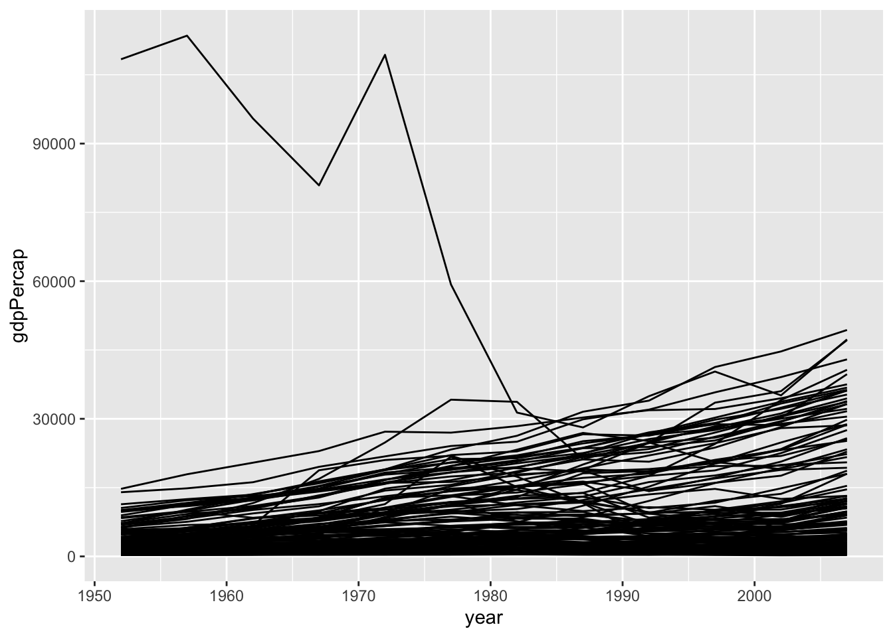

### Facet to Make Small Multiples

The facet_wrap() function can take a series of arguments, but the most important is the first one, which is specified using R's "formula" syntax, which uses the tilde character, \~. Facets are usually a one-sided formula. Most of the time you will just want a single variable on the right side of the formula.


```r
p <- ggplot(data = gapminder,
            mapping = aes(x = year,
                          y = gdpPercap))
p + geom_line(aes(group = country)) + facet_wrap(~ continent)
```


```r
p <- ggplot(data = gapminder, mapping = aes(x = year, y = gdpPercap))
p + geom_line(color="gray70", aes(group = country)) +
    geom_smooth(size = 1.1, method = "loess", se = FALSE) +
    scale_y_log10(labels=scales::dollar) +
    facet_wrap(~ continent, ncol = 5) +
    labs(x = "Year",
         y = "GDP per capita",
         title = "GDP per capita on Five Continents")
```

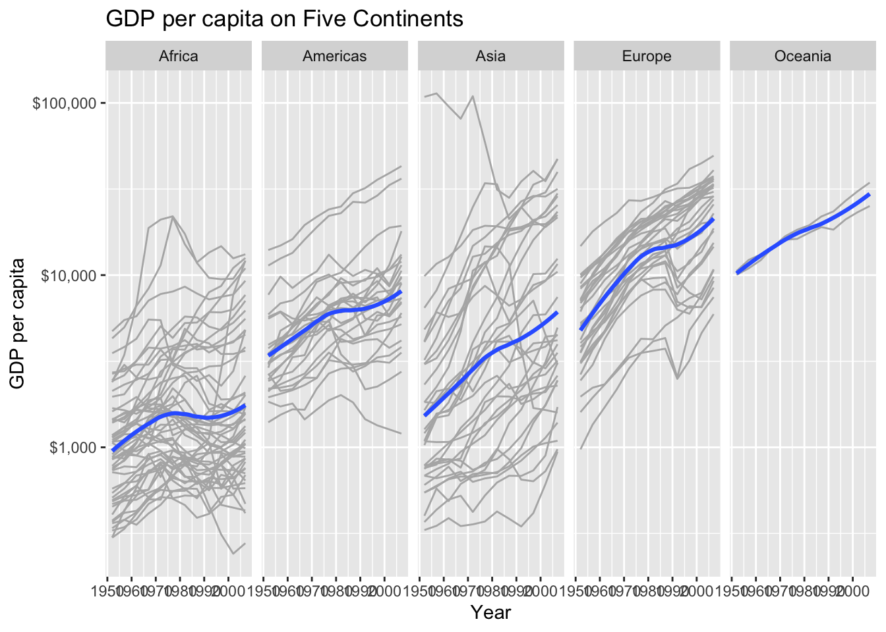

The facet_wrap() function is best used when you want a series of small multiples based on a single categorical variable. Your panels will be laid out in order and then wrapped into a grid. If you wish you can specify the number of rows or the number of columns in the resulting layout. Facets can be more complex than this. For instance, you might want to cross-classify some data by two categorical variables. In that case you should try facet_grid() instead. This function will lay out your plot in a true two-dimensional arrangement, instead of a series of panels wrapped into a grid.


```r
p <- ggplot(data = gss_sm,
            mapping = aes(x = age, y = childs))
p + geom_point(alpha = 0.2) +
    geom_smooth() +
    facet_grid(sex ~ race)
```

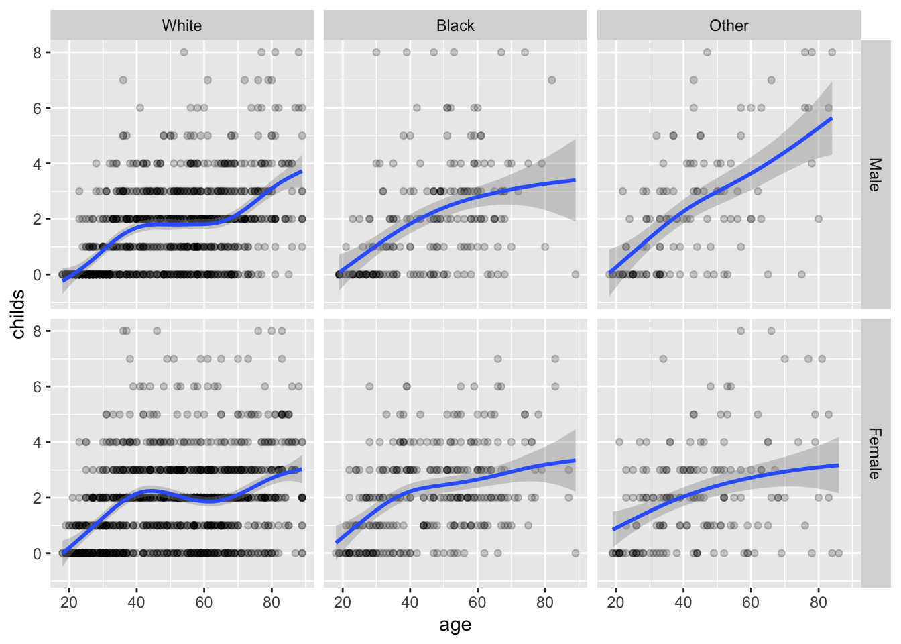

Multipanel layouts of this kind are especially effective when used to summarize continuous variation(as in a scatterplot) across two or more categorical variables, with the categories (and hence the panels) ordered in some sensible way.

### Geoms Can Transform Data

Some geoms plot our data directly on the figure, as is the case with geom_point(), which takes variables designated as x and y and plots the points on a grid. But other geoms clearly do more work on the data before it gets plotted. Every geom\_ function has an associated stat\_ function that it uses by default. The reverse is also the case: every stat\_ function has an associated geom\_ function that it will plot by default if you ask it to. Sometimes the calculations being done by the stat\_ functions that work together with the geom\_ functions might not be immediately obvious. When ggplot calculates the count or the proportion, it returns temporary variables that we can use as mappings in our plots.


```r
p <- ggplot(data = gss_sm, mapping = aes(x = bigregion)) 
p + geom_bar() # geom_bar called the default stat_ function associated with it, stat_count().
```

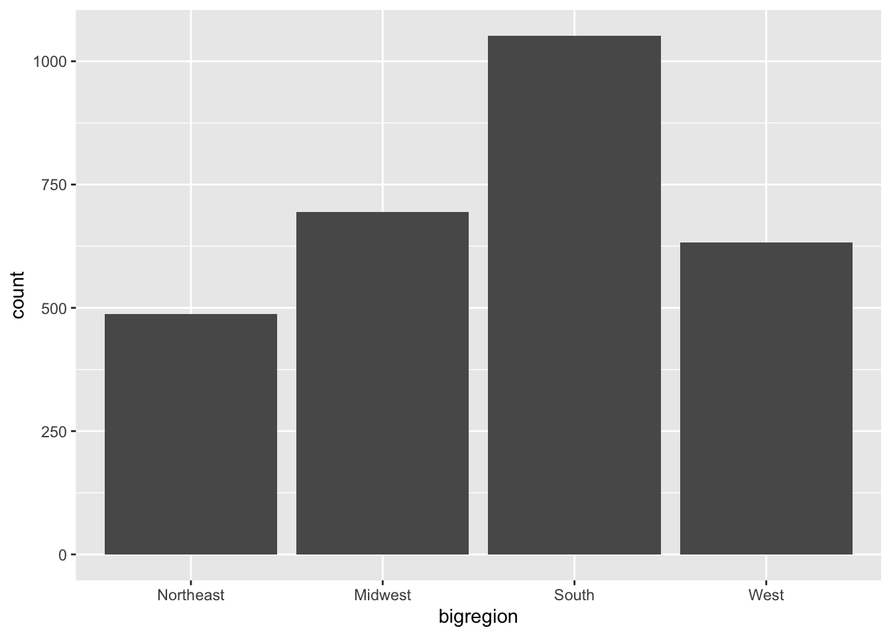

```r
# We no longer have a count on the y-axis, but the proportions of the bars all have a value of 1, so all the bars are the same height. We want them to sum to 1, so that we get the number of observations per continent as a proportion of the total number of observations. This is a grouping issue again. In a sense, it’s the reverse of the earlier grouping problem we faced when we needed to tell ggplot that our yearly data was grouped by country.

p <- ggplot(data = gss_sm,
            mapping = aes(x = bigregion))
p + geom_bar(mapping = aes(y = ..prop..))
```

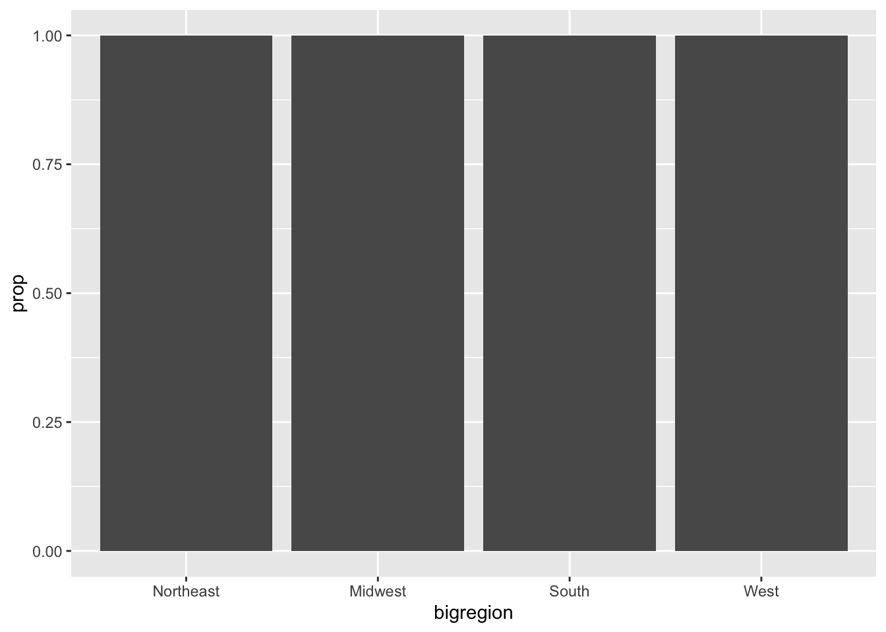

```r
# In this case, we need to tell ggplot to ignore the x-categories when calculating denominator of the proportion, and use the total number observations instead. To do so we specify group = 1 inside the aes() call. The value of 1 is just a kind of “dummy group” that tells ggplot to use the whole dataset when establishing the denominator for its prop calculations.

p <- ggplot(data = gss_sm,
            mapping = aes(x = bigregion))
p + geom_bar(mapping = aes(y = ..prop.., group = 1)) # 1 is a dummy group
```

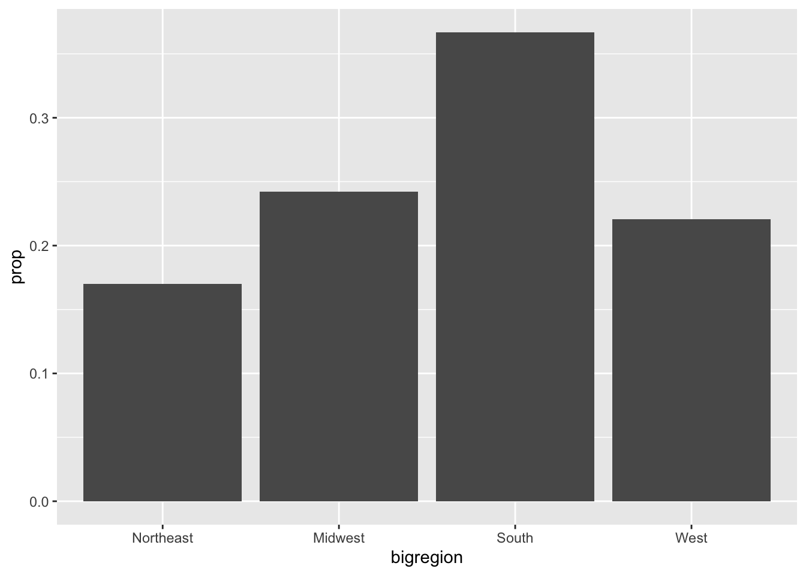

```r
# Another example
p <- ggplot(data = gss_sm,
            mapping = aes(x = religion, fill = religion))
p + geom_bar() + guides(fill = FALSE) #  If we set guides(fill = FALSE), the legend is removed
```

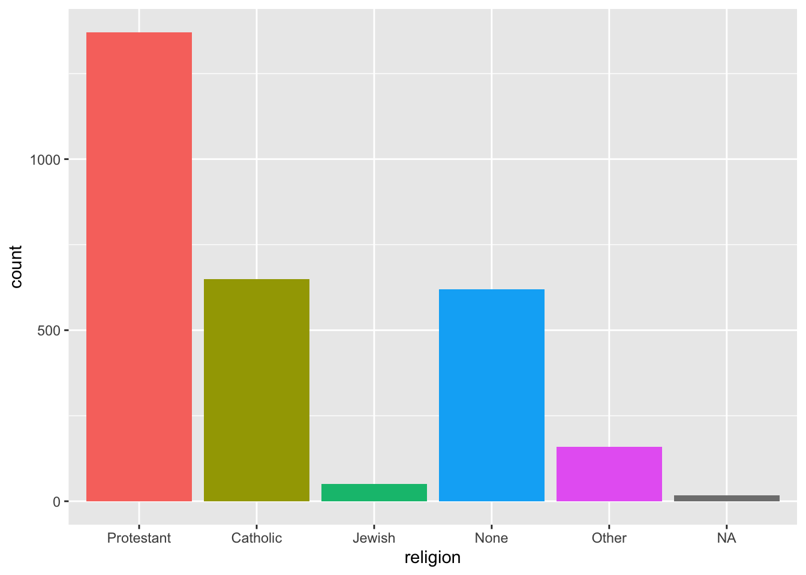

### Frequency Plots the Slightly Awkward Way

A more appropriate use of the fill aesthetic with geom_bar() is to cross-classify two categorical variables. This is the graphical equivalent of a frequency table of counts or proportions. When we cross-classify categories in bar charts, there are several ways to display the results. With geom_bar() the output is controlled by the position argument.


```r
p <- ggplot(data = gss_sm,
            mapping = aes(x = bigregion, fill = religion))
p + geom_bar() # The default output of geom_bar() is a stacked bar chart
```

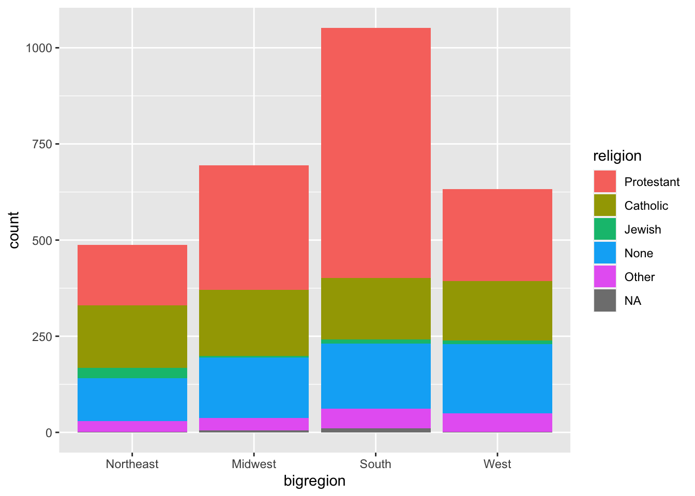

```r
# An alternative choice is to set the position argument to "fill".
p <- ggplot(data = gss_sm,
            mapping = aes(x = bigregion, fill = religion))
p + geom_bar(position = "fill") # the bars are all the same height 
```

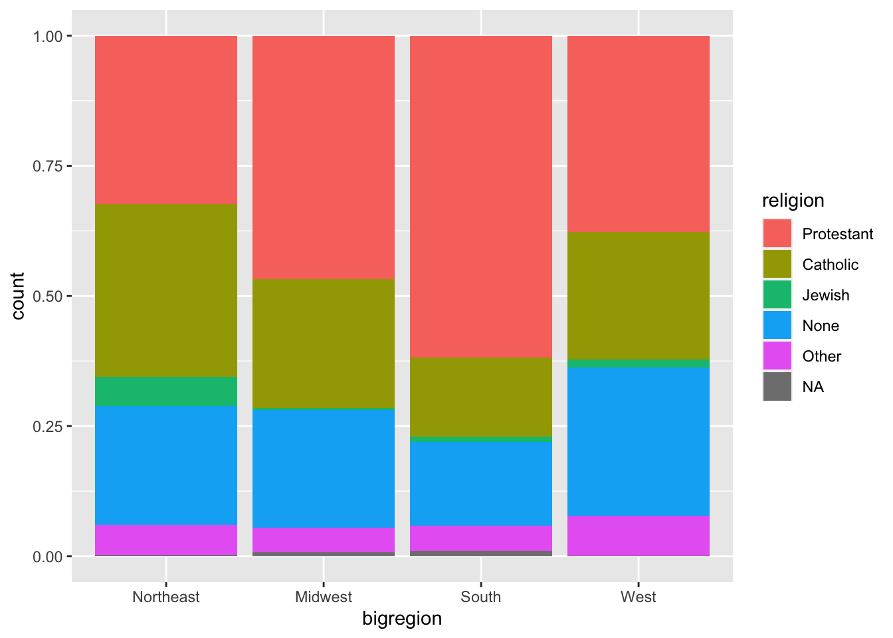

```r
# When we just wanted the overall proportions for one variable, we mapped group = 1 to tell ggplot to calculate the proportions with respect to the overall N.
p <- ggplot(data = gss_sm,
            mapping = aes(x = bigregion, fill = religion))
p + geom_bar(position = "dodge",
             mapping = aes(y = ..prop.., group = religion))
```

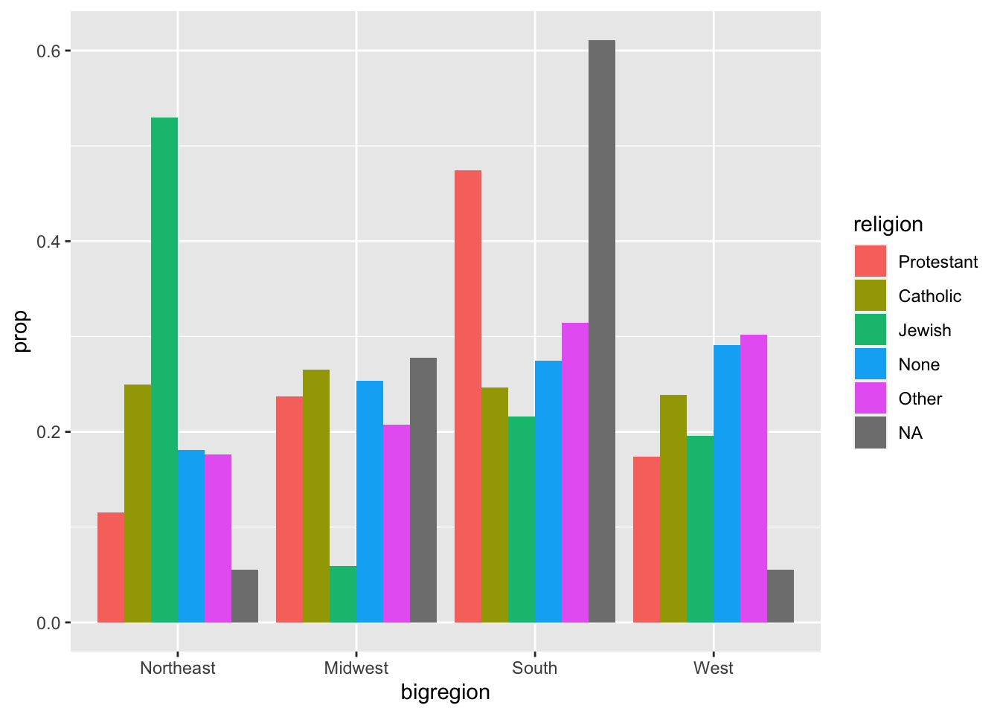

```r
# We can ask ggplot to give us a proportional bar chart of religious affiliation, and then facet that by region
p <- ggplot(data = gss_sm,
            mapping = aes(x = religion))
p + geom_bar(position = "dodge",
             mapping = aes(y = ..prop.., group = bigregion)) +
    facet_wrap(~ bigregion, ncol = 1)
```

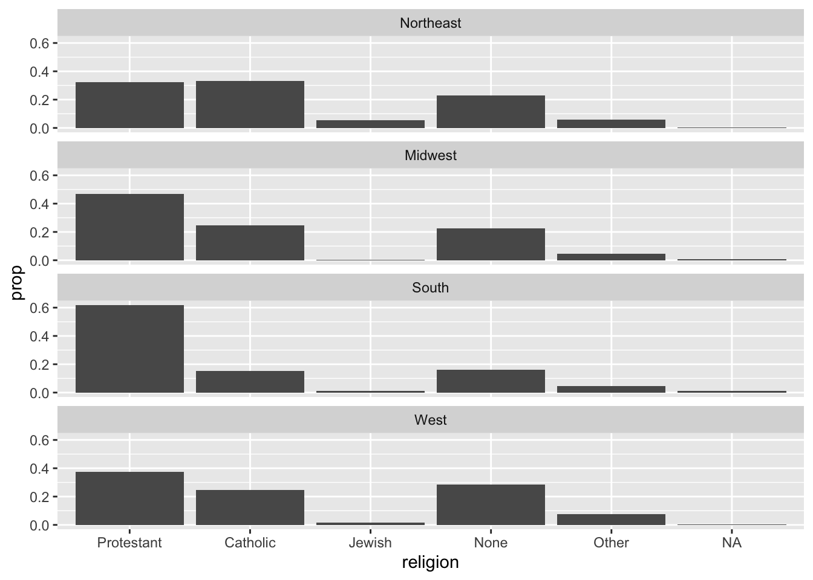

### Histograms and density plots

A histogram is a way of summarizing a continuous variable by chopping it up into segments or "bins" and counting how many observations are found within each bin. In a bar chart, the categories are given to us going in (e.g., regions of the country, or religious affiliation). With a histogram, we have to decide how finely to bin the data. As with the bar charts, a newly-calculated variable, count, appears on the x-axis.

While histograms summarize single variables, it's also possible to use several at once to compare distributions. We can facet histograms by some variable of interest.


```r
# By default, the geom_histogram() function will choose a bin size for us based on a rule of thumb.
p <- ggplot(data = midwest,
            mapping = aes(x = area))
p + geom_histogram()
```

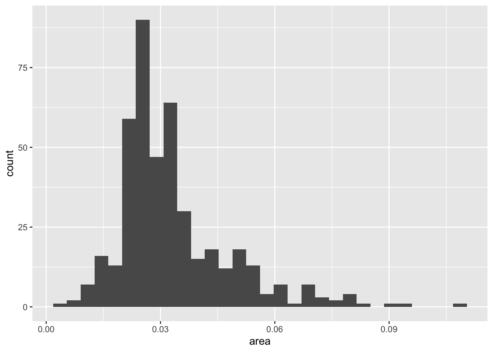

```r
# selecting another bin size
p <- ggplot(data = midwest,
            mapping = aes(x = area))
p + geom_histogram(bins = 10)
```

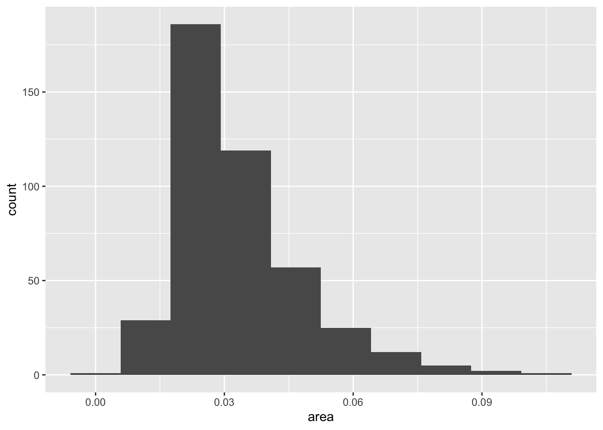

```r
oh_wi <- c("OH", "WI")
# subset the data
p <- ggplot(data = subset(midwest, subset = state %in% oh_wi), # %in% operator is a convenient way to filter on more than one termin a variable
            mapping = aes(x = percollege, fill = state))
p + geom_histogram(alpha = 0.4, bins = 20)
```


```r
# When working with a continuous variable, an alternative to binning the data and making a histogram is to calculate a kernel density estimate of the underlying distribution.
p <- ggplot(data = midwest,
            mapping = aes(x = area, fill = state, color = state))
p + geom_density(alpha = 0.3)
```

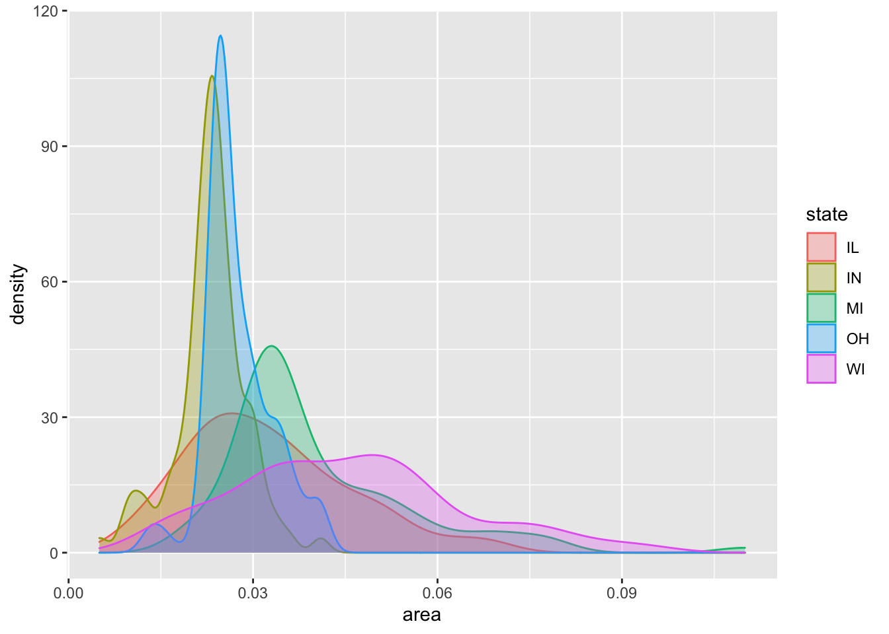

```r
# For geom_density(), the stat_density() function can return its default ..density.. statistic, or ..scaled.., which will give a proportional density estimate. It can also return a statistic called ..count.., which is the density times the number of points. This can be used in stacked density plots.
p <- ggplot(data = subset(midwest, subset = state %in% oh_wi),
            mapping = aes(x = area, fill = state, color = state))
p + geom_density(alpha = 0.3, mapping = (aes(y = ..scaled..)))
```

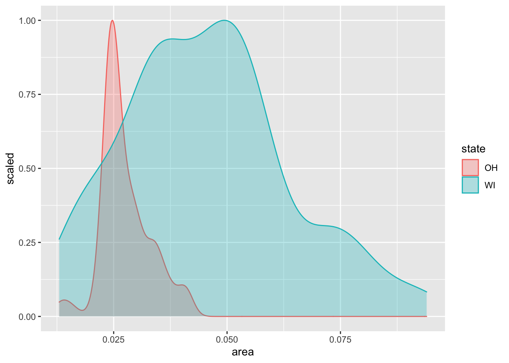

### Avoid transformations when necessary

Often our data is, in effect, already a summary table. This can happen when we have computed a table of marginal frequencies or percentages from the original data. Because we are working directly with percentage values in a summary table,we no longer have any need for ggplot to count up values for us or perform any other calculations. That is, we do not need the services of any stat\_ functions. We can tell geom_bar() not to do any work on the variable before plotting it. To do this we say stat = 'identity' in the geom_bar() call.


```r
p <- ggplot(data = titanic,
            mapping = aes(x = fate, y = percent, fill = sex))
p + geom_bar(position = "dodge", stat = "identity") + theme(legend.position = "top")
```

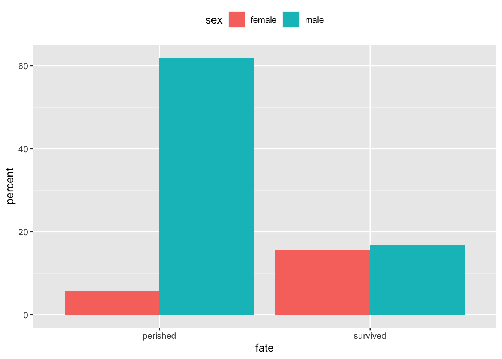

```r
# For convenience ggplot also provides a related geom, geom_col(), which has exactly the same effect but assumes that stat = "identity".
# The position argument in geom_bar() and geom_col() can also take the value of "identity". Just as stat = "identity" means “don’t do any summary calculations”, position = "identity" means “just plot the values as given”.
p <- ggplot(data = oecd_sum,
            mapping = aes(x = year, y = diff, fill = hi_lo))
p + geom_col() + guides(fill = FALSE) +
  labs(x = NULL, y = "Difference in Years",
       title = "The US Life Expectancy Gap",
       subtitle = "Difference between US and OECD
                   average life expectancies, 1960-2015",
       caption = "Data: OECD. After a chart by Christopher Ingraham,
                  Washington Post, December 27th 2017.")
```

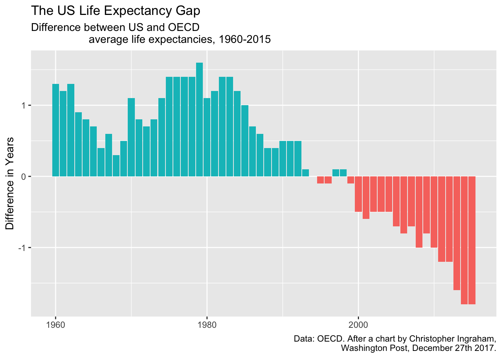

## Graph Tables, Add Labels, Make Notes

### Use Pipes to Summarize Data

letting the geoms (and their stat\_ functions) do the work can sometimes get a little confusing. It is too easy to lose track of whether one has calculated row margins, column margins, or overall relative frequencies. A better strategy is to calculate the frequency table you want first and then plot that table. This has the benefit of allowing you do to some quick sanity checks on your tables, to make sure you haven't made any errors.

In addition to making our code easier to read, it lets us more easily perform sanity checks on our results, so that we are sure we have grouped and summarized things in the right order.


```r
rel_by_region <- gss_sm %>%
    group_by(bigregion, religion) %>% # from outermost to innermost 
    summarize(N = n()) %>%
    mutate(freq = N / sum(N), # calculate relative proportion 
           pct = round((freq*100), 0)) # calculate percentage

# Checking pct
rel_by_region %>% 
  group_by(bigregion) %>%
  summarize(total = sum(pct))
```

```
## # A tibble: 4 × 2
##   bigregion total
##   <fct>     <dbl>
## 1 Northeast   100
## 2 Midwest     101
## 3 South       100
## 4 West        101
```

```r
# As a rule, dodged charts can be more cleanly expressed as faceted plots. Faceting removes the need for a legend and thus makes the chart simpler to read.

p <- ggplot(rel_by_region, aes(x = religion, y = pct, fill = religion))
p + geom_col(position = "dodge2") +
    labs(x = NULL, y = "Percent", fill = "Religion") +
    guides(fill = FALSE) + 
    coord_flip() + # flip the axis 
    facet_grid(~ bigregion)
```

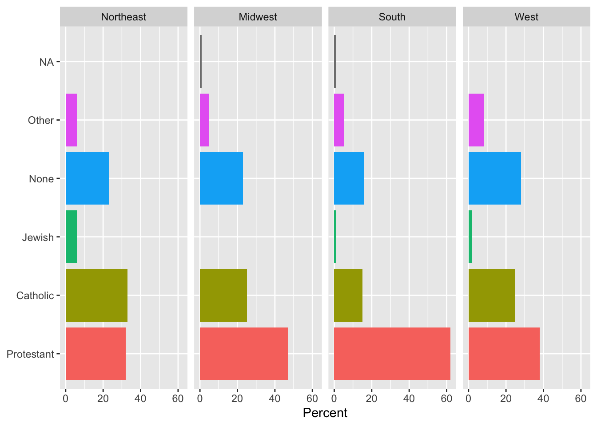

### Continuous Variables by Group or Category

The variables specified in group_by() are retained in the new data frame, the variables created with summarize() are added, and all the other variables in the original data are dropped.

We generally want our plots to present data in some meaningful order. The reorder() function will do this for us. It takes two required arguments. The first is the categorical variable or factor that we want to reorder. In this case, that's country. The second is the variable we want to reorder it by. Here that is the donation rate, donors. The third and optional argument to reorder() is the function you want to use as a summary statistic. If you give reorder() only the first two required arguments, then by default it will reorder the categories of your first variable by the mean value of the second. You can use any sensible function you like to reorder the categorical variable (e.g., median, or sd).


```r
organdata %>% dplyr::select(1:6) %>% sample_n(size = 10) # pick a sample 
```

```
## # A tibble: 10 × 6
##    country       year       donors    pop pop_dens   gdp
##    <chr>         <date>      <dbl>  <int>    <dbl> <int>
##  1 Spain         1997-01-01   29    39348    7.78  17203
##  2 Finland       NA           NA     4986    1.47  18025
##  3 Australia     1995-01-01   10.2  18072    0.233 21079
##  4 Australia     1992-01-01   12.4  17495    0.226 17914
##  5 Ireland       1997-01-01   20.9   3673    5.23  22017
##  6 France        NA           NA    56709   10.3   18162
##  7 United States 1998-01-01   21   275854    2.86  31612
##  8 Germany       1994-01-01   12.3  81438   22.8   20690
##  9 Sweden        1991-01-01   16.4   8617    1.92  19000
## 10 Spain         1994-01-01   25    39166    7.74  15024
```

```r
# dotplot
p <- ggplot(data = organdata, mapping = aes(x = year, y = donors)) 
p + geom_point()
```

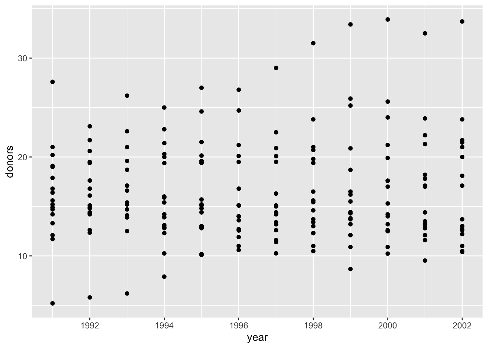

```r
# lineplot
p <- ggplot(data = organdata,
            mapping = aes(x = year, y = donors))
p + geom_line(aes(group = country)) + facet_wrap(~ country)
```

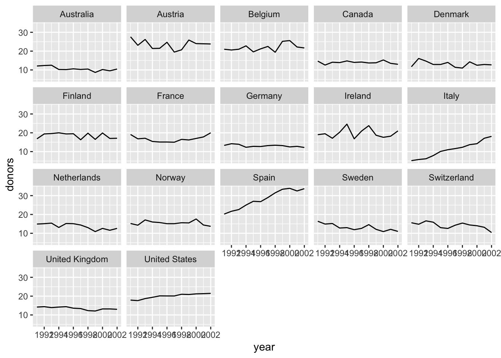

```r
# boxplot
p <- ggplot(data = organdata,
            mapping = aes(x = country, y = donors))
p + geom_boxplot() +
  coord_flip()
```

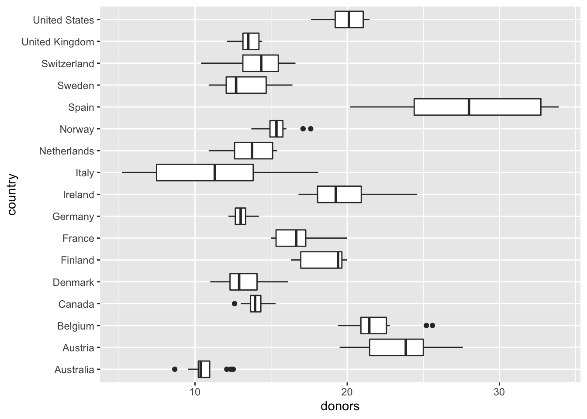

```r
# boxplot reordered
p <- ggplot(data = organdata,
            mapping = aes(x = reorder(country, donors, na.rm = TRUE),
                          y = donors))
p + geom_boxplot() +
    labs(x=NULL) +
    coord_flip()
```

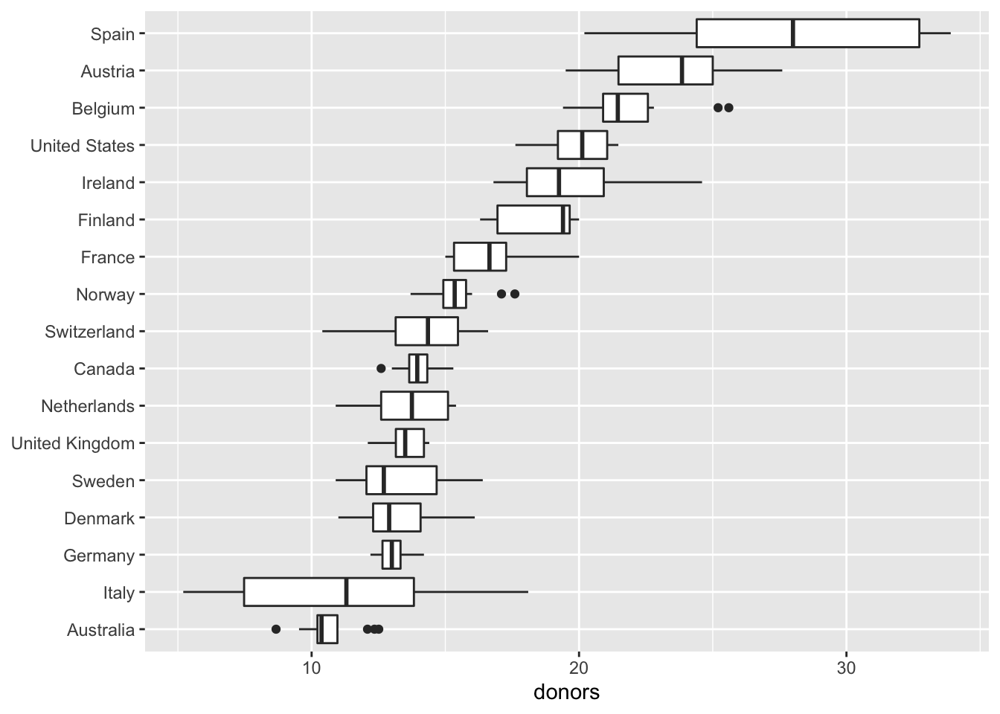

```r
# violin plot reordered and filled
p <- ggplot(data = organdata,
            mapping = aes(x = reorder(country, donors, na.rm=TRUE),
                          y = donors, fill = world))
p + geom_violin() + labs(x=NULL) +
    coord_flip() + theme(legend.position = "top")
```

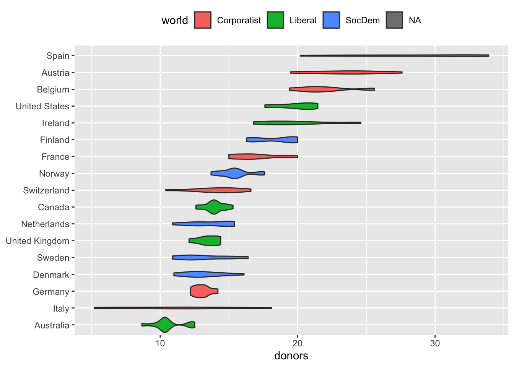

```r
# dotplot reordered and colored
p <- ggplot(data = organdata,
            mapping = aes(x = reorder(country, donors, na.rm=TRUE),
                          y = donors, color = world))
p + geom_point() + labs(x=NULL) +
    coord_flip() + theme(legend.position = "top")
```

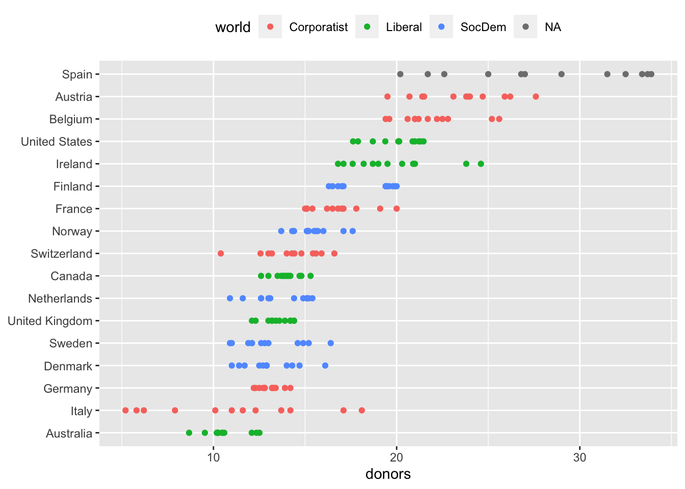

```r
# dotplot jittered, reordered and colored
p <- ggplot(data = organdata,
            mapping = aes(x = reorder(country, donors, na.rm=TRUE),
                          y = donors, color = world))
p + geom_jitter(position = position_jitter(width=0.15)) + # to avoid overplotting 
    labs(x=NULL) + coord_flip() + theme(legend.position = "top")
```

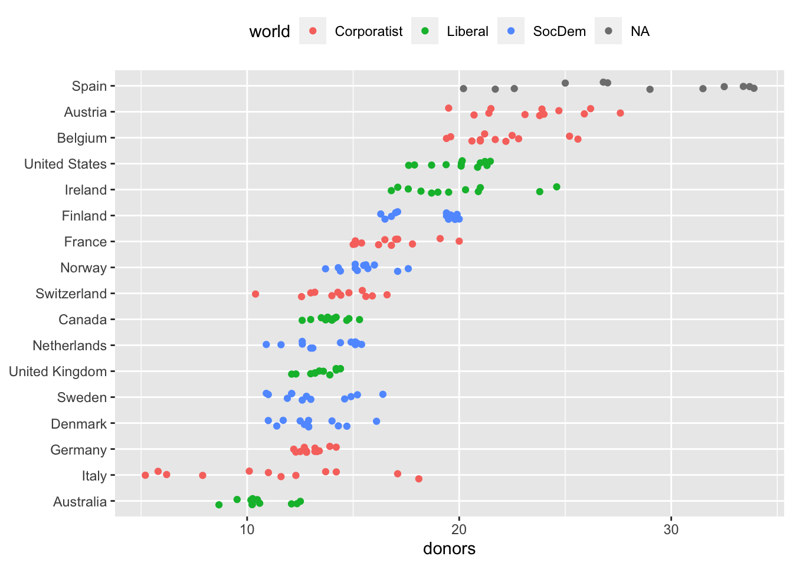

When we want to summarize a categorical variable that just has one point per category, we should use this approach as well. The result will be a Cleveland dotplot, a simple and extremely effective method of presenting data that is usually better than either a bar chart or a table. Cleveland dotplots are generally preferred to bar or column charts. When making them, put the categories on the y-axis and order them in the way that is most relevant to the numerical summary you are providing. This sort of plot is also an excellent way to summarizemodel results or any data with with error ranges.


```r
by_country <- organdata %>% 
  group_by(consent_law, country) %>%
  summarize(donors_mean = mean(donors, na.rm = TRUE),
              donors_sd = sd(donors, na.rm = TRUE),
              gdp_mean = mean(gdp, na.rm = TRUE),
              health_mean = mean(health, na.rm = TRUE),
              roads_mean = mean(roads, na.rm = TRUE),
              cerebvas_mean = mean(cerebvas, na.rm = TRUE))

# Doing the same in another better way
by_country <- organdata %>% 
  group_by(consent_law, country) %>%
  summarize_if(is.numeric, list(mean, sd), na.rm = TRUE) %>% # list instead funs
  ungroup()
by_country # vars are named using the original variable, with the function’s name appended
```

```
## # A tibble: 17 × 28
##    consent_law country   donor…¹ pop_fn1 pop_d…² gdp_fn1 gdp_l…³ healt…⁴ healt…⁵
##    <chr>       <chr>       <dbl>   <dbl>   <dbl>   <dbl>   <dbl>   <dbl>   <dbl>
##  1 Informed    Australia    10.6  18318.   0.237  22179.  21779.   1958.   1848.
##  2 Informed    Canada       14.0  29608.   0.297  23711.  23353.   2272.   2163.
##  3 Informed    Denmark      13.1   5257.  12.2    23722.  23275    2054.   1973.
##  4 Informed    Germany      13.0  80255.  22.5    22163.  21938.   2349.   2256.
##  5 Informed    Ireland      19.8   3674.   5.23   20824.  20154.   1480.   1341.
##  6 Informed    Netherla…    13.7  15548.  37.4    23013.  22554.   1993.   1885.
##  7 Informed    United K…    13.5  58187.  24.0    21359.  20962.   1561.   1464.
##  8 Informed    United S…    20.0 269330.   2.80   29212.  28699.   3988.   3760.
##  9 Presumed    Austria      23.5   7927.   9.45   23876.  23415.   1875.   1803.
## 10 Presumed    Belgium      21.9  10153.  30.7    22500.  22096.   1958.   1862.
## 11 Presumed    Finland      18.4   5112.   1.51   21019.  20763    1615.   1560.
## 12 Presumed    France       16.8  58056.  10.5    22603.  22211.   2160.   2066.
## 13 Presumed    Italy        11.1  57360.  19.0    21554.  21195.   1757    1689.
## 14 Presumed    Norway       15.4   4386.   1.35   26448.  25769.   2217.   2125.
## 15 Presumed    Spain        28.1  39666.   7.84   16933   16584.   1289.   1220.
## 16 Presumed    Sweden       13.1   8789.   1.95   22415.  22094    1951.   1868 
## 17 Presumed    Switzerl…    14.2   7037.  17.0    27233   26931.   2776.   2656.
## # … with 19 more variables: pubhealth_fn1 <dbl>, roads_fn1 <dbl>,
## #   cerebvas_fn1 <dbl>, assault_fn1 <dbl>, external_fn1 <dbl>,
## #   txp_pop_fn1 <dbl>, donors_fn2 <dbl>, pop_fn2 <dbl>, pop_dens_fn2 <dbl>,
## #   gdp_fn2 <dbl>, gdp_lag_fn2 <dbl>, health_fn2 <dbl>, health_lag_fn2 <dbl>,
## #   pubhealth_fn2 <dbl>, roads_fn2 <dbl>, cerebvas_fn2 <dbl>,
## #   assault_fn2 <dbl>, external_fn2 <dbl>, txp_pop_fn2 <dbl>, and abbreviated
## #   variable names ¹​donors_fn1, ²​pop_dens_fn1, ³​gdp_lag_fn1, ⁴​health_fn1, …
```

```r
# Cleveland dotplot reordered and colored
p <- ggplot(data = by_country,
            mapping = aes(x = donors_fn1, y = reorder(country, donors_fn1),
                          color = consent_law))
p + geom_point(size = 3) +
    labs(x = "Donor Procurement Rate",
         y = "", color = "Consent Law") +
    theme(legend.position="top")
```

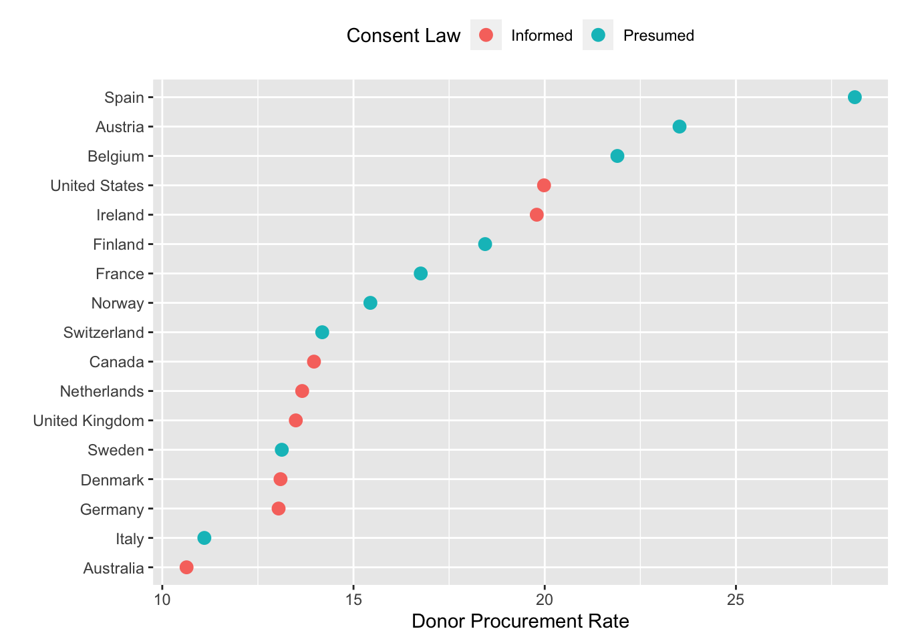

```r
# Cleveland dotplot reordered, colored and faceted
p <- ggplot(data = by_country,
            mapping = aes(x = donors_fn1,
                          y = reorder(country, donors_fn1)))

p + geom_point(size=3) +
    facet_wrap(~ consent_law, scales = "free_y", ncol = 1) + # col arg to make panels appear on top of other and make y-scale free; where one axis is categorical, as here, we can free the categorical axis and leave the continuous one fixed 
    labs(x= "Donor Procurement Rate",
         y= "")
```

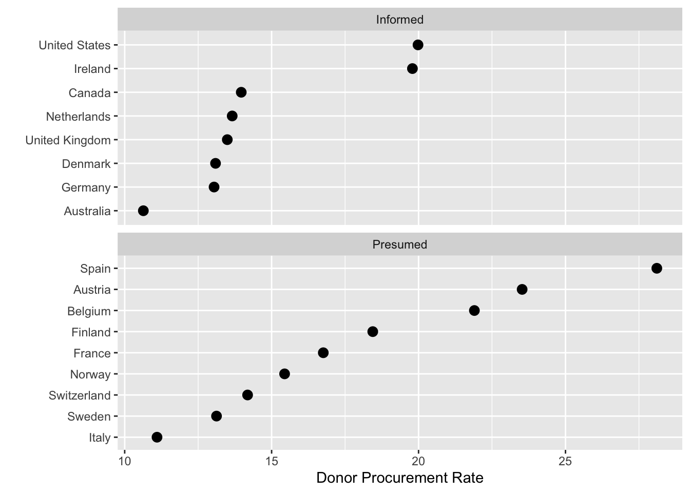

```r
# Dot-and-whisker plot
p <- ggplot(data = by_country, mapping = aes(x = reorder(country,
              donors_fn1), y = donors_fn1))

p + geom_pointrange(mapping = aes(ymin = donors_fn1 - donors_fn2, # how us a point estimate and a range around it 
       ymax = donors_fn1 + donors_fn2)) +
     labs(x= "", y= "Donor Procurement Rate") + coord_flip()
```

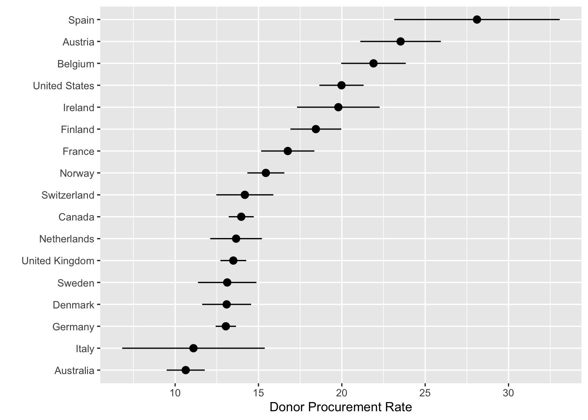

### Plot Text Directly

The ggrepel package provides geom_text_repel() and geom_label_repel(), two geoms that can pick out labels much more flexibly than the default geom_text(). The ggrepel package has several other useful geoms and options to aid with effectively plotting labels along with points. The performance of its labeling algorithm is consistently very good. For many purposes it will be a better first choice than geom_text().


```r
elections_historic %>% dplyr::select(2:7) 
```

```
## # A tibble: 49 × 6
##     year winner                 win_party ec_pct popular_pct popular_margin
##    <int> <chr>                  <chr>      <dbl>       <dbl>          <dbl>
##  1  1824 John Quincy Adams      D.-R.      0.322       0.309        -0.104 
##  2  1828 Andrew Jackson         Dem.       0.682       0.559         0.122 
##  3  1832 Andrew Jackson         Dem.       0.766       0.547         0.178 
##  4  1836 Martin Van Buren       Dem.       0.578       0.508         0.142 
##  5  1840 William Henry Harrison Whig       0.796       0.529         0.0605
##  6  1844 James Polk             Dem.       0.618       0.495         0.0145
##  7  1848 Zachary Taylor         Whig       0.562       0.473         0.0479
##  8  1852 Franklin Pierce        Dem.       0.858       0.508         0.0695
##  9  1856 James Buchanan         Dem.       0.588       0.453         0.122 
## 10  1860 Abraham Lincoln        Rep.       0.594       0.396         0.101 
## # … with 39 more rows
```

```r
p_title <- "Presidential Elections: Popular & Electoral College Margins"
p_subtitle <- "1824-2016"
p_caption <- "Data for 2016 are provisional."
x_label <- "Winner's share of Popular Vote"
y_label <- "Winner's share of Electoral College Votes"

p <- ggplot(elections_historic, aes(x = popular_pct, y = ec_pct,
                                    label = winner_label))

p + geom_hline(yintercept = 0.5, size = 1.4, color = "gray80") + # two new geoms, geom_hline() and geom_vline() to make the lines. see also geom_abline() geom that draws straight lines based on a supplied slope and intercept
    geom_vline(xintercept = 0.5, size = 1.4, color = "gray80") +
    geom_point() +
    geom_text_repel() +
    scale_x_continuous(labels = scales::percent) +
    scale_y_continuous(labels = scales::percent) +
    labs(x = x_label, y = y_label, title = p_title, subtitle = p_subtitle,
         caption = p_caption)
```

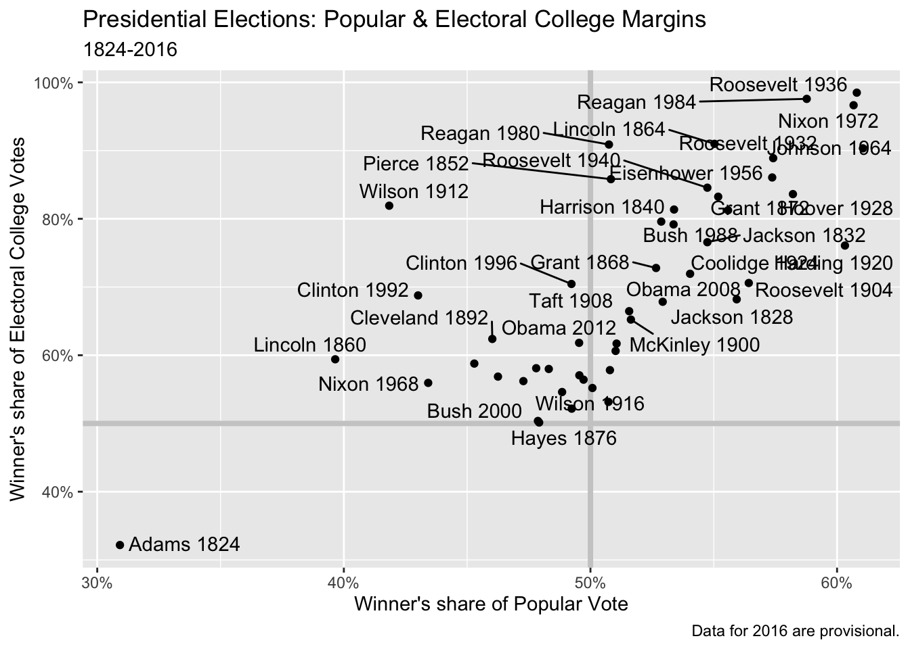

### Label Outliers

Sometimes we want to pick out some points of interest in the data without labeling every single item. Alternatively, we can pick out specific points by creating a dummy variable in the data set just for this purpose.


```r
p <- ggplot(data = by_country,
            mapping = aes(x = gdp_fn1, y = health_fn1))

# Using subset to filter the data
p + geom_point() +
    geom_text_repel(data = subset(by_country, gdp_fn1 > 25000),
                    mapping = aes(label = country))
```

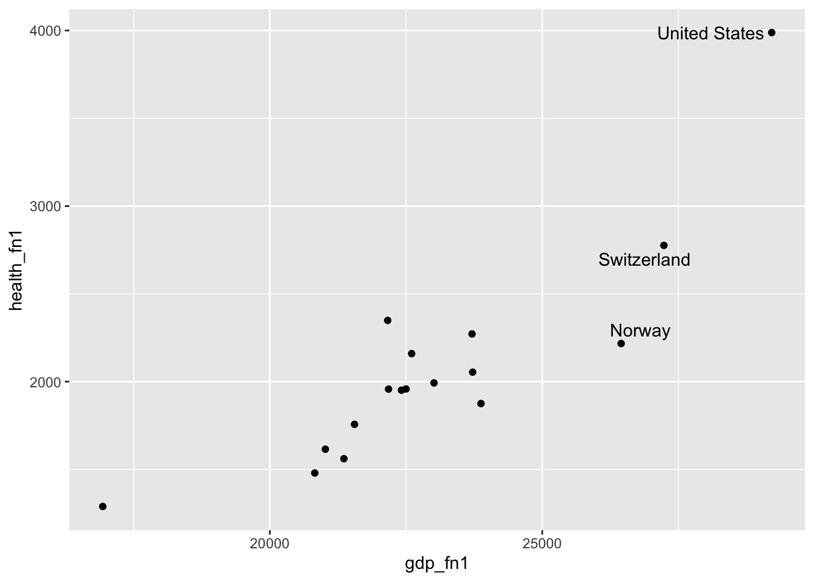

```r
p <- ggplot(data = by_country,
            mapping = aes(x = gdp_fn1, y = health_fn1))

p + geom_point() +
    geom_text_repel(data = subset(by_country,
                                  gdp_fn1 > 25000 | health_fn1 < 1500 |
                                  country %in% "Belgium"),
                    mapping = aes(label = country))
```

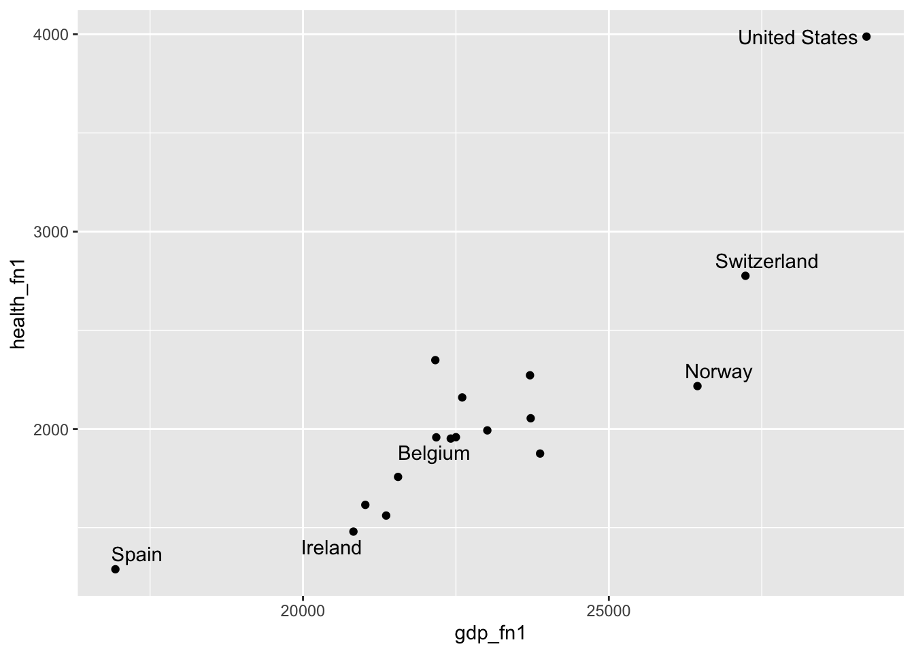

```r
# Creating a dummy variable to subset the data
organdata$ind <- organdata$ccode %in% c("Ita", "Spa") &
                    organdata$year > 1998

p <- ggplot(data = organdata,
            mapping = aes(x = roads,
                          y = donors, color = ind))
p + geom_point() +
    geom_text_repel(data = subset(organdata, ind),
                    mapping = aes(label = ccode)) +
    guides(label = FALSE, color = FALSE)
```

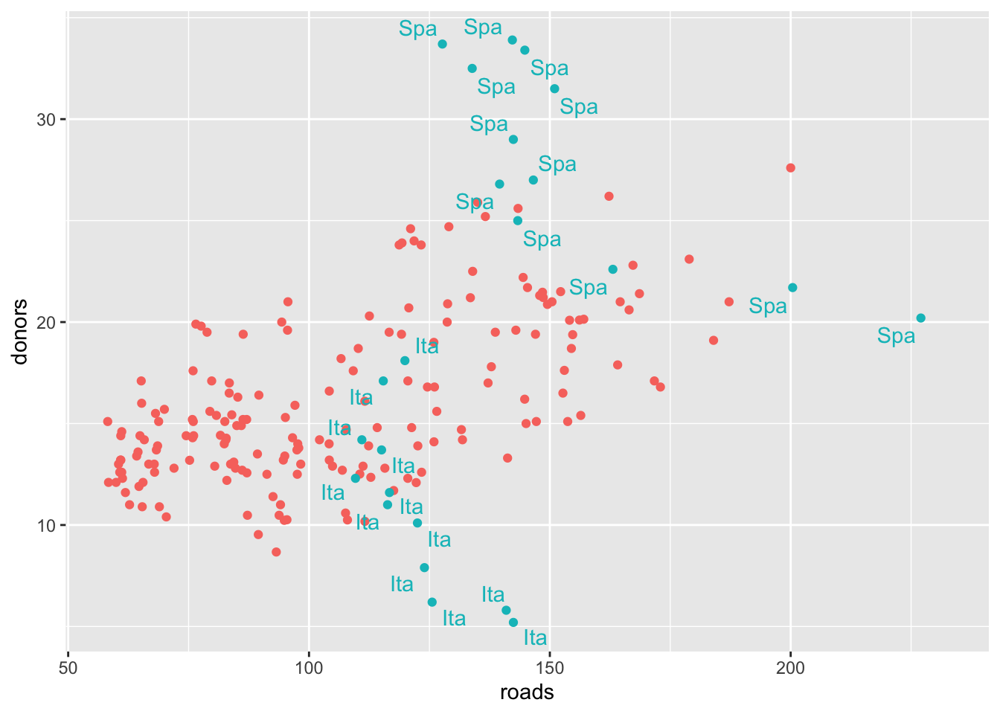

### Write and draw in the plot area

Sometimes we want to annotate the figure directly.We use annotate() for this purpose. We will tell annotate() to use a text geom temporarily taking advantage of their features in order to place something on the plot. The annotate() function can work with other geoms, too. The most obvious use-case is putting arbitrary text on the plot.


```r
p <- ggplot(data = organdata, mapping = aes(x = roads, y = donors))
p + geom_point() + annotate(geom = "text", x = 91, y = 33,
                            label = "A surprisingly high \n recovery rate.",
                            hjust = 0)
```

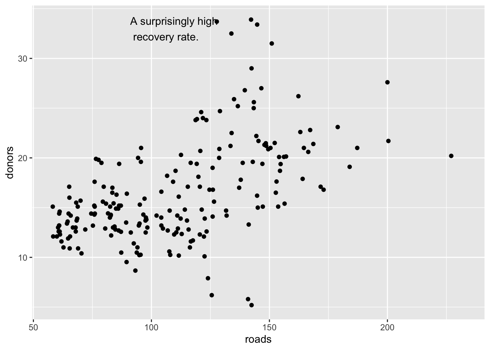

### Understanding Scales, Guides, and Themes

Learning about new geoms extended what we have seen already. Each geom makes a different type of plot. Different plots require different mappings in order to work, and so each geom\_ function takes mappings tailored to the kind of graph it draws. You can't use geom_point() to make a scatterplot without supplying an x and a y mapping, for example. Using geom_histogram() only requires you to supply an x mapping. Similarly, geom_pointrange() requires ymin and ymax mappings in order to know where to draw the lineranges it makes. A geom\_ function may take optional arguments, too. When using geom_boxplot() you can specify what the outliers look like using arguments like outlier.shape and outlier.color.

Now we'll make use of new functions for controlling some aspects of the appearance of our graph.

-   Every aesthetic mapping has a scale. If you want to adjust how that scale is marked or graduated, then you use a scale\_ function.
-   Many scales come with a legend or key to help the reader interpret the graph. These are called guides. You can make adjustments to them with the guides() function. Perhaps the most common use case is to make the legend disappear, as it is sometimes superfluous. Another is to adjust the arrangement of the key in legends and colorbars.
-   Graphs have other features not strictly connected to the logical structure of the data being displayed. These include things like their background color, the typeface used for labels, or the placement of the legend on the graph. To adjust these, use the theme() function.

Consistent with ggplot's overall approach, adjusting some visible feature of the graph means first thinking about the relationship that the feature has with the underlying data. Roughly speaking, if the change you want to make will affect the substantive interpretation of any particular geom, then most likely you will either be mapping an aesthetic to a variable using that geom's aes() function, or you will be specifying a change via some scale\_ function. If the change you want to make does not affect the interpretation of a given geom\_, then most likely you will either be setting a variable inside the geom\_ function, or making a cosmetic change via the theme() function.


```r
p <- ggplot(data = organdata,
            mapping = aes(x = roads,
                          y = donors,
                          color = world))
p + geom_point()
```

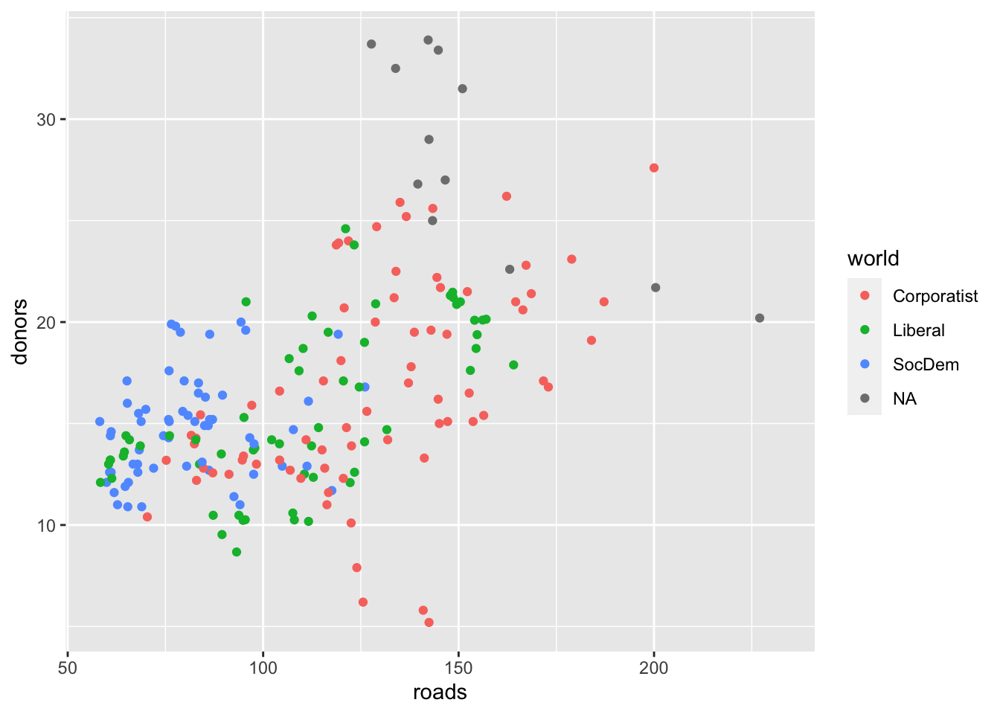

Scales and guides are closely connected, which can make things confusing. The guide provides information about the scale, such as in a legend or colorbar. Thus, it is possible to make adjustments to guides from inside the various scale\_ functions. More often it is easier to use the guides() function directly.

A plot with three aesthetic mappings. The variable roads is mapped to x; donors is mapped to y; and world is mapped to color. The x and y scales are both continuous, running smoothly from just under the lowest value of the variable to just over the highest value. Various labeled tick marks orient the reader to the values on each axis. The color mapping also has a scale. The world measure is an unordered categorical variable, so its scale is discrete. It takes one of four values, each represented by a different color.

Along with color, mappings like fill, shape, and size will have scales that we might want to customize or adjust. We could have mapped world to shape instead of color. In that case our four-category variable would have a scale consisting of four different shapes. Scales for these mappings may have labels, axis tick marks at particular positions, or specific colors or shapes. If we want to adjust them, we use one of the scale\_ functions.

Many different kinds of variable can be mapped. More often than not x and y are continuous measures. But they might also easily be discrete, as when we mapped country names to the y axis in our boxplots and dotplots. An x or y mapping can also be defined as a transformation onto a log scale, or as a special sort of number value like a date. Similarly, a color or a fill mapping can be discrete and unordered, as with our world variable, or discrete and ordered, as with letter grades in an exam. A color or fill mapping can also be a continuous quantity, represented as a gradient running smoothly from a low to a high value. Finally, both continuous gradients and ordered discrete values might have some defined neutral midpoint with extremes diverging in both directions.

Because we have several potential mappings, and each mapping might be to one of several different scales, we end up with a lot of individual scale\_ functions. Each deals with one combination of mapping and scale. They are named according to a consistent logic: \*scale\_<MAPPING>\_<KIND>\*. First comes the scale\_ name, then the mapping it applies to, and finally the kind of value the scale will display. Thus, the scale_x\_continuous() function controls x scales for continuous variables; scale_y\_discrete() adjusts y scales for discrete variables; and scale_x\_log10() transforms an x mapping to a log scale. Most of the time, ggplot will guess correctly what sort of scale is needed for your mapping. Then it will work out some default features of the scale (such as its labels and where the tick marks go). In many cases you will not need to make any scale adjustments. If x is mapped to a continuous variable then adding + scale_x\_continuous() to your plot statement with no further arguments will have no effect. It is already there implicitly. Adding + scale_x\_log10(), on the other hand, will transform your scale, as now you have replaced the default treatment of a continuous x variable.

If you want to adjust the labels or tick marks on a scale, you will need to know which mapping it is for and what sort of scale it is. Then you supply the arguments to the appropriate scale function. For example, we can change the x-axis of the previous plot to a log scale, and then also change the position and labels of the tick marks on the y-axis.


```r
p <- ggplot(data = organdata,
            mapping = aes(x = roads,
                          y = donors,
                          color = world))
p + geom_point() +
    scale_x_log10() +
    scale_y_continuous(breaks = c(5, 15, 25),
                       labels = c("Five", "Fifteen", "Twenty Five"))
```


The same applies to mappings like color and fill. Here the available scale\_ functions include ones that deal with continuous, diverging, and discrete variables, as well as others that we will encounter later when we discuss the use of color and color palettes in more detail. When working with a scale that produces a legend, we can also use this its scale\_ function to specify the labels in the key. To change the title of the legend, however, we use the labs() function, which lets us label all the mappings.


```r
p <- ggplot(data = organdata,
            mapping = aes(x = roads,
                          y = donors,
                          color = world))
p + geom_point() +
    scale_color_discrete(labels =
                             c("Corporatist", "Liberal",
                               "Social Democratic", "Unclassified")) +
    labs(x = "Road Deaths",
         y = "Donor Procurement",
        color = "Welfare State")
```

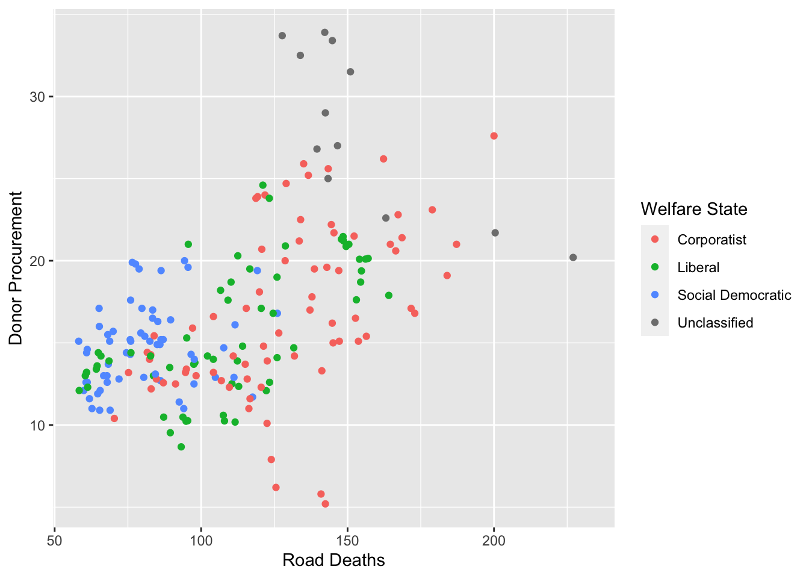

If we want to move the legend somewhere else on the plot, we are making a purely cosmetic decision and that is the job of the theme() function. As we have already seen, adding + theme(legend.position = "top") will move the legend as instructed. Finally, to make the legend disappear altogether, we tell ggplot that we do not want a guide for that scale.

We will use scale\_ functions fairly regularly to make small adjustments to the labels and axes of our graphs. And we will occasionally use the theme() function to make some cosmetic adjustments.


```r
p <- ggplot(data = organdata,
            mapping = aes(x = roads,
                          y = donors,
                          color = world))
p + geom_point() +
    labs(x = "Road Deaths",
         y = "Donor Procurement") +
    guides(color = FALSE)
```

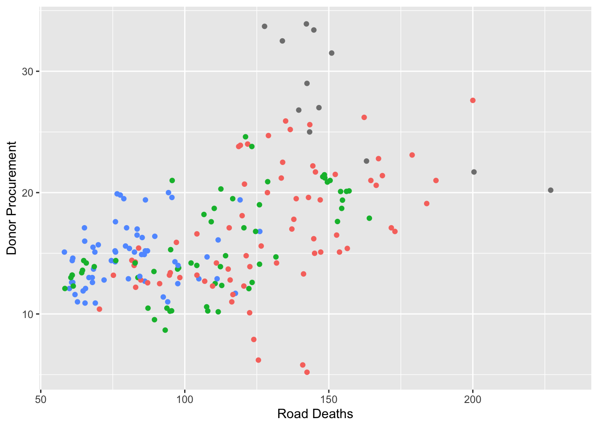

## Refine your plots


```r
# Progressive enhancements of the same plot
# v1
p <- ggplot(data = subset(asasec, Year == 2014),
            mapping = aes(x = Members, y = Revenues, label = Sname))

p + geom_point() + geom_smooth()
```

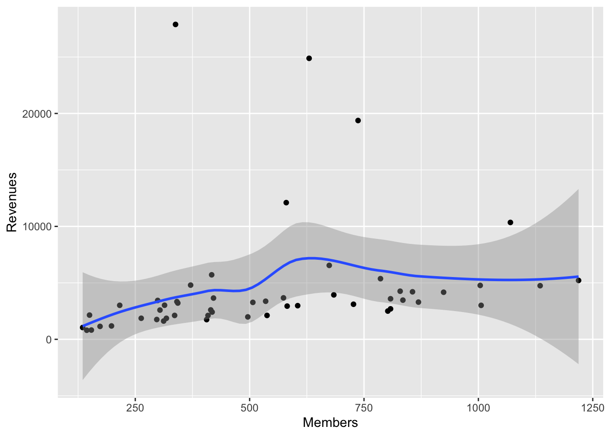

```r
## `geom_smooth()` using method = 'loess' and formula 'y ~ x'

# v2
p <- ggplot(data = subset(asasec, Year == 2014),
            mapping = aes(x = Members, y = Revenues, label = Sname))

p + geom_point(mapping = aes(color = Journal)) +
    geom_smooth(method = "lm")
```

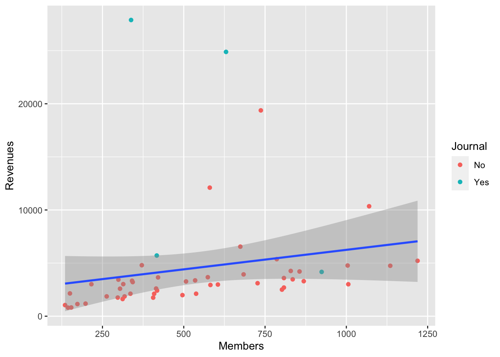

```r
# v3: 
p0 <- ggplot(data = subset(asasec, Year == 2014),
             mapping = aes(x = Members, y = Revenues, label = Sname))

p1 <- p0 + geom_smooth(method = "lm", se = FALSE, color = "gray80") +
    geom_point(mapping = aes(color = Journal)) 

# v4
p2 <- p1 + geom_text_repel(data=subset(asasec,
                                       Year == 2014 & Revenues > 7000),
                           size = 2)
p2
```

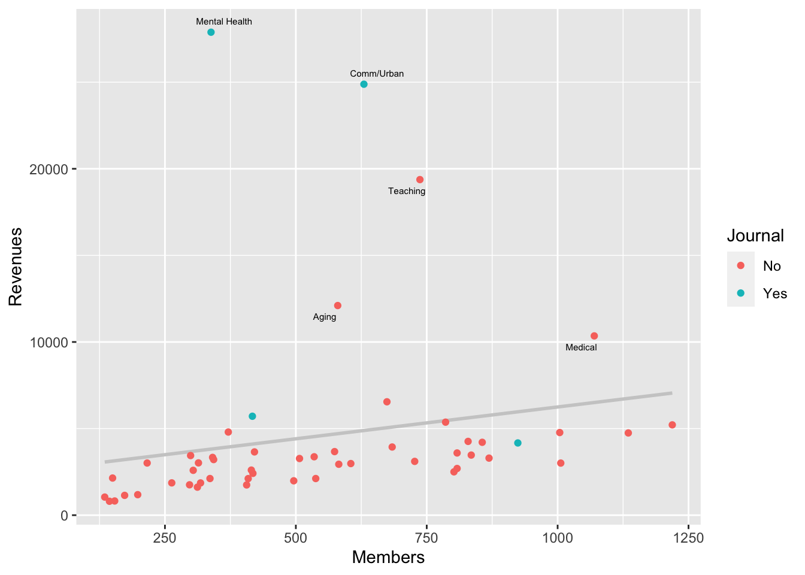

```r
# v5
p3 <- p2 + labs(x="Membership",
        y="Revenues",
        color = "Section has own Journal",
        title = "ASA Sections",
        subtitle = "2014 Calendar year.",
        caption = "Source: ASA annual report.")
p4 <- p3 + scale_y_continuous(labels = scales::dollar) +
     theme(legend.position = "bottom")
p4
```

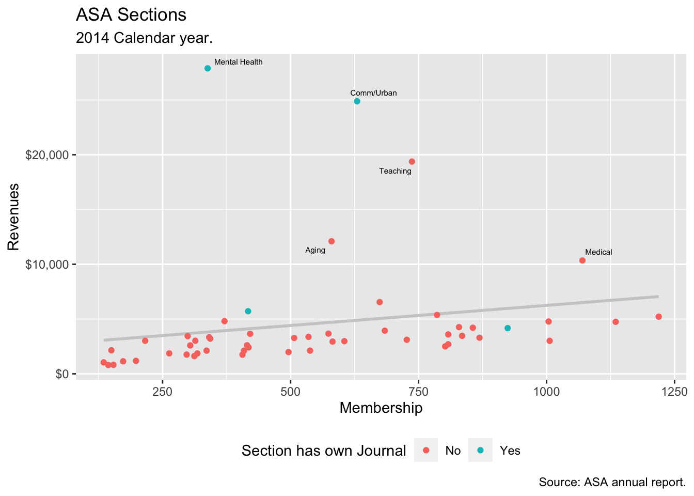

### Use color to your advantage

You should choose a color palette in the first place based on its ability to express the data you are plotting. Take care to choose a palette that reflects the structure of your data. Separate from these mapping issues, there are considerations about which colors in particular to choose. In general, the default color palettes that ggplot makes available are well-chosen for their perceptual properties and aesthetic qualities. We can also use color and color layers as device for emphasis, to highlight particular data points or parts of the plot, perhaps in conjunction with other features.

We choose color palettes for mappings through one of the scale\_ functions for color or fill. While it is possible to very finely control the look of your color schemes by varying the hue, chroma, and luminance of each color you use via scale_color_hue(), or scale_fill_hue(), in general this is not recommended. Instead you should use the RColorBrewer package to make a wide range of named color palettes available to you. When used in conjunction with ggplot, you access these colors by specifying the scale_color_brewer() or scale_fill_brewer() functions, depending on the aesthetic you are mapping.

You can also specify colors manually, via scale_color_manual() or scale_fill_manual(). These functions take a value argument that can be specified as vector of color names or color values that R knows about. The ability to manually specify colors can be useful when the meaning of a category itself has a strong color association. R knows many color names (like red, and green, and cornflowerblue. Try demo('colors') for an overview. Alternatively, color values can be specified via their hexadecimal RGB value. This is a way of encoding color values in the RGB colorspace, where each channel can take a value from 0 to 255 like this. A color hex value begins with a hash or pound character, \#, followed by three pairs of hexadecimal or "hex" numbers. Hex values are in Base 16, with the first six letters of the alphabet standing for the numbers 10 to 15. This allows a two-character hex number to range from 0 to 255. You read them as \#rrggbb, where rr is the two-digit hex code for the red channel, gg for the green channel, and bb for the blue channel. So \#CC55DD translates in decimal to CC = 204 (red), 55 = 85 (green), and DD = 221 (blue). It gives a strong pink color.

If we are serious about using a safe palette for color-blind viewers, we should investigate the dichromat package (The colorblindr package has similar functionality) instead. It provides a range of safe palettes and some useful functions for helping you approximately see what your current palette might look like to a viewer with one of several different kinds of color blindness.


```r
p <- ggplot(data = organdata,
            mapping = aes(x = roads, y = donors, color = world))
p + geom_point(size = 2) + scale_color_brewer(palette = "Set2") +
    theme(legend.position = "top")
```

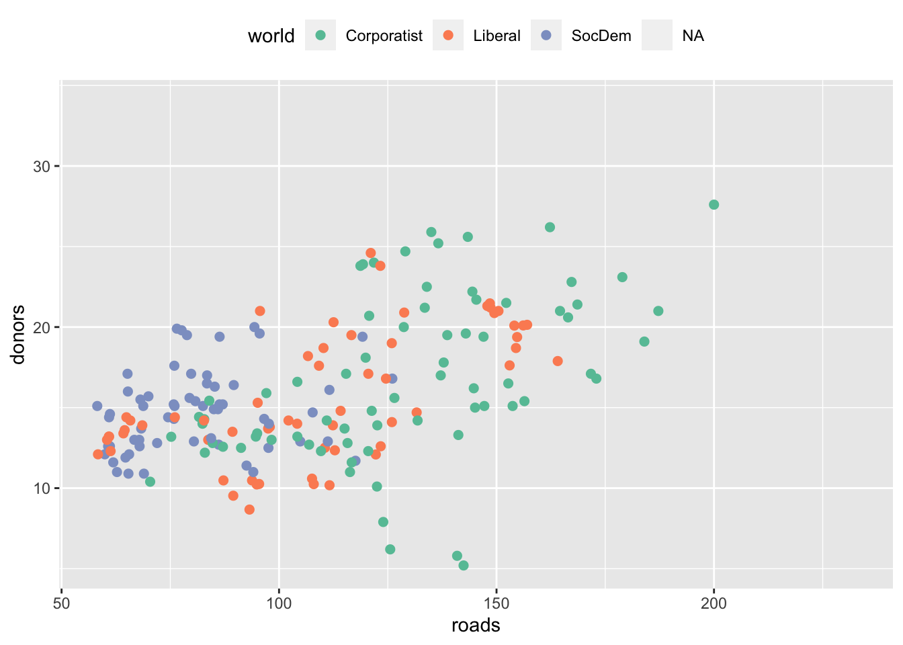

```r
p + geom_point(size = 2) + scale_color_brewer(palette = "Pastel2") +
        theme(legend.position = "top")
```

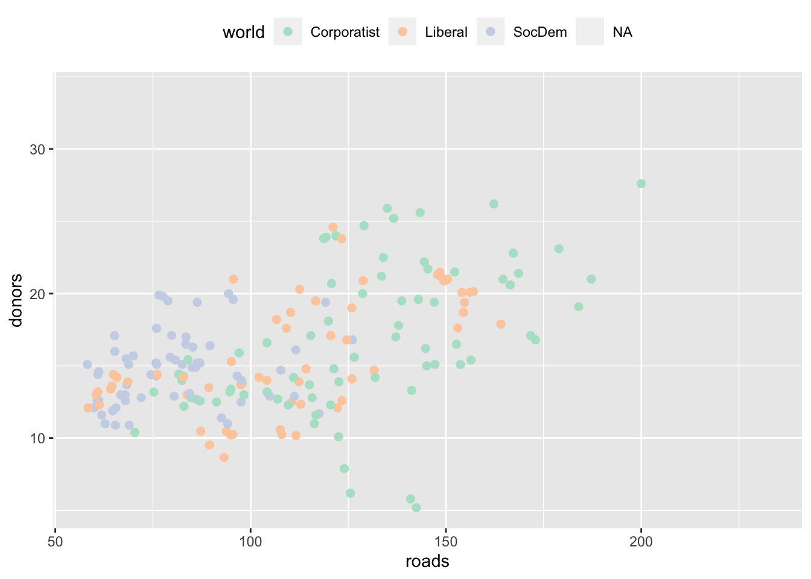

```r
p + geom_point(size = 2) + scale_color_brewer(palette = "Dark2") +
    theme(legend.position = "top")
```

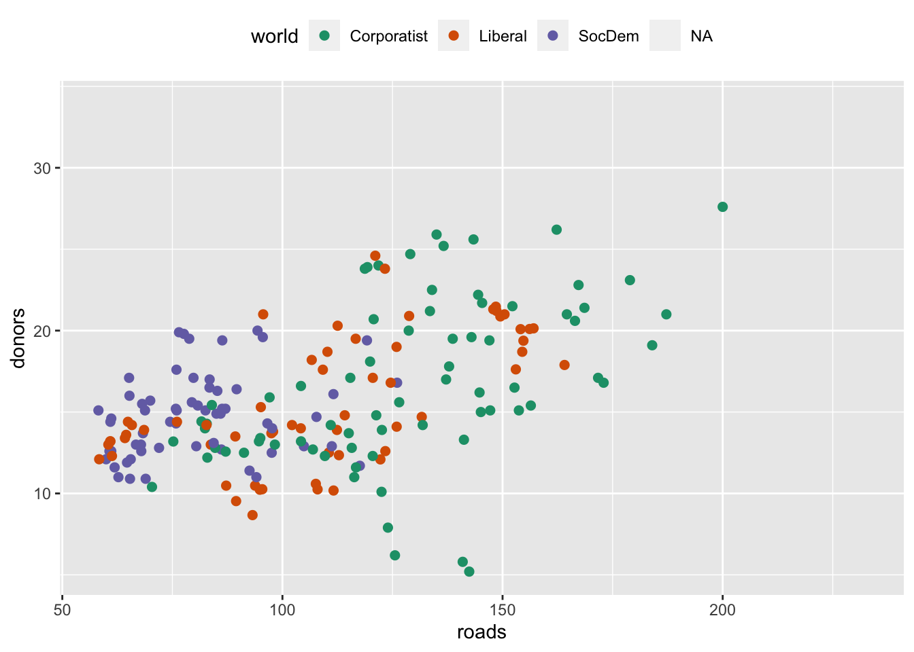

```r
# Defining your own palette
cb_palette <- c("#999999", "#E69F00", "#56B4E9", "#009E73",
                "#F0E442", "#0072B2", "#D55E00", "#CC79A7")

p4 + scale_color_manual(values = cb_palette)
```

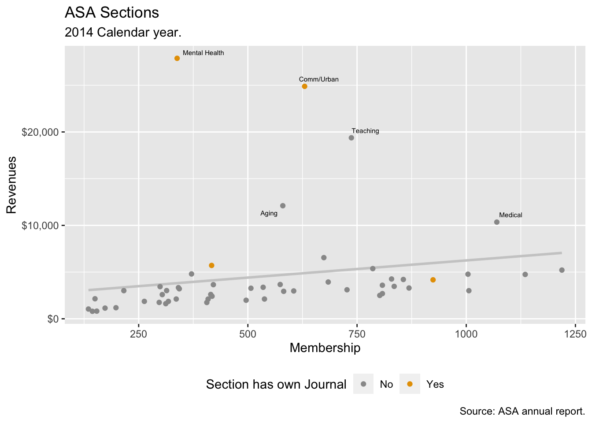

```r
# Setting default color palette
Default <- brewer.pal(5, "Set2")

# safety colors from dichromat 
types <- c("deutan", "protan", "tritan")
names(types) <- c("Deuteronopia", "Protanopia", "Tritanopia")

color_table <- types %>%
    purrr::map(~ dichromat(Default, .x)) %>%
    as_tibble() %>%
    add_column(Default, .before = TRUE)

color_table
```

```
## # A tibble: 5 × 4
##   Default Deuteronopia Protanopia Tritanopia
##   <chr>   <chr>        <chr>      <chr>     
## 1 #66C2A5 #AEAEA7      #BABAA5    #82BDBD   
## 2 #FC8D62 #B6B661      #9E9E63    #F29494   
## 3 #8DA0CB #9C9CCB      #9E9ECB    #92ABAB   
## 4 #E78AC3 #ACACC1      #9898C3    #DA9C9C   
## 5 #A6D854 #CACA5E      #D3D355    #B6C8C8
```

```r
color_comp(color_table)
```

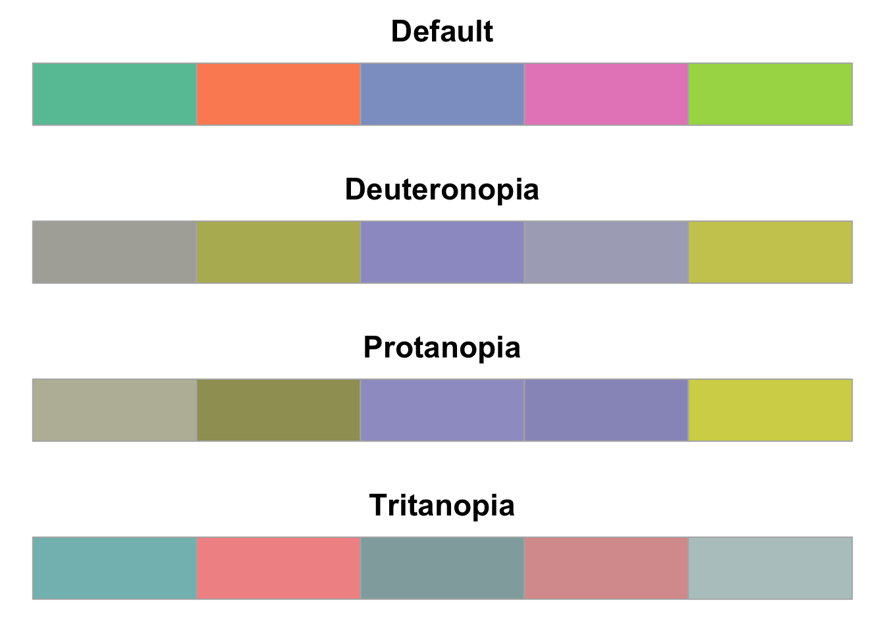

### Layer color and text together

Aside from mapping variables directly, color is also very useful when we want to pick out or highlight some aspect of our data. In cases like this that the layered approach of ggplot can really work to our advantage.

We will build up a plot of data about the 2016 US general election. It is contained in the county_data object in the socviz library. We begin by defining a blue and red color for the Democrats and Republicans. Then we create the basic setup and first layer of the plot. We subset the data, including only counties with a value of "No" on the flipped variable. We set the color of geom_point() to be a light gray, as it will form the background layer of the plot. And we apply a log transformation to the x-axis scale.

In the next step we add a second geom_point() layer. Here we start with the same dataset but extract a complementary subset from it. This time we choose the "Yes" counties on the flipped variable. The x and y mappings are the same, but we add a color scale for these points, mapping the partywinner16 variable to the color aesthetic. Then we specify a manual color scale with scale_color_manual(), where the values are the blue and red party_colors we defined above.

The next layer sets the y-axis scale and the labels.

Finally, we add a third layer using the geom_text_repel() function. Once again we supply a set of instructions to subset the data for this text layer. We are interested in the flipped counties that have with a relatively high percentage of African-American residents.


```r
# Democrat Blue and Republican Red
party_colors <- c("#2E74C0", "#CB454A")

p0 <- ggplot(data = subset(county_data,
                           flipped == "No"),
             mapping = aes(x = pop,
                           y = black/100))

p1 <- p0 + geom_point(alpha = 0.15, color = "gray50") +
    scale_x_log10(labels=scales::comma) 

p1
```

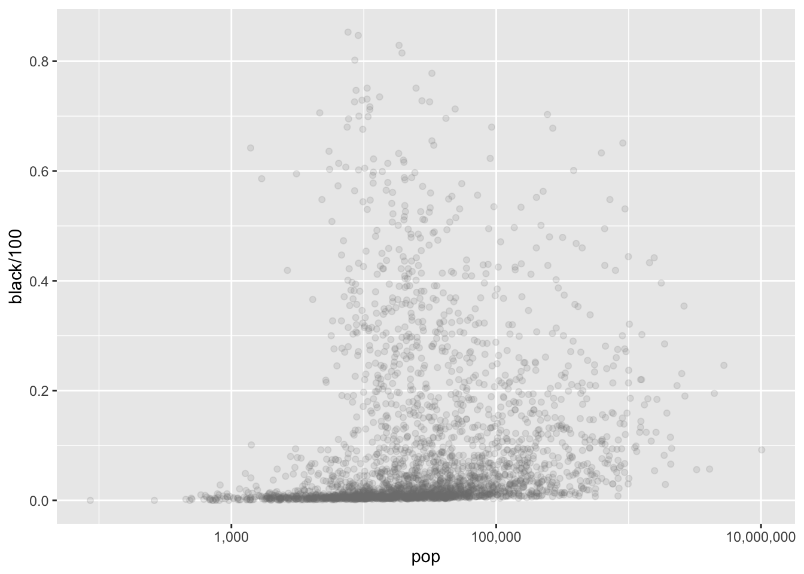

```r
p2 <- p1 + geom_point(data = subset(county_data,
                                    flipped == "Yes"),
                      mapping = aes(x = pop, y = black/100,
                                    color = partywinner16)) +
    scale_color_manual(values = party_colors)

p2
```

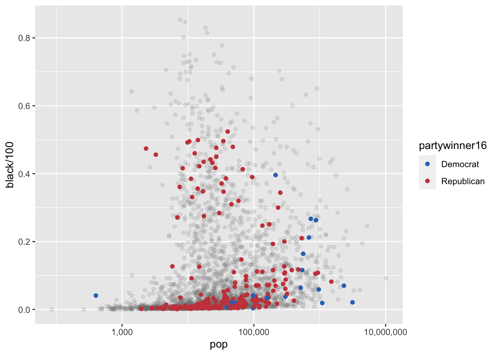

```r
p3 <- p2 + scale_y_continuous(labels=scales::percent) +
    labs(color = "County flipped to ... ",
         x = "County Population (log scale)",
         y = "Percent Black Population",
         title = "Flipped counties, 2016",
         caption = "Counties in gray did not flip.")

p3
```


```r
p4 <- p3 + geom_text_repel(data = subset(county_data,
                                      flipped == "Yes" &
                                      black  > 25),
                           mapping = aes(x = pop,
                                   y = black/100,
                                   label = state), size = 2)

p4 + theme_minimal() +
    theme(legend.position="top")
```

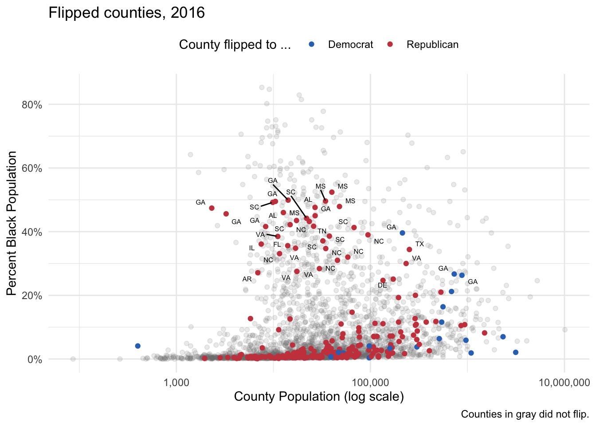

### Change the appearance of plots with themes

If we want to change the overall look of it all at once, we can do that using ggplot’s theme engine. Themes can be turned on or off using the theme_set() function. It takes the name of a theme (which will itself be a function) as an argument.

Internally, theme functions are a set of detailed instructions to turn on, turn off, or modify a large number of graphical elements on the plot. Once set, a theme applies to all subsequent plots and it remains active until it is replaced by a different theme. This be done either through the use of another theme_set() statement, or on a per-plot basis by adding the theme function to the end of the plot: p4 + theme_gray() would temporarily override the generally active theme for the p4 object only. You can still use the theme() function to fine-tune any aspect of your plot, as seen above with the relocation of the legend to the top of the graph.

The ggplot library comes with several built-in themes, including theme_minimal() and theme_classic(), with theme_gray() or theme_grey() as the default. If these are not to your taste, install the ggthemes library for many more options.

You can define your own themes either entirely from scratch, or by starting with one you like and making adjustments from there.

Wilke’s cowplot package, for instance, contains a well-developed theme suitable for figures whose final destination is a journal article. Bob Rudis’s hrbrthemes package, meanwhile, has a distinctive and compact look and feel that takes advantage of some freely-available typefaces.

The theme() function allows you to exert very fine-grained control over the appearance of all kinds of text and graphical elements in a plot.


```r
# theme_set(theme_bw())
# p4 + theme(legend.position="top")
# 
# theme_set(theme_dark())
# p4 + theme(legend.position="top")
# 
# theme_set(theme_economist())
# p4 + theme(legend.position="top")

# theme_set(theme_wsj())

p4 + theme(plot.title = element_text(size = rel(0.6)),
           legend.title = element_text(size = rel(0.35)),
           plot.caption = element_text(size = rel(0.35)),
           legend.position = "top")
```

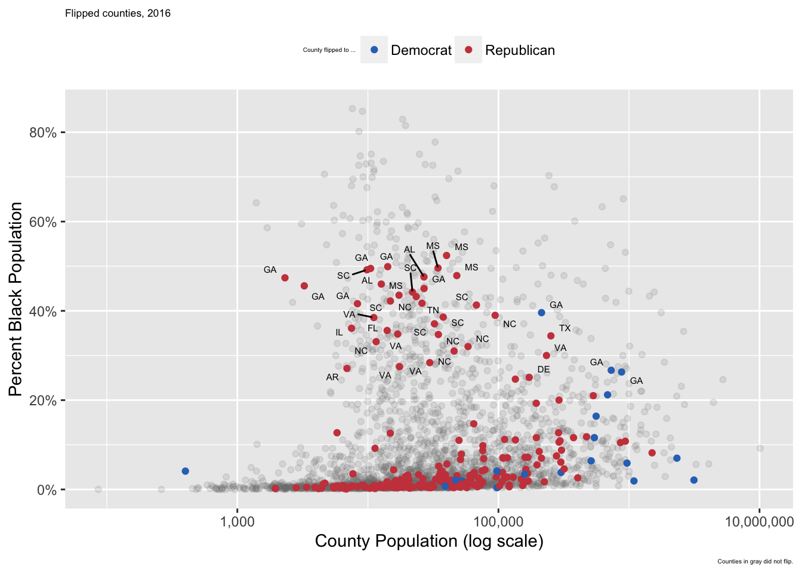

```r
p4 + theme(legend.position = "top")
```

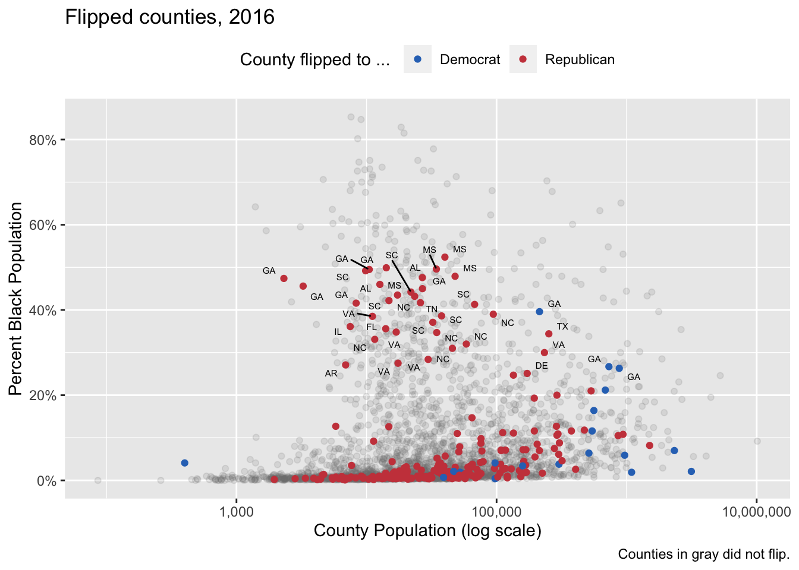

```r
p4 + theme(legend.position = "top",
           plot.title = element_text(size=rel(2),
                                     lineheight=.5,
                                     family="Times",
                                     face="bold.italic",
                                     colour="orange"),
           axis.text.x = element_text(size=rel(1.1),
                                      family="Courier",
                                      face="bold",
                                      color="purple"))
```


### Use Theme Elements in a Substantive Way

The gss_lon data contains information on the age of each GSS respondent for all the years in the survey since 1972. We will fill the density curves with a dark grey color, and then add an indicator of the mean age in each year, and a text layer for the label. With those in place we then adjust the detail of several theme elements, mostly to remove them. As before we use element_text() to tweak the appearance of various text elements such as titles and labels. And we also use element_blank() to remove several of them altogether. First, we need to calculate the mean age of the respondents for each year of interest. Because the GSS has been around for most (but not all) years since 1972, we will look at distributions about every four years since the beginning.

The initial p object subsets the data by the years we have chosen, and maps x to the age variable. The geom_density() call is the base layer, with arguments to turn off its default line color, set the fill to a shade of gray, and scale the y-axis between zero and one. Using our summarized dataset, the geom_vline() layer draws a vertical white line at the mean age of the distribution.

The ggridges package offers a different take on small-multiple density plots by allowing the distributions to overlap vertically to interesting effect. It is especially useful for repeated distributional measures that change in a clear direction. The expand argument in scale_y_discrete() adjusts the scaling of the y-axis slightly. The package also comes with its own theme, theme_ridges() that adjusts the labels so that they are aligned properly. The degree of overlap in the distributions is controlled by the scale argument in the geom.

Setting these thematic elements in an ad hoc way is often one of the first things people want to do when they make plot. But making small adjustments to theme elements should be the very last thing you do in the plotting process. Ideally, once you have set up a theme that works well for you, it should be something you can avoid having to do at all.


```r
yrs <- c(seq(1972, 1988, 4), 1993, seq(1996, 2016, 4))
yrs
```

```
##  [1] 1972 1976 1980 1984 1988 1993 1996 2000 2004 2008 2012 2016
```

```r
mean_age <- gss_lon %>%
    filter(age %nin% NA && year %in% yrs) %>%
    group_by(year) %>%
    summarize(xbar = round(mean(age, na.rm = TRUE), 0))
mean_age
```

```
## # A tibble: 31 × 2
##     year  xbar
##    <dbl> <dbl>
##  1  1972    45
##  2  1973    44
##  3  1974    45
##  4  1975    44
##  5  1976    45
##  6  1977    45
##  7  1978    44
##  8  1980    45
##  9  1982    45
## 10  1983    44
## # … with 21 more rows
```

```r
mean_age$y <- 0.3

yr_labs <- data.frame(x = 85, y = 0.8,
                      year = yrs)

# First, we create the plot structure
p <- ggplot(data = subset(gss_lon, year %in% yrs),
            mapping = aes(x = age))

p1 <- p + geom_density(fill = "gray20", color = FALSE,
                       alpha = 0.9, mapping = aes(y = ..scaled..)) +
    geom_vline(data = subset(mean_age, year %in% yrs),
               aes(xintercept = xbar), color = "white", size = 0.5) +
    geom_text(data = subset(mean_age, year %in% yrs),
              aes(x = xbar, y = y, label = xbar), nudge_x = 7.5,
              color = "white", size = 3.5, hjust = 1) +
    geom_text(data = subset(yr_labs, year %in% yrs),
              aes(x = x, y = y, label = year)) +
    facet_grid(year ~ ., switch = "y")

# With the structure of the plot in place, we then style the elements in the way that we want, using a series of instructions to theme().
# p1 + theme_book(base_size = 10, plot_title_size = 10,
#                 strip_text_size = 32, panel_spacing = unit(0.1, "lines")) +
#     theme(plot.title = element_text(size = 16),
#           axis.text.x= element_text(size = 12),
#           axis.title.y=element_blank(),
#           axis.text.y=element_blank(),
#           axis.ticks.y = element_blank(),
#           strip.background = element_blank(),
#           strip.text.y = element_blank(),
#           panel.grid.major = element_blank(),
#           panel.grid.minor = element_blank()) +
#     labs(x = "Age",
#          y = NULL,
#          title = "Age Distribution of\nGSS Respondents")

# Using the ggridges package
p <- ggplot(data = gss_lon,
            mapping = aes(x = age, y = factor(year, levels = rev(unique(year)),
                                     ordered = TRUE)))

p + geom_density_ridges(alpha = 0.6, fill = "lightblue", scale = 1.5) +
    scale_x_continuous(breaks = c(25, 50, 75)) +
    scale_y_discrete(expand = c(0.01, 0)) + 
    labs(x = "Age", y = NULL,
         title = "Age Distribution of\nGSS Respondents") +
    theme_ridges() +
    theme(title = element_text(size = 16, face = "bold"))
```


### Case Studies
#### Two y-axes
R makes it slightly tricky to draw graphs with two y-axes. In fact, ggplot rules it out of order altogether. It is possible to do it using R’s base graphics. Most of the time when people draw plots with two y-axes they want to line the series up as closely as possible because they suspect that there’s a substantive association between them. The main problem with using two y-axes is that it makes it even easier than usual to fool yourself (or someone else) about the degree of association between the variables. This is because you can adjust the scaling of the axes to relative to one another in way that moves the data series around more or less however you like.

We could use a split- or broken-axis plot to show the two series at the same time. These can be effective sometimes, and they seem to have better perceptual properties than overlayed charts with dual axes. Another compromise, if the series are not in the same units (or of widely differing magnitudes), is to rescale one of the series (e.g., by dividing or multiplying it by a thousand), or alternatively to index each of them to 100 at the start of the first period, and then plot them both. Index numbers can have complications of their own, but here they allow us use one axis instead of two, and also to calculate a sensible difference between the two series and plot that as well.

Now we have our two plots, we want to lay them out nicely. We do not want them to appear in the same plot area, but we do want to compare them. It would be possible to do this with a facet, but that would mean doing a fair amount of data munging to get all three series (the two indices and the difference between them) into the same tidy data frame. An alternative is to make two separate plots and then arrange them just as we like. The cowplot library makes things easy. It has a plot_grid() function that works much like grid.arrange() while also taking care of some fine details, including the proper alignment of axes across separate plot objects.

The broader problem with dual-axis plots of this sort is that the apparent association between these variables is probably spurious. The original plot is enabling our desire to spot patterns, but substantively it is probably the case that both of these time series are tending to increase, but are not otherwise related in any deep way. The use of dual axes is not recommended in general because is already much too easy to present spurious, or at least overconfident, associations, especially with time series data. Scatterplots can do that just fine. Even with a single series, we can make associations look steeper or flatter by fiddling with the aspect ratio. Using two y-axes gives you an extra degree of freedom to mess about with the data.


```r
# Tidying data
head(fredts)
```

```
##         date  sp500 monbase  sp500_i monbase_i
## 1 2009-03-11 696.68 1542228 100.0000  100.0000
## 2 2009-03-18 766.73 1693133 110.0548  109.7849
## 3 2009-03-25 799.10 1693133 114.7012  109.7849
## 4 2009-04-01 809.06 1733017 116.1308  112.3710
## 5 2009-04-08 830.61 1733017 119.2240  112.3710
## 6 2009-04-15 852.21 1789878 122.3245  116.0579
```

```r
fredts_m <- fredts %>% dplyr::select(date, sp500_i, monbase_i) %>%
    gather(key = series, value = score, sp500_i:monbase_i)

head(fredts_m)
```

```
##         date  series    score
## 1 2009-03-11 sp500_i 100.0000
## 2 2009-03-18 sp500_i 110.0548
## 3 2009-03-25 sp500_i 114.7012
## 4 2009-04-01 sp500_i 116.1308
## 5 2009-04-08 sp500_i 119.2240
## 6 2009-04-15 sp500_i 122.3245
```

```r
# Plotting
p <- ggplot(data = fredts_m,
            mapping = aes(x = date, y = score,
                          group = series,
                          color = series))
p1 <- p + geom_line() + theme(legend.position = "top") +
    labs(x = "Date",
         y = "Index",
         color = "Series")

p <- ggplot(data = fredts,
            mapping = aes(x = date, y = sp500_i - monbase_i))

p2 <- p + geom_line() +
    labs(x = "Date",
         y = "Difference")
cowplot::plot_grid(p1, p2, nrow = 2, rel_heights = c(0.75, 0.25), align = "v") # arrange the plots 
```


#### Redrawing a bad slide
To redraw the chart I took the numbers from the bars on the chart together with employee data from QZ.com. Where there was quarterly data in the slide, I used the end-of-year number for employees, except for 2012. Mayer was appointed in July of 2012. Ideally we would have quarterly revenue and quarterly employee data for all years, but given that we do not, the most sensible thing to do is to keep things annualized except for the one year of interest, when Mayer arrives as CEO. It’s worth doing this because otherwise the large round of layoffs that immediately preceded her arrival would be misattributed to her tenure as CEO. The redrawing is straightforward. We could just draw a scatterplot and color the points by whether Mayer was CEO at the time. We can take a small step further by making a scatterplot but also holding on to the temporal element. We can use geom_path() and use use line segments to “join the dots” of the yearly observations in order, labeling each point with its year.

Alternatively, we can keep the analyst community happy by putting time back on the x-axis and plotting the ratio of revenue to employees on the y-axis.


```r
headTail(yahoo)
```

```
##   Year Revenue Employees Mayer
## 1 2004    3574      7600    No
## 2 2005    5257      9800    No
## 3 2006    6425     11400    No
## 4 2007    6969     14300    No
## 5  ...     ...       ...  <NA>
## 6 2012    4986     12000    No
## 7 2012    4986     11500   Yes
## 8 2013    4680     12200   Yes
## 9 2014    4618     12500   Yes
```

```r
p <- ggplot(data = yahoo,
            mapping = aes(x = Employees, y = Revenue))
p + geom_path(color = "gray80") +
    geom_text(aes(color = Mayer, label = Year), # highlight points of interest 
              size = 3, fontface = "bold") +
    theme(legend.position = "bottom") +
    labs(color = "Mayer is CEO",
         x = "Employees", y = "Revenue (Millions)",
         title = "Yahoo Employees vs Revenues, 2004-2014") +
    scale_y_continuous(labels = scales::dollar) +
    scale_x_continuous(labels = scales::comma)
```


```r
# Alternative version
p <- ggplot(data = yahoo,
            mapping = aes(x = Year, y = Revenue/Employees))

p + geom_vline(xintercept = 2012) +
    geom_line(color = "gray60", size = 2) +
    annotate("text", x = 2013, y = 0.44,
             label = " Mayer becomes CEO", size = 2.5) +
    labs(x = "Year\n",
         y = "Revenue/Employees",
         title = "Yahoo Revenue to Employee Ratio, 2004-2014")
```


#### Saying no to pie

There is a reasonable amount of customization in this graph. First, the text of the facets is made bold in the theme() call. The graphical element is first named (strip.text.x) and then modified using the element_text() function. We also use a custom palette for the fill mapping, via scale_fill_brewer(). And finally we relabel the facets to something more informative than their bare variable names. This is done using the labeller argument and the as_labeller() function inside the facet_grid() call. At the beginning of the plotting code, we set up an object called f_labs, which is in effect a tiny data frame that associates new labels with the values of the type variable in studebt. We use backticks (the angled quote character located next to the ‘1’ key on US keyboards) to pick out the values we want to relabel. The as_labeller() function takes this object and uses it to create new text for the labels when facet_grid() is called.

When the categorical axis labels are long, though, I generally find it’s easier to read them on the y-axis. The colors on the graph are not encoding or mapping any information in the data that is not already taken care of by the faceting. The fill mapping is useful, but also redundant. This graph could easily be in black and white, and would be just as informative if it were.

One thing that is not emphasized in a faceted chart like this is the idea that each of the debt categories is a share or percentage of a total amount.

Instead of having separate bars distinguished by heights, we can array the percentages for each distribution proportionally within a single bar. We will make a stacked bar chart. We are careful to map the income categories in an ascending sequence of colors, and to adjust the key so that the values run from low to high, from left to right, and from yellow to purple. This is done partly by switching the fill mapping from Debt to Debtrc. The categories of the latter are the same as the former, but the sequence of income levels is coded in the order we want.

The rest of the work is done in the guides() call. We give guides() a series of instructions about the fill mapping: reverse the direction of the color coding; put the legend title above the key; put the labels for the colors below the key; widen the width of the color boxes a little, and place the whole key on a single row.


```r
head(studebt)
```

```
## # A tibble: 6 × 4
##   Debt     type        pct Debtrc  
##   <ord>    <fct>     <int> <ord>   
## 1 Under $5 Borrowers    20 Under $5
## 2 $5-$10   Borrowers    17 $5-$10  
## 3 $10-$25  Borrowers    28 $10-$25 
## 4 $25-$50  Borrowers    19 $25-$50 
## 5 $50-$75  Borrowers     8 $50-$75 
## 6 $75-$100 Borrowers     3 $75-$100
```

```r
# setting up some labels in advance, as we will reuse them
p_xlab <- "Amount Owed, in thousands of Dollars"
p_title <- "Outstanding Student Loans"
p_subtitle <- "44 million borrowers owe a total of $1.3 trillion"
p_caption <- "Source: FRB NY"

# a special label for the facets
f_labs <- c(`Borrowers` = "Percent of\nall Borrowers",
            `Balances` = "Percent of\nall Balances")

p <- ggplot(data = studebt,
            mapping = aes(x = Debt, y = pct/100, fill = type))
p + geom_bar(stat = "identity") +
    scale_fill_brewer(type = "qual", palette = "Dark2") +
    scale_y_continuous(labels = scales::percent) +
    guides(fill = FALSE) +
    theme(strip.text.x = element_text(face = "bold")) +
    labs(y = NULL, x = p_xlab,
      caption = p_caption,
      title = p_title,
      subtitle = p_subtitle) +
    facet_grid(~ type, labeller = as_labeller(f_labs)) +
    coord_flip()
```


```r
# stacked bar chart
p <- ggplot(studebt, aes(y = pct/100, x = type, fill = Debtrc)) # pct/100 to plot as pct 
p + geom_bar(stat = "identity", color = "gray80") + # we set the border colors of the bars to a light gray in geom_bar() to make the bar segments easier to distinguish. 
  scale_x_discrete(labels = as_labeller(f_labs)) +
  scale_y_continuous(labels = scales::percent) +
  scale_fill_viridis(discrete = TRUE) + # using scale_fill_viridis() for the color palette 
  guides(fill = guide_legend(reverse = TRUE,
                             title.position = "top",
                             label.position = "bottom",
                             keywidth = 3,
                             nrow = 1)) +
  labs(x = NULL, y = NULL,
       fill = "Amount Owed, in thousands of dollars",
       caption = p_caption,
       title = p_title,
       subtitle = p_subtitle) +
  theme(legend.position = "top",
        axis.text.y = element_text(face = "bold", hjust = 1, size = 12),
        axis.ticks.length = unit(0, "cm"),
        panel.grid.major.y = element_blank()) +
  coord_flip()
```


# Fundamentals of Data Visualization (Claus O. Wilke) + SDS 375
## Aesthetic mappings


```r
# data preparation
temperatures <- read_csv("input/tempnormals.csv")

# mapping aesthetics to data
ggplot(data = temperatures, aes(x = day_of_year, y = temperature, color = location)) +
  geom_line()
```


```r
ggplot(temperatures, aes(x = day_of_year, y = location, color = temperature)) +
  geom_point(size = 5)
```


```r
ggplot(temperatures, aes(month,temperature, color = location)) +
  geom_boxplot()
```


```r
ggplot(temperatures, aes(month, temperature, fill = location)) +
  geom_violin() +
  facet_wrap(~ location )
```


```r
# Color and fill apply to different things
# Many geoms have both color and fill aesthetics
ggplot(temperatures, aes(month, temperature, color = location)) + 
  geom_boxplot()
```


```r
ggplot(temperatures, aes(month, temperature, fill = location)) + 
  geom_boxplot()
```


```r
# Aesthetics can also be used as parameters in geoms
ggplot(temperatures, aes(month, temperature, fill = location)) + 
  geom_boxplot(color = "steelblue")
```


## Visualizing amounts


```r
boxoffice <- tibble(
  rank = 1:5,
  title = c("Star Wars", "Jumanji", "Pitch Perfect 3", "Greatest Showman", "Ferdinand"),
  amount = c(71.57, 36.17, 19.93, 8.81, 7.32) # million USD
)

ggplot(boxoffice, aes(title, amount)) +
  geom_col()
```


```r
# Order by data value
ggplot(boxoffice, aes(fct_reorder(title, amount), amount)) +
  geom_col()
```


```r
# Order by data value, descending
ggplot(boxoffice, aes(fct_reorder(title, -amount), amount)) +
  geom_col() + 
  xlab(NULL) # remove x axis label
```


```r
# Flip x and y, set custom x axis label
ggplot(boxoffice, aes(amount, fct_reorder(title, amount))) +
  geom_col() +
  xlab("amount (in million USD)") +
  ylab(NULL)
```


```r
# Use geom_bar() to count before plotting
ggplot(penguins, aes(y = species)) + # note: no x aesthetic defined
  geom_bar()
```


```r
# Getting the bars into the right order
ggplot(penguins, aes(y = fct_relevel(species, "Chinstrap", "Gentoo", "Adelie"))) + # Manually, using fct_relevel()
  geom_bar() +
  ylab(NULL)
```


```r
ggplot(penguins, aes(y = fct_reorder(species, species, length))) + # Using fct_reorder + length
  geom_bar() +
  ylab(NULL)
```


```r
# Display counts by species and sex
ggplot(penguins, aes(sex, fill = species)) +
  geom_bar()
```


```r
penguins_nomissing <- na.omit(penguins) # remove all rows with any missing values
ggplot(penguins_nomissing, aes(sex, fill = species)) +
  geom_bar()
```


```r
# Positions define how subgroups are shown
ggplot(penguins_nomissing, aes(sex, fill = species)) +
  geom_bar(position = "dodge") # position = "dodge": Place bars for subgroups side-by-side 
```


```r
ggplot(penguins_nomissing, aes(sex, fill = species)) +
  geom_bar(position = "stack") # position = "stack": Place bars for subgroups on top of each other 
```


```r
ggplot(penguins_nomissing, aes(sex, fill = species)) +
  geom_bar(position = "fill") # position = "fill": Like "stack", but scale to 100% 
```


## Visualizing distributions


```r
# import data
titanic <- read_csv("input/titanic.csv")
lincoln_temps <- lincoln_weather %>%
  mutate(
    date = ymd(CST),
    month_long = Month,
    month = fct_recode(
      Month,
      Jan = "January",
      Feb = "February",
      Mar = "March",
      Apr = "April",
      May = "May",
      Jun = "June",
      Jul = "July",
      Aug = "August",
      Sep = "September",
      Oct = "October",
      Nov = "November",
      Dec = "December"
    ),
    mean_temp = `Mean Temperature [F]`
  ) %>%
  dplyr::select(date, month, month_long, mean_temp) %>%
  mutate(month = fct_rev(month)) # fct_recode() places levels in reverse order

# Making histograms and setting the bin width
ggplot(titanic, aes(age)) +
  geom_histogram(binwidth = 5)
```


```r
# Always set the center as well
ggplot(titanic, aes(age)) +
  geom_histogram(
    binwidth = 5,  # width of the bins
    center = 2.5   # center of the bin containing that value
  )
```


```r
# Making density plots
ggplot(titanic, aes(age)) +
  geom_density(fill = "skyblue")
```


```r
# Modifying bandwidth (bw) and kernel parameters
ggplot(titanic, aes(age)) +
  geom_density(
    fill = "skyblue",
    bw = 0.5,               # a small bandwidth
    kernel = "gaussian"     # Gaussian kernel (the default)
  )
```


```r
ggplot(titanic, aes(age)) +
  geom_density(
    fill = "skyblue",
    bw = 2,                 # a moderate bandwidth
    kernel = "rectangular"  # rectangular kernel
  )
```


```r
# Statistical transformations (stats) can be set explicitly
ggplot(titanic, aes(age)) +
  geom_density(
    stat = "density",    # the default for geom_density()
    fill = "skyblue"
  )
```


```r
ggplot(titanic, aes(age)) +
  geom_area(  # geom_area() does not normally use stat = "density"
    stat = "density",
    fill = "skyblue"
  )
```


```r
ggplot(titanic, aes(age)) +
  geom_line(  # neither does geom_line()
    stat = "density"
  )
```


```r
ggplot(titanic, aes(age)) +
  # we can use multiple geoms on top of each other
  geom_area(stat = "density", fill = "skyblue") +
  geom_line(stat = "density")
```


```r
# Parameters are handed through to the stat
ggplot(titanic, aes(age)) +
  geom_line(stat = "density", bw = 3) # bw is a parameter of stat_density(), not of geom_line() 
```


```r
ggplot(titanic, aes(age)) +
  geom_line(stat = "density", bw = 0.3)
```


```r
# We can explicitly map results from stat computations
ggplot(titanic, aes(age)) +
  geom_tile( # geom_tile() draws rectangular colored areas
    aes(
      y = 1, # draw all tiles at the same y location
      fill = after_stat(density)  # use computed density for fill
    ),
    stat = "density",
    n = 20    # number of points calculated by stat_density() 
  )
```


```r
ggplot(titanic, aes(age)) +
  geom_tile( # geom_tile() draws rectangular colored areas
    aes(
      y = 1, # draw all tiles at the same y location
      fill = after_stat(density)  # use computed density for fill
    ),
    stat = "density",
    n = 200   # number of points calculated by stat_density() 
  )
```


```r
# Boxplot
ggplot(lincoln_temps, aes(x = month, y = mean_temp)) +
  geom_boxplot(fill = "skyblue")
```


```r
# Violin plot
ggplot(lincoln_temps, aes(x = month, y = mean_temp)) +
  geom_violin(fill = "skyblue")
```


```r
# Strip chart
ggplot(lincoln_temps, aes(x = month, y = mean_temp)) +
  geom_point(size = 0.75)  # reduce point size to minimize overplotting
```


```r
ggplot(lincoln_temps, aes(x = month, y = mean_temp)) +
  geom_point(size = 0.75,  # reduce point size to minimize overplotting 
    position = position_jitter(
      width = 0.15,  # amount of jitter in horizontal direction
      height = 0     # amount of jitter in vertical direction (0 = none)
    )
  )
```


```r
# Sina plot
ggplot(lincoln_temps, aes(x = month, y = mean_temp)) +
  geom_violin(fill = "skyblue", color = NA) + # violins in background
  geom_sina(size = 0.75) # sina jittered points in foreground
```


```r
# Ridgeline plot
ggplot(lincoln_temps, aes(x = mean_temp, y = month_long)) +
  geom_density_ridges()
```


## Coordinate systems and axes


```r
# import data
US_census <- read_csv("https://wilkelab.org/SDS375/datasets/US_census.csv")
tx_counties <- US_census %>%
  filter(state == "Texas") %>%
  dplyr::select(name, pop2010) %>%
  extract(name, "county", regex = "(.+) County") %>%
  mutate(popratio = pop2010/median(pop2010)) %>%
  arrange(desc(popratio)) %>%
  mutate(index = 1:n())

# The parameter name sets the axis title
ggplot(boxoffice) +
  aes(amount, fct_reorder(title, amount)) +
  geom_col() +
  scale_x_continuous(
    name = "weekend gross (million USD)" # We could do the same with xlab() and ylab()   
  ) +
  scale_y_discrete(
    name = NULL  # no axis title
  )
```


```r
# The parameter limits sets the scale limits
ggplot(boxoffice) +
  aes(amount, fct_reorder(title, amount)) +
  geom_col() +
  scale_x_continuous(
    name = "weekend gross (million USD)",
    limits = c(0, 80) # We could do the same with xlim() and ylim() 
  ) +
  scale_y_discrete(
    name = NULL
  )
```


```r
# The parameter breaks sets the axis tick positions
ggplot(boxoffice) +
  aes(amount, fct_reorder(title, amount)) +
  geom_col() +
  scale_x_continuous(
    name = "weekend gross (million USD)",
    limits = c(0, 80),
    breaks = c(0, 25, 50, 75)
  ) +
  scale_y_discrete(
    name = NULL
  )
```


```r
# The parameter labels sets the axis tick labels
ggplot(boxoffice) +
  aes(amount, fct_reorder(title, amount)) +
  geom_col() +
  scale_x_continuous(
    name = "weekend gross",
    limits = c(0, 80),
    breaks = c(0, 25, 50, 75),
    labels = c("0", "$25M", "$50M", "$75M")
  ) +
  scale_y_discrete(
    name = NULL
  )
```


```r
# The parameter expand sets the axis expansion
ggplot(boxoffice) +
  aes(amount, fct_reorder(title, amount)) +
  geom_col() +
  scale_x_continuous(
    name = "weekend gross (million USD)",
    limits = c(0, 80),
    breaks = c(0, 25, 50, 75),
    labels = c("0", "$25M", "$50M", "$75M"),
    expand = expansion(mult = c(0, 0.06))
  ) +
  scale_y_discrete(
    name = NULL
  )
```


```r
# Linear y scale
ggplot(tx_counties) +
  aes(x = index, y = popratio) +
  geom_point() +
  scale_y_continuous(
    name = "population number / median",
    breaks = c(0, 100, 200),
    labels = c("0", "100", "200")
  )
```


```r
# Log y scale
ggplot(tx_counties) +
  aes(x = index, y = popratio) +
  geom_point() +
  scale_y_log10(
    name = "population number / median",
    breaks = c(0.01, 1, 100),
    labels = c("0.01", "1", "100")
  )
```


```r
# Coords define the coordinate system
ggplot(temperatures, aes(day_of_year, temperature, color = location)) +
  geom_line() +
  coord_cartesian()  # cartesian coords are the default
```


```r
ggplot(temperatures, aes(day_of_year, temperature, color = location)) +
  geom_line() +
  coord_polar()   # polar coords
```


```r
ggplot(temperatures, aes(day_of_year, temperature, color = location)) +
  geom_line() +
  coord_polar() + 
  scale_y_continuous(limits = c(0, 105))  # fix up temperature limits
```


## Color scales


```r
# Data input
temperatures <- read_csv("https://wilkelab.org/SDS375/datasets/tempnormals.csv") %>%
  mutate(
    location = factor(
      location, levels = c("Death Valley", "Houston", "San Diego", "Chicago")
    )
  ) %>%
  dplyr::select(location, day_of_year, month, temperature)

temps_months <- read_csv("https://wilkelab.org/SDS375/datasets/tempnormals.csv") %>%
  group_by(location, month_name) %>%
  summarize(mean = mean(temperature)) %>%
  mutate(
    month = factor(
      month_name,
      levels = c("Jan", "Feb", "Mar", "Apr", "May", "Jun", "Jul", "Aug", "Sep", "Oct", "Nov", "Dec")
    ),
    location = factor(
      location, levels = c("Death Valley", "Houston", "San Diego", "Chicago")
    )
  ) %>%
  dplyr::select(-month_name)


US_regions <- read_csv("input/US_regions.csv")
popgrowth <- left_join(US_census, US_regions) %>%
    group_by(region, division, state) %>%
    summarize(pop2000 = sum(pop2000, na.rm = TRUE),
              pop2010 = sum(pop2010, na.rm = TRUE),
              popgrowth = (pop2010-pop2000)/pop2000,
              area = sum(area)) %>%
    arrange(popgrowth) %>%
    ungroup() %>%
    mutate(state = factor(state, levels = state),
           region = factor(region, levels = c("West", "South", "Midwest", "Northeast")))

# default
ggplot(temps_months, aes(x = month, y = location, fill = mean)) + 
  geom_tile(width = 0.95, height = 0.95) + 
  coord_fixed(expand = FALSE) +
  theme_classic()
```


```r
  # no fill scale defined, default is scale_fill_gradient()

# scale_fill_gradient()
ggplot(temps_months, aes(x = month, y = location, fill = mean)) + 
  geom_tile(width = 0.95, height = 0.95) + 
  coord_fixed(expand = FALSE) +
  theme_classic() +
  scale_fill_gradient()
```


```r
# scale_fill_viridis_c()
ggplot(temps_months, aes(x = month, y = location, fill = mean)) + 
  geom_tile(width = 0.95, height = 0.95) + 
  coord_fixed(expand = FALSE) +
  theme_classic() +
  scale_fill_viridis_c()
```


```r
# scale_fill_viridis_c(option = "B")
ggplot(temps_months, aes(x = month, y = location, fill = mean)) + 
  geom_tile(width = 0.95, height = 0.95) + 
  coord_fixed(expand = FALSE) +
  theme_classic() +
  scale_fill_viridis_c(option = "B", begin = 0.15)
```


```r
# scale_fill_distiller(palette = "YlGnBu")
ggplot(temps_months, aes(x = month, y = location, fill = mean)) + 
  geom_tile(width = 0.95, height = 0.95) + 
  coord_fixed(expand = FALSE) +
  theme_classic() +
  scale_fill_distiller(palette = "YlGnBu")
```


```r
# using package colorspace
ggplot(temps_months, aes(x = month, y = location, fill = mean)) + 
  geom_tile(width = 0.95, height = 0.95) + 
  coord_fixed(expand = FALSE) +
  theme_classic() +
  colorspace::scale_fill_continuous_sequential(palette = "YlGnBu", rev = FALSE)
```


```r
ggplot(temps_months, aes(x = month, y = location, fill = mean)) + 
  geom_tile(width = 0.95, height = 0.95) + 
  coord_fixed(expand = FALSE) +
  theme_classic() +
  colorspace::scale_fill_continuous_sequential(palette = "Viridis", rev = FALSE)
```


```r
ggplot(temps_months, aes(x = month, y = location, fill = mean)) + 
  geom_tile(width = 0.95, height = 0.95) + 
  coord_fixed(expand = FALSE) +
  theme_classic() +
  colorspace::scale_fill_continuous_sequential(palette = "Inferno", begin = 0.15, rev = FALSE)
```


```r
colorspace::hcl_palettes(type = "sequential", plot = TRUE) # all sequential palettes
```


```r
colorspace::hcl_palettes(type = "diverging", plot = TRUE, n = 9) # all diverging palettes
```


```r
colorspace::divergingx_palettes(plot = TRUE, n = 9) # all divergingx palettes
```


```r
# Discrete, qualitative scales are best set manually
ggplot(popgrowth, aes(x = pop2000, y = popgrowth, color = region)) +
  geom_point() +
  scale_x_log10()
```


```r
  # no color scale defined, default is scale_color_hue()

ggplot(popgrowth, aes(x = pop2000, y = popgrowth, color = region)) +
  geom_point() +
  scale_x_log10() +
  scale_color_hue()
```


```r
# library(ggthemes)  # for scale_color_colorblind()
ggplot(popgrowth, aes(x = pop2000, y = popgrowth, color = region)) +
  geom_point() +
  scale_x_log10() +
  scale_color_colorblind()  # uses Okabe-Ito colors
```


```r
# manually
ggplot(popgrowth, aes(x = pop2000, y = popgrowth, color = region)) +
  geom_point() +
  scale_x_log10() +
  scale_color_manual(
    values = c(West = "#E69F00", South = "#56B4E9", Midwest = "#009E73", Northeast = "#F0E442")
  )
```


## Figure design


```r
# starting figure
ggplot(lincoln_temps) +
  aes(x = mean_temp, y = month_long) +
  geom_density_ridges()
```


```r
# geoms (via arguments to geoms)
# Set scale and bandwidth to shape ridgelines
ggplot(lincoln_temps) +
  aes(x = mean_temp, y = month_long) +
  geom_density_ridges(
    scale = 3, bandwidth = 3.4
  )
```


```r
# Set rel_min_height to cut ridgelines near zero
ggplot(lincoln_temps) +
  aes(x = mean_temp, y = month_long) +
  geom_density_ridges(
    scale = 3, bandwidth = 3.4,
    rel_min_height = 0.01
  )
```


```r
# scales (via scale_*() functions)
# Use scale_*() functions to specify axis labels
ggplot(lincoln_temps) +
  aes(x = mean_temp, y = month_long) +
  geom_density_ridges(
    scale = 3, bandwidth = 3.4,
    rel_min_height = 0.01,
  ) +
  scale_x_continuous(
    name = "mean temperature (°F)"
  ) +
  scale_y_discrete(
    name = NULL  # NULL means no label
  )
```


```r
# Specify scale expansion
ggplot(lincoln_temps) +
  aes(x = mean_temp, y = month_long) +
  geom_density_ridges(
    scale = 3, bandwidth = 3.4,
    rel_min_height = 0.01
  ) +
  scale_x_continuous(
    name = "mean temperature (°F)",
    expand = c(0, 0)
  ) +
  scale_y_discrete(
    name = NULL,
    expand = expansion(add = c(0.2, 2.6))
  )
```


```r
# plot appearance (via themes)
# Set overall plot theme
ggplot(lincoln_temps) +
  aes(x = mean_temp, y = month_long) +
  geom_density_ridges(
    scale = 3, bandwidth = 3.4,
    rel_min_height = 0.01
  ) +
  scale_x_continuous(
    name = "mean temperature (°F)",
    expand = c(0, 0)
  ) +
  scale_y_discrete(
    name = NULL,
    expand = expansion(add = c(0.2, 2.6))
  ) +
  theme_minimal_grid()  # from cowplot
```


```r
# Align y axis labels to grid lines
ggplot(lincoln_temps) +
  aes(x = mean_temp, y = month_long) +
  geom_density_ridges(
    scale = 3, bandwidth = 3.4,
    rel_min_height = 0.01
  ) +
  scale_x_continuous(
    name = "mean temperature (°F)",
    expand = c(0, 0)
  ) +
  scale_y_discrete(
    name = NULL,
    expand = expansion(add = c(0.2, 2.6))
  ) +
  theme_minimal_grid() +
  theme(
    axis.text.y = element_text(vjust = 0)
  )
```


```r
# Change fill color from default gray to blue
ggplot(lincoln_temps) +
  aes(x = mean_temp, y = month_long) +
  geom_density_ridges(
    scale = 3, bandwidth = 3.4,
    rel_min_height = 0.01,
    fill = "#7DCCFF"
  ) +
  scale_x_continuous(
    name = "mean temperature (°F)",
    expand = c(0, 0)
  ) +
  scale_y_discrete(
    name = NULL,
    expand = expansion(add = c(0.2, 2.6))
  ) +
  theme_minimal_grid() +
  theme(
    axis.text.y = element_text(vjust = 0)
  )
```


```r
# Draw lines in white instead of black
ggplot(lincoln_temps) +
  aes(x = mean_temp, y = month_long) +
  geom_density_ridges(
    scale = 3, bandwidth = 3.4,
    rel_min_height = 0.01,
    fill = "#7DCCFF",
    color = "white"
  ) +
  scale_x_continuous(
    name = "mean temperature (°F)",
    expand = c(0, 0)
  ) +
  scale_y_discrete(
    name = NULL,
    expand = expansion(add = c(0.2, 2.6))
  ) +
  theme_minimal_grid() +
  theme(
    axis.text.y = element_text(vjust = 0)  
    )
```


```r
# Using ready-made themes
ggplot(penguins, aes(flipper_length_mm, body_mass_g, color = species)) +
  geom_point()
```


```r
  # default theme is theme_gray()

ggplot(penguins, aes(flipper_length_mm, body_mass_g, color = species)) +
  geom_point() +
  theme_gray(14) # most themes take a font-size argument to scale text size
```


```r
ggplot(penguins, aes(flipper_length_mm, body_mass_g, color = species)) +
  geom_point() +
  theme_minimal(14)
```


```r
ggplot(penguins, aes(flipper_length_mm, body_mass_g, color = species)) +
  geom_point() +
  theme_classic(14)
```


```r
ggplot(penguins, aes(flipper_length_mm, body_mass_g, color = species)) +
  geom_point() +
  theme_half_open()  # from package cowplot
```


```r
ggplot(penguins, aes(flipper_length_mm, body_mass_g, color = species)) +
  geom_point() +
  theme_minimal_hgrid()  # from package cowplot
```


```r
ggplot(penguins, aes(flipper_length_mm, body_mass_g, color = species)) +
  geom_point() +
  theme_economist(14) + scale_color_economist() # from package ggthemes
```


```r
ggplot(penguins, aes(flipper_length_mm, body_mass_g, color = species)) +
  geom_point() +
  theme_fivethirtyeight(14) + scale_color_fivethirtyeight() # from package ggthemes
```


```r
# Customizing theme elements
ggplot(penguins) +
  aes(flipper_length_mm, body_mass_g) +
  geom_point(aes(color = species)) +
  theme_minimal_grid() +
  theme(
    # change color of only the x axis title
    axis.title.x = element_text(
      color = "royalblue2"
    )
  )
```


```r
ggplot(penguins) +
  aes(flipper_length_mm, body_mass_g) +
  geom_point(aes(color = species)) +
  theme_minimal_grid() +
  theme(
    # change all text colors?
    # why does it not work?
    text = element_text(color = "royalblue2")
  )
```


```r
ggplot(penguins) +
  aes(flipper_length_mm, body_mass_g) +
  geom_point(aes(color = species)) +
  theme_minimal_grid() +
  theme(
    text = element_text(color = "royalblue2"),
    axis.text = element_text( # The element axis.text has its own color set in the theme. Therefore it doesn't inherit from text 
      color = "royalblue2"
    )
  )
```


```r
# Horizontal and vertical alignment
ggplot(penguins) +
  aes(flipper_length_mm, body_mass_g) +
  geom_point(aes(color = species)) +
  theme_minimal_grid() +
  theme(
    axis.title.x = element_text(
      # horizontal justification
      # (0 = left)
      hjust = 0
    )
  )
```


```r
ggplot(penguins) +
  aes(flipper_length_mm, body_mass_g) +
  geom_point(aes(color = species)) +
  theme_minimal_grid() +
  theme(
    axis.title.x = element_text(
      # horizontal justification
      # (0.5 = center)
      hjust = 0.5
    )
  )
```


```r
ggplot(penguins) +
  aes(flipper_length_mm, body_mass_g) +
  geom_point(aes(color = species)) +
  theme_minimal_grid() +
  theme(
    axis.title.x = element_text(
      # horizontal justification
      # (1 = right)
      hjust = 1
    )
  )
```


```r
ggplot(penguins) +
  aes(flipper_length_mm, body_mass_g) +
  geom_point(aes(color = species)) +
  theme_minimal_grid() +
  theme(
    axis.text.y = element_text(
      # vertical justification
      # (0 = bottom)
      vjust = 0
    )
  )
```


```r
ggplot(penguins) +
  aes(flipper_length_mm, body_mass_g) +
  geom_point(aes(color = species)) +
  theme_minimal_grid() +
  theme(
    axis.text.y = element_text(
      # vertical justification
      # (0.5 = center)
      vjust = 0.5
    )
  )
```


```r
ggplot(penguins) +
  aes(flipper_length_mm, body_mass_g) +
  geom_point(aes(color = species)) +
  theme_minimal_grid() +
  theme(
    axis.text.y = element_text(
      # vertical justification
      # (1 = top)
      vjust = 1
    )
  )
```


```r
# Remove elements entirely: element_blank()
ggplot(penguins) +
  aes(flipper_length_mm, body_mass_g) +
  geom_point(aes(color = species)) +
  theme_minimal_grid() +
  theme(
    # all text gone
    text = element_blank()
  )
```


```r
# Set background color: element_rect()
ggplot(penguins) +
  aes(flipper_length_mm, body_mass_g) +
  geom_point(aes(color = species)) +
  theme_minimal_grid() +
  theme(
    plot.background = element_rect(
      fill = "aliceblue"
    )
  )
```


```r
ggplot(penguins) +
  aes(flipper_length_mm, body_mass_g) +
  geom_point(aes(color = species)) +
  theme_minimal_grid() +
  theme(
    panel.background = element_rect(
      fill = "aliceblue"
    )
  )
```


```r
ggplot(penguins) +
  aes(flipper_length_mm, body_mass_g) +
  geom_point(aes(color = species)) +
  theme_minimal_grid() +
  theme(
    legend.box.background = element_rect(
      fill = "aliceblue",
      color = "steelblue4" # line color
    )
  )
```


```r
ggplot(penguins) +
  aes(flipper_length_mm, body_mass_g) +
  geom_point(aes(color = species)) +
  theme_minimal_grid() +
  theme(
    legend.box.background = element_rect(
      fill = "aliceblue",
      color = "steelblue4" # line color
    ),
    legend.box.margin = margin(7, 7, 7, 7)
  )
```


```r
# Move the legend: legend.position
ggplot(penguins) +
  aes(flipper_length_mm, body_mass_g) +
  geom_point(aes(color = species)) +
  theme_minimal_grid() +
  theme(
    legend.box.background = element_rect(
      fill = "aliceblue",
      color = "steelblue4" # line color
    ),
    legend.box.margin = margin(7, 7, 7, 7),
    # relative position inside plot panel
    legend.position = c(1, 0),
    # justification relative to position
    legend.justification = c(1, 0)
  )
```


## Data wrangling


```r
# Example application of grouping: Counting
penguins %>%
  group_by(species) %>%
  summarize(
    n = n()  # n() returns the number of observations per group
  )
```

```
## # A tibble: 3 × 2
##   species       n
##   <fct>     <int>
## 1 Adelie      152
## 2 Chinstrap    68
## 3 Gentoo      124
```

```r
# group by multiple variables
penguins %>%
  group_by(species, island) %>%
  summarize(
    n = n()  # n() returns the number of observations per group
  )
```

```
## # A tibble: 5 × 3
## # Groups:   species [3]
##   species   island        n
##   <fct>     <fct>     <int>
## 1 Adelie    Biscoe       44
## 2 Adelie    Dream        56
## 3 Adelie    Torgersen    52
## 4 Chinstrap Dream        68
## 5 Gentoo    Biscoe      124
```

```r
# count(...) is a short-cut for group_by(...) %>% summarize(n = n())
penguins %>%
  count(species, island)
```

```
## # A tibble: 5 × 3
##   species   island        n
##   <fct>     <fct>     <int>
## 1 Adelie    Biscoe       44
## 2 Adelie    Dream        56
## 3 Adelie    Torgersen    52
## 4 Chinstrap Dream        68
## 5 Gentoo    Biscoe      124
```

```r
# Performing multiple summaries at once
penguins %>%
  group_by(species) %>%
  summarize(
    n = n(),                                      # number of penguins
    mean_mass = mean(body_mass_g, na.rm = T),                # mean body mass
    max_flipper_length = max(flipper_length_mm, na.rm = T),  # max flipper length
    percent_female = sum(sex == "female", na.rm = T) / sum(!is.na(sex))     # percent of female penguins
  )
```

```
## # A tibble: 3 × 5
##   species       n mean_mass max_flipper_length percent_female
##   <fct>     <int>     <dbl>              <int>          <dbl>
## 1 Adelie      152     3701.                210          0.5  
## 2 Chinstrap    68     3733.                212          0.5  
## 3 Gentoo      124     5076.                231          0.487
```

```r
# Making a wide summary table
penguins_wide <- penguins %>%
  count(species, island) %>%
  pivot_wider(names_from = "island", values_from = "n")

# going back to long format
penguins_wide %>% 
  pivot_longer(cols = -species, names_to = "island", values_to = "n")
```

```
## # A tibble: 9 × 3
##   species   island        n
##   <fct>     <chr>     <int>
## 1 Adelie    Biscoe       44
## 2 Adelie    Dream        56
## 3 Adelie    Torgersen    52
## 4 Chinstrap Biscoe       NA
## 5 Chinstrap Dream        68
## 6 Chinstrap Torgersen    NA
## 7 Gentoo    Biscoe      124
## 8 Gentoo    Dream        NA
## 9 Gentoo    Torgersen    NA
```

```r
# Column specifications work just like in select():
# specify columns by subtraction
penguins_wide %>% 
  pivot_longer(cols = -species, names_to = "island", values_to = "n")
```

```
## # A tibble: 9 × 3
##   species   island        n
##   <fct>     <chr>     <int>
## 1 Adelie    Biscoe       44
## 2 Adelie    Dream        56
## 3 Adelie    Torgersen    52
## 4 Chinstrap Biscoe       NA
## 5 Chinstrap Dream        68
## 6 Chinstrap Torgersen    NA
## 7 Gentoo    Biscoe      124
## 8 Gentoo    Dream        NA
## 9 Gentoo    Torgersen    NA
```

```r
# specify columns by explicit listing
penguins_wide %>% 
  pivot_longer(cols = c(Biscoe, Dream, Torgersen), names_to = "island", values_to = "n")
```

```
## # A tibble: 9 × 3
##   species   island        n
##   <fct>     <chr>     <int>
## 1 Adelie    Biscoe       44
## 2 Adelie    Dream        56
## 3 Adelie    Torgersen    52
## 4 Chinstrap Biscoe       NA
## 5 Chinstrap Dream        68
## 6 Chinstrap Torgersen    NA
## 7 Gentoo    Biscoe      124
## 8 Gentoo    Dream        NA
## 9 Gentoo    Torgersen    NA
```

```r
# specify columns by range
penguins_wide %>% 
  pivot_longer(cols = Biscoe:Torgersen, names_to = "island", values_to = "n")
```

```
## # A tibble: 9 × 3
##   species   island        n
##   <fct>     <chr>     <int>
## 1 Adelie    Biscoe       44
## 2 Adelie    Dream        56
## 3 Adelie    Torgersen    52
## 4 Chinstrap Biscoe       NA
## 5 Chinstrap Dream        68
## 6 Chinstrap Torgersen    NA
## 7 Gentoo    Biscoe      124
## 8 Gentoo    Dream        NA
## 9 Gentoo    Torgersen    NA
```

```r
# Combine datasets: joins
band_members
```

```
## # A tibble: 3 × 2
##   name  band   
##   <chr> <chr>  
## 1 Mick  Stones 
## 2 John  Beatles
## 3 Paul  Beatles
```

```r
band_instruments
```

```
## # A tibble: 3 × 2
##   name  plays 
##   <chr> <chr> 
## 1 John  guitar
## 2 Paul  bass  
## 3 Keith guitar
```

```r
left_join(band_members, band_instruments) # add right table to left; In case of doubt, use left_join()
```

```
## # A tibble: 3 × 3
##   name  band    plays 
##   <chr> <chr>   <chr> 
## 1 Mick  Stones  <NA>  
## 2 John  Beatles guitar
## 3 Paul  Beatles bass
```

```r
right_join(band_members, band_instruments) # add left table to right
```

```
## # A tibble: 3 × 3
##   name  band    plays 
##   <chr> <chr>   <chr> 
## 1 John  Beatles guitar
## 2 Paul  Beatles bass  
## 3 Keith <NA>    guitar
```

```r
inner_join(band_members, band_instruments) # keep intersection only
```

```
## # A tibble: 2 × 3
##   name  band    plays 
##   <chr> <chr>   <chr> 
## 1 John  Beatles guitar
## 2 Paul  Beatles bass
```

```r
full_join(band_members, band_instruments) # merge all cases
```

```
## # A tibble: 4 × 3
##   name  band    plays 
##   <chr> <chr>   <chr> 
## 1 Mick  Stones  <NA>  
## 2 John  Beatles guitar
## 3 Paul  Beatles bass  
## 4 Keith <NA>    guitar
```

## Getting things into the right order


```r
# We can use fct_relevel() to manually order the bars in a bar plot
ggplot(penguins, aes(y = fct_relevel(species, "Chinstrap", "Gentoo", "Adelie"))) +
  geom_bar()
```


```r
# Somewhat cleaner: mutate first, then plot
penguins %>%
  mutate(species = fct_relevel(species, "Chinstrap", "Gentoo", "Adelie")) %>%
  ggplot(aes(y = species)) +
  geom_bar()
```


```r
# We order things in ggplot with factors
penguins %>%
  mutate(species = fct_relevel(species, "Chinstrap", "Gentoo", "Adelie")) %>% # ggplot generally places visual elements in the order defined by the levels 
  slice(1:30) %>%   # get first 30 rows
  pull(species)     # pull out just the `species` column
```

```
##  [1] Adelie Adelie Adelie Adelie Adelie Adelie Adelie Adelie Adelie Adelie
## [11] Adelie Adelie Adelie Adelie Adelie Adelie Adelie Adelie Adelie Adelie
## [21] Adelie Adelie Adelie Adelie Adelie Adelie Adelie Adelie Adelie Adelie
## Levels: Chinstrap Gentoo Adelie
```

```r
# The order of the y axis is from bottom to top
penguins %>%
  mutate(species = fct_relevel(species, "Chinstrap", "Gentoo", "Adelie")) %>%
  ggplot(aes(y = species)) +
  geom_bar()
```


```r
# Reorder based on frequency: fct_infreq()
penguins %>%
  mutate(species = fct_infreq(species)) %>%
  slice(1:30) %>%   # get first 30 rows
  pull(species)     # pull out just the `species` column
```

```
##  [1] Adelie Adelie Adelie Adelie Adelie Adelie Adelie Adelie Adelie Adelie
## [11] Adelie Adelie Adelie Adelie Adelie Adelie Adelie Adelie Adelie Adelie
## [21] Adelie Adelie Adelie Adelie Adelie Adelie Adelie Adelie Adelie Adelie
## Levels: Adelie Gentoo Chinstrap
```

```r
penguins %>%
  mutate(species = fct_infreq(species)) %>%
  ggplot(aes(y = species)) +
  geom_bar()
```


```r
# Reverse order: fct_rev()
penguins %>%
  mutate(species = fct_rev(fct_infreq(species))) %>%
  ggplot(aes(y = species)) + geom_bar()
```


```r
# Reorder based on numeric values
penguins %>%
  count(species)
```

```
## # A tibble: 3 × 2
##   species       n
##   <fct>     <int>
## 1 Adelie      152
## 2 Chinstrap    68
## 3 Gentoo      124
```

```r
penguins %>%
  count(species) %>%
  mutate(species = fct_reorder(species, n)) %>% # The order is ascending, from smallest to largest value 
  pull(species)
```

```
## [1] Adelie    Chinstrap Gentoo   
## Levels: Chinstrap Gentoo Adelie
```

```r
penguins %>%
  count(species) %>%
  mutate(species = fct_reorder(species, n)) %>%
  ggplot(aes(species, n)) + geom_col()
```


```r
penguins %>%
  count(species) %>% # summarize data
  mutate(species = fct_reorder(species, n)) %>%
  ggplot(aes(n, species)) + geom_col()
```


```r
penguins %>% 
  # modify the original dataset, no summary
  mutate(species = fct_infreq(species)) %>%
  ggplot(aes(y = fct_rev(species))) + geom_bar()
```


```r
# Default order is alphabetic, from bottom to top
gapminder %>%
  filter(
    year == 2007,
    continent == "Americas"
  ) %>%
  ggplot(aes(lifeExp, country)) + 
  geom_point()
```


```r
gapminder %>%
  filter(
    year == 2007,
    continent == "Americas"
  ) %>%
  mutate(
    country = fct_reorder(country, lifeExp) # Order is ascending from bottom to top 
  ) %>%
  ggplot(aes(lifeExp, country)) + 
  geom_point()
```


```r
# We can also order facets
gapminder %>%
  filter(country %in% c("Norway", "Portugal", "Spain", "Austria")) %>%
  ggplot(aes(year, lifeExp)) + geom_line() +
  facet_wrap(vars(country), nrow = 1)
```


```r
# When the levels of a factor occur more than once, fct_reorder() applies a summary function
gapminder %>%
  filter(country %in% c("Norway", "Portugal", "Spain", "Austria")) %>%
  mutate(country = fct_reorder(country, lifeExp)) %>% # default: order by median
  ggplot(aes(year, lifeExp)) + geom_line() +
  facet_wrap(vars(country), nrow = 1)
```


```r
# We can also set the summary function explicitly
gapminder %>%
  filter(country %in% c("Norway", "Portugal", "Spain", "Austria")) %>%
  mutate(country = fct_reorder(country, lifeExp, min)) %>% # order by minimum
  ggplot(aes(year, lifeExp)) + geom_line() +
  facet_wrap(vars(country), nrow = 1)
```


```r
gapminder %>%
  filter(country %in% c("Norway", "Portugal", "Spain", "Austria")) %>%
  mutate(country = fct_reorder(country, lifeExp, max)) %>% # order by maximum
  ggplot(aes(year, lifeExp)) + geom_line() +
  facet_wrap(vars(country), nrow = 1)
```


```r
gapminder %>%
  filter(country %in% c("Norway", "Portugal", "Spain", "Austria")) %>%
  # order by custom function: here, difference between max and min
  mutate(country = fct_reorder(country, lifeExp, function(x) { max(x) - min(x) })) %>%
  ggplot(aes(year, lifeExp)) + geom_line() +
  facet_wrap(vars(country), nrow = 1)
```


```r
gapminder %>%
  filter(country %in% c("Norway", "Portugal", "Spain", "Austria")) %>%
  # order by custom function: here, difference between min and max
  mutate(country = fct_reorder(country, lifeExp, function(x) { min(x) - max(x) })) %>%
  ggplot(aes(year, lifeExp)) + geom_line() +
  facet_wrap(vars(country), nrow = 1)
```


```r
flight_data <- flights %>% # take data on individual flights
  left_join(airlines) %>%  # add in full-length airline names
  dplyr::select(name, carrier, flight, year, month, day, origin, dest) # pick columns of interest

# alphabetic ordering
flight_data %>%
  ggplot(aes(y = name)) + 
  geom_bar()
```


```r
flight_data %>%
  mutate(
    name = fct_infreq(name)  # based on numeric values (ascending order)
  ) %>%
  ggplot(aes(y = fct_rev(name))) + # reverse order 
  geom_bar()
```


```r
flight_data %>%
  mutate(
    # keep only the 7 most common airlines (lumping)
    name = fct_infreq(fct_lump_n(name, 7))
  ) %>%
  ggplot(aes(y = fct_rev(name))) + 
  geom_bar()
```


```r
# In most cases, you will want to order before lumping
flight_data %>%
  mutate(
    # order before lumping
    name = fct_lump_n(fct_infreq(name), 7)
  ) %>%
  ggplot(aes(y = fct_rev(name))) + 
  geom_bar()
```


```r
# separate visually categories
flight_data %>%
  mutate(
    name = fct_lump_n(fct_infreq(name), 7),
    # Use `fct_other()` to manually lump all
    # levels not called "Other" into "Named"
    highlight = fct_other(
      name,
      keep = "Other", other_level = "Named"
    )
  ) %>%
  ggplot() +
  aes(
    y = fct_rev(name),
    fill = highlight
  ) + 
  geom_bar()
```


```r
# Put the legend in the right order
flight_data %>%
  mutate(
    name = fct_lump_n(fct_infreq(name), 7),
    # Use `fct_other()` to manually lump all
    # levels not called "Other" into "Named"
    highlight = fct_other(
      name,
      keep = "Other", other_level = "Named"
    )
  ) %>%
  ggplot() +
  aes(
    y = fct_rev(name),
    # reverse fill aesthetic
    fill = fct_rev(highlight)
  ) + 
  geom_bar()
```


```r
# final version
flight_data %>%
  mutate(
    name = fct_lump_n(fct_infreq(name), 7),
    highlight = fct_other(
      name, keep = "Other", other_level = "Named"
    )
  ) %>%
  ggplot() +
  aes(y = fct_rev(name), fill = highlight) + 
  geom_bar() +
  scale_x_continuous(
    name = "Number of flights",
    expand = expansion(mult = c(0, 0.07))
  ) +
  scale_y_discrete(name = NULL) +
  scale_fill_manual(
    values = c(
      Named = "gray50", Other = "#98545F"
    ),
    guide = "none"
  ) +
  theme_minimal_vgrid()
```


## Visualizing proportions


```r
# Making pie charts with ggplot: polar coords
# the data
bundestag <- tibble(
  party = c("CDU/CSU", "SPD", "FDP"),
  seats = c(243, 214, 39)
)
# make bar chart in polar coords
ggplot(bundestag) +
  aes(seats, "YY", fill = party) + 
  geom_col() +
  coord_polar() +
  scale_x_continuous(
    name = NULL, breaks = NULL
  ) +
  scale_y_discrete(
    name = NULL, breaks = NULL
  ) +
  ggtitle("German Bundestag 1976-1980")
```


```r
# Making pie charts with ggplot: ggforce stat pie
ggplot(bundestag) +
  aes(
    x0 = 0, y0 = 0, # position of pie center
    r0 = 0, r = 1,  # inner and outer radius
    amount = seats, # size of pie slices
    fill = party
  ) + 
  geom_arc_bar(stat = "pie") +
  coord_fixed()
```


```r
ggplot(bundestag) +
  aes(
    x0 = 1, y0 = 1, # position of pie center
    r0 = 1, r = 2,  # inner and outer radius
    amount = seats, # size of pie slices
    fill = party
  ) + 
  geom_arc_bar(stat = "pie") +
  coord_fixed(
    xlim = c(-1, 3), ylim = c(-1, 3)
  )
```


```r
# Making pie charts with ggplot: ggforce manual comp.
# prepare pie data
pie_data <- bundestag %>%
  arrange(seats) # sort so pie slices end up sorted
pie_data
```

```
## # A tibble: 3 × 2
##   party   seats
##   <chr>   <dbl>
## 1 FDP        39
## 2 SPD       214
## 3 CDU/CSU   243
```

```r
pie_data <- bundestag %>%
  arrange(seats) %>% # sort so pie slices end up sorted
  mutate(
    end_angle = 2*pi*cumsum(seats)/sum(seats),   # ending angle for each pie slice
    start_angle = lag(end_angle, default = 0),   # starting angle for each pie slice
    mid_angle = 0.5*(start_angle + end_angle),   # middle of each pie slice, for text labels
    # horizontal and vertical justifications for outer labels
    hjust = ifelse(mid_angle > pi, 1, 0),
    vjust = ifelse(mid_angle < pi/2 | mid_angle > 3*pi/2, 0, 1)
  )
pie_data
```

```
## # A tibble: 3 × 7
##   party   seats end_angle start_angle mid_angle hjust vjust
##   <chr>   <dbl>     <dbl>       <dbl>     <dbl> <dbl> <dbl>
## 1 FDP        39     0.494       0         0.247     0     0
## 2 SPD       214     3.20        0.494     1.85      0     1
## 3 CDU/CSU   243     6.28        3.20      4.74      1     0
```

```r
ggplot(pie_data) +
  aes(
    x0 = 0, y0 = 0, r0 = 0, r = 1,
    start = start_angle, end = end_angle,
    fill = party
  ) +
  geom_arc_bar() +
  geom_text( # place amounts inside the pie
    aes(
      x = 0.6 * sin(mid_angle),
      y = 0.6 * cos(mid_angle),
      label = seats
    )
  ) +
  coord_fixed()
```


```r
ggplot(pie_data) +
  aes(
    x0 = 0, y0 = 0, r0 = 0, r = 1,
    start = start_angle, end = end_angle,
    fill = party
  ) +
  geom_arc_bar() +
  geom_text( # place amounts inside the pie
    aes(
      x = 0.6 * sin(mid_angle),
      y = 0.6 * cos(mid_angle),
      label = seats
    )
  ) +
  geom_text( # place party name outside the pie
    aes(
      x = 1.05 * sin(mid_angle),
      y = 1.05 * cos(mid_angle),
      label = party,
      hjust = hjust, vjust = vjust
    )
  ) +
  coord_fixed()
```


```r
ggplot(pie_data) +
  aes(
    x0 = 0, y0 = 0, r0 = 0, r = 1,
    start = start_angle, end = end_angle,
    fill = party
  ) +
  geom_arc_bar() +
  geom_text( # place amounts inside the pie
    aes(
      x = 0.6 * sin(mid_angle),
      y = 0.6 * cos(mid_angle),
      label = seats
    )
  ) +
  geom_text( # place party name outside the pie
    aes(
      x = 1.05 * sin(mid_angle),
      y = 1.05 * cos(mid_angle),
      label = party,
      hjust = hjust, vjust = vjust
    )
  ) +
  coord_fixed(xlim = c(-1.8, 1.3))
```


```r
ggplot(pie_data) +
  aes(
    x0 = 0, y0 = 0, r0 = 0.4, r = 1,
    start = start_angle, end = end_angle,
    fill = party
  ) +
  geom_arc_bar() +
  geom_text( # place amounts inside the pie
    aes(
      x = 0.7 * sin(mid_angle),
      y = 0.7 * cos(mid_angle),
      label = seats
    )
  ) +
  geom_text( # place party name outside the pie
    aes(
      x = 1.05 * sin(mid_angle),
      y = 1.05 * cos(mid_angle),
      label = party,
      hjust = hjust, vjust = vjust
    )
  ) +
  coord_fixed(xlim = c(-1.8, 1.3))
```


## Visualizing trends


```r
# get the data
blue_jays <- read_csv("input/blue_jays.csv")
cars93 <- read_csv("input/cars93.csv")

# We visualize linear trends with regression lines
# We add trend lines with geom_smooth()
ggplot(blue_jays) +
  aes(body_mass_g, head_length_mm) + 
  geom_point() + theme_bw(14) +
  geom_smooth()
```


```r
# Scatter plot with linear regression
ggplot(blue_jays) +
  aes(body_mass_g, head_length_mm) + 
  geom_point() + theme_bw(14) +
  geom_smooth(
    # smooth using linear model
    method = "lm"
  )
```


```r
# Scatter plot with linear regression, no confidence band
ggplot(blue_jays) +
  aes(body_mass_g, head_length_mm) + 
  geom_point() + theme_bw(14) +
  geom_smooth(
    # smooth using linear model
    method = "lm",
    # suppress confidence band
    se = FALSE
  )
```


```r
# Scatter plot with linear regression by sex
ggplot(blue_jays) +
  aes(
    body_mass_g, head_length_mm,
    color = sex
  ) + 
  geom_point() + theme_bw(14) +
  geom_smooth(
    # smooth using linear model
    method = "lm",
    # suppress confidence band
    se = FALSE
  )
```


```r
# Linear regression can be nonsensical
ggplot(cars93) +
  aes(x = Price, y = Fuel.tank.capacity) +
  geom_point() + theme_bw(14) +
  geom_smooth(method = "lm") # makes no sense 
```


```r
# Exact shape of smoothing line depends on method details
ggplot(cars93) +
  aes(x = Price, y = Fuel.tank.capacity) +
  geom_point() + theme_bw(14) +
  # loess smoothing
  geom_smooth(
    se = FALSE,
    method = "loess", #span = 0.75 per default 
    formula = y ~ x
  )
```


```r
ggplot(cars93) +
  aes(x = Price, y = Fuel.tank.capacity) +
  geom_point() + theme_bw(14) +
  # loess smoothing
  geom_smooth(
    se = FALSE,
    method = "loess",
    formula = y ~ x,
    span = 0.25 # other value 
  )
```


```r
ggplot(cars93) +
  aes(x = Price, y = Fuel.tank.capacity) +
  geom_point() + theme_bw(14) +
  # loess smoothing
  geom_smooth(
    se = FALSE,
    method = "loess",
    formula = y ~ x,
    span = 1.5
  )
```


```r
# Smoothing lines are particularly unreliable near their endpoints
ggplot(cars93) +
  aes(x = Price, y = Fuel.tank.capacity) +
  geom_point() + theme_bw(14) +
  # cubic spline, 5 knots
  geom_smooth(
    se = FALSE,
    method = "gam",
    formula = y ~ s(x, k = 5, bs = 'cr')
  )
```


```r
ggplot(cars93) +
  aes(x = Price, y = Fuel.tank.capacity) +
  geom_point() + theme_bw(14) +
  # Gaussian process spline, 6 knots
  geom_smooth(
    se = FALSE,
    method = "gam",
    formula = y ~ s(x, k = 6, bs = 'gp')
  )
```


## Working with models


```r
penguins %>%
  ggplot(aes(body_mass_g, flipper_length_mm)) +
  geom_point() +
  geom_smooth(method = "lm", se = FALSE) +
  facet_wrap(vars(species))
```


```r
# We can fit a linear model with lm()
penguins_adelie <- filter(penguins, species == "Adelie")
lm_out <- lm(flipper_length_mm ~ body_mass_g, data = penguins_adelie)
summary(lm_out)
```

```
## 
## Call:
## lm(formula = flipper_length_mm ~ body_mass_g, data = penguins_adelie)
## 
## Residuals:
##      Min       1Q   Median       3Q      Max 
## -14.2769  -3.6192   0.0569   3.4696  18.0477 
## 
## Coefficients:
##               Estimate Std. Error t value             Pr(>|t|)    
## (Intercept) 165.244813   3.849281  42.929 < 0.0000000000000002 ***
## body_mass_g   0.006677   0.001032   6.468        0.00000000134 ***
## ---
## Signif. codes:  0 '***' 0.001 '**' 0.01 '*' 0.05 '.' 0.1 ' ' 1
## 
## Residual standard error: 5.798 on 149 degrees of freedom
##   (1 Beobachtung als fehlend gelöscht)
## Multiple R-squared:  0.2192,	Adjusted R-squared:  0.214 
## F-statistic: 41.83 on 1 and 149 DF,  p-value: 0.000000001343
```

```r
# Use map() to fit models to groups of data
lm_data <- penguins %>%
  nest(data = -species) %>% # nest all data except species column
  mutate(
    # apply linear model to each nested data frame
    fit = map(data, ~lm(flipper_length_mm ~ body_mass_g, data = .x))
  )
lm_data$fit[[1]] 
```

```
## 
## Call:
## lm(formula = flipper_length_mm ~ body_mass_g, data = .x)
## 
## Coefficients:
## (Intercept)  body_mass_g  
##  165.244813     0.006677
```

```r
summary(lm_data$fit[[1]]) # summarize the first model, which is for Adelie
```

```
## 
## Call:
## lm(formula = flipper_length_mm ~ body_mass_g, data = .x)
## 
## Residuals:
##      Min       1Q   Median       3Q      Max 
## -14.2769  -3.6192   0.0569   3.4696  18.0477 
## 
## Coefficients:
##               Estimate Std. Error t value             Pr(>|t|)    
## (Intercept) 165.244813   3.849281  42.929 < 0.0000000000000002 ***
## body_mass_g   0.006677   0.001032   6.468        0.00000000134 ***
## ---
## Signif. codes:  0 '***' 0.001 '**' 0.01 '*' 0.05 '.' 0.1 ' ' 1
## 
## Residual standard error: 5.798 on 149 degrees of freedom
##   (1 Beobachtung als fehlend gelöscht)
## Multiple R-squared:  0.2192,	Adjusted R-squared:  0.214 
## F-statistic: 41.83 on 1 and 149 DF,  p-value: 0.000000001343
```

```r
summary(lm_data$fit[[2]]) # summarize the second model, which is for Chinstrap
```

```
## 
## Call:
## lm(formula = flipper_length_mm ~ body_mass_g, data = .x)
## 
## Residuals:
##      Min       1Q   Median       3Q      Max 
## -12.0194  -2.7401   0.1781   2.9859   8.9806 
## 
## Coefficients:
##                Estimate  Std. Error t value            Pr(>|t|)    
## (Intercept) 171.3041886   4.2443258   40.36 <0.0000000000000002 ***
## body_mass_g   0.0090391   0.0008321   10.86 <0.0000000000000002 ***
## ---
## Signif. codes:  0 '***' 0.001 '**' 0.01 '*' 0.05 '.' 0.1 ' ' 1
## 
## Residual standard error: 4.633 on 121 degrees of freedom
##   (1 Beobachtung als fehlend gelöscht)
## Multiple R-squared:  0.4937,	Adjusted R-squared:  0.4896 
## F-statistic:   118 on 1 and 121 DF,  p-value: < 0.00000000000000022
```

```r
summary(lm_data$fit[[3]]) # summarize the third model, which is for Gento
```

```
## 
## Call:
## lm(formula = flipper_length_mm ~ body_mass_g, data = .x)
## 
## Residuals:
##      Min       1Q   Median       3Q      Max 
## -14.4296  -3.3315   0.4097   2.8889  11.5941 
## 
## Coefficients:
##               Estimate Std. Error t value             Pr(>|t|)    
## (Intercept) 151.380874   6.574823  23.024 < 0.0000000000000002 ***
## body_mass_g   0.011905   0.001752   6.795        0.00000000375 ***
## ---
## Signif. codes:  0 '***' 0.001 '**' 0.01 '*' 0.05 '.' 0.1 ' ' 1
## 
## Residual standard error: 5.512 on 66 degrees of freedom
## Multiple R-squared:  0.4116,	Adjusted R-squared:  0.4027 
## F-statistic: 46.17 on 1 and 66 DF,  p-value: 0.000000003748
```

```r
glance(lm_out) # provides model-wide summary estimates in tidy format
```

```
## # A tibble: 1 × 12
##   r.squ…¹ adj.r…² sigma stati…³ p.value    df logLik   AIC   BIC devia…⁴ df.re…⁵
##     <dbl>   <dbl> <dbl>   <dbl>   <dbl> <dbl>  <dbl> <dbl> <dbl>   <dbl>   <int>
## 1   0.219   0.214  5.80    41.8 1.34e-9     1  -479.  963.  972.   5008.     149
## # … with 1 more variable: nobs <int>, and abbreviated variable names
## #   ¹​r.squared, ²​adj.r.squared, ³​statistic, ⁴​deviance, ⁵​df.residual
```

```r
tidy(lm_out) # provides information about regression coefficients in tidy format
```

```
## # A tibble: 2 × 5
##   term         estimate std.error statistic  p.value
##   <chr>           <dbl>     <dbl>     <dbl>    <dbl>
## 1 (Intercept) 165.        3.85        42.9  8.68e-86
## 2 body_mass_g   0.00668   0.00103      6.47 1.34e- 9
```

```r
# Apply these functions to multiple models with map()
lm_summary <- penguins %>%
  nest(data = -species) %>%
  mutate(
    fit = map(data, ~lm(flipper_length_mm ~ body_mass_g, data = .x)),
    glance_out = map(fit, glance)
  ) %>%
  dplyr::select(species, glance_out) %>%
  unnest(cols = glance_out)
lm_summary
```

```
## # A tibble: 3 × 13
##   species   r.squared adj.r.sq…¹ sigma stati…²  p.value    df logLik   AIC   BIC
##   <fct>         <dbl>      <dbl> <dbl>   <dbl>    <dbl> <dbl>  <dbl> <dbl> <dbl>
## 1 Adelie        0.219      0.214  5.80    41.8 1.34e- 9     1  -479.  963.  972.
## 2 Gentoo        0.494      0.490  4.63   118.  1.33e-19     1  -362.  730.  739.
## 3 Chinstrap     0.412      0.403  5.51    46.2 3.75e- 9     1  -212.  429.  436.
## # … with 3 more variables: deviance <dbl>, df.residual <int>, nobs <int>, and
## #   abbreviated variable names ¹​adj.r.squared, ²​statistic
```

```r
# Make label data
label_data <- lm_summary %>%
  mutate(
    rsqr = signif(r.squared, 2),  # round to 2 significant digits
    pval = signif(p.value, 2),
    label = glue::glue("R^2 = {rsqr}, P = {pval}"),
    body_mass_g = 6400, flipper_length_mm = 175 # label position in plot
  ) %>%
  dplyr::select(species, label, body_mass_g, flipper_length_mm)
label_data
```

```
## # A tibble: 3 × 4
##   species   label                                  body_mass_g flipper_length_mm
##   <fct>     <glue>                                       <dbl>             <dbl>
## 1 Adelie    R^2 = 0.22, P = 0.0000000013                  6400               175
## 2 Gentoo    R^2 = 0.49, P = 0.00000000000000000013        6400               175
## 3 Chinstrap R^2 = 0.41, P = 0.0000000037                  6400               175
```

```r
# Plotting
ggplot(penguins, aes(body_mass_g, flipper_length_mm)) + geom_point() +
  geom_text(
    data = label_data, aes(label = label),
    size = 10/.pt, hjust = 1  # 10pt, right-justified
  ) +
  geom_smooth(method = "lm", se = FALSE) + facet_wrap(vars(species))
```


## Visualizing uncertainty


```r
# Making a plot with error bars in R
lm_data <- gapminder %>%
  nest(data = -c(continent, year))
lm_data
```

```
## # A tibble: 60 × 3
##    continent  year data             
##    <fct>     <int> <list>           
##  1 Asia       1952 <tibble [33 × 4]>
##  2 Asia       1957 <tibble [33 × 4]>
##  3 Asia       1962 <tibble [33 × 4]>
##  4 Asia       1967 <tibble [33 × 4]>
##  5 Asia       1972 <tibble [33 × 4]>
##  6 Asia       1977 <tibble [33 × 4]>
##  7 Asia       1982 <tibble [33 × 4]>
##  8 Asia       1987 <tibble [33 × 4]>
##  9 Asia       1992 <tibble [33 × 4]>
## 10 Asia       1997 <tibble [33 × 4]>
## # … with 50 more rows
```

```r
lm_data <- gapminder %>%
  nest(data = -c(continent, year)) %>%
  mutate(
    fit = map(data, ~lm(lifeExp ~ log(gdpPercap), data = .x)),
    tidy_out = map(fit, tidy)
  ) %>%
  unnest(cols = tidy_out) %>%
  dplyr::select(-fit, -data) %>%
  filter(term != "(Intercept)", continent != "Oceania")
lm_data
```

```
## # A tibble: 48 × 7
##    continent  year term           estimate std.error statistic       p.value
##    <fct>     <int> <chr>             <dbl>     <dbl>     <dbl>         <dbl>
##  1 Asia       1952 log(gdpPercap)     4.16     1.25       3.33 0.00228      
##  2 Asia       1957 log(gdpPercap)     4.17     1.28       3.26 0.00271      
##  3 Asia       1962 log(gdpPercap)     4.59     1.24       3.72 0.000794     
##  4 Asia       1967 log(gdpPercap)     4.50     1.15       3.90 0.000477     
##  5 Asia       1972 log(gdpPercap)     4.44     1.01       4.41 0.000116     
##  6 Asia       1977 log(gdpPercap)     4.87     1.03       4.75 0.0000442    
##  7 Asia       1982 log(gdpPercap)     4.78     0.852      5.61 0.00000377   
##  8 Asia       1987 log(gdpPercap)     5.17     0.727      7.12 0.0000000531 
##  9 Asia       1992 log(gdpPercap)     5.09     0.649      7.84 0.00000000760
## 10 Asia       1997 log(gdpPercap)     5.11     0.628      8.15 0.00000000335
## # … with 38 more rows
```

```r
ggplot2::ggplot(lm_data) +
  aes(
    x = year, y = estimate,
    ymin = estimate - 1.96*std.error,
    ymax = estimate + 1.96*std.error,
    color = continent
  ) +
  geom_pointrange(
    position = position_dodge(width = 1)
  ) +
  scale_x_continuous(
    breaks = unique(gapminder$year)
  ) +
  theme(legend.position = "top")
```


```r
# The ggdist package provides many different visualizations of uncertainty
# Half-eyes
lm_data %>%
  filter(year == 1952) %>%
  mutate(
    continent =
      fct_reorder(continent, estimate)
  ) %>%
  ggplot2::ggplot(aes(x = estimate, y = continent)) +
  ggdist::stat_dist_halfeye(
    aes(dist = dist_normal(
      mu = estimate, sigma = std.error
    )),
    point_size = 4
  )
```


```r
# Gradients interval
lm_data %>%
  filter(year == 1952) %>%
  mutate(
    continent =
      fct_reorder(continent, estimate)
  ) %>%
  ggplot2::ggplot(aes(x = estimate, y = continent)) +
  ggdist::stat_dist_gradientinterval(
    aes(dist = dist_normal(
      mu = estimate, sigma = std.error
    )),
    point_size = 4,
    fill = "skyblue"
  )
```


```r
# Dots interval
lm_data %>%
  filter(year == 1952) %>%
  mutate(
    continent =
      fct_reorder(continent, estimate)
  ) %>%
 ggplot2::ggplot(aes(x = estimate, y = continent)) +
  ggdist::stat_dist_dotsinterval(
    aes(dist = dist_normal(
      mu = estimate, sigma = std.error
    )),
    point_size = 4,
    fill = "skyblue",
    quantiles = 20
  )
```


```r
lm_data %>%
  filter(year == 1952) %>%
  mutate(
    continent =
      fct_reorder(continent, estimate)
  ) %>%
  ggplot2::ggplot(aes(x = estimate, y = continent)) +
  ggdist::stat_dist_dotsinterval(
    aes(dist = dist_normal(
      mu = estimate, sigma = std.error
    )),
    point_size = 4,
    fill = "skyblue",
    quantiles = 10
)
```


## Dimension reduction


```r
blue_jays <- read_csv("input/blue_jays.csv")

blue_jays %>% 
  ggplot() +
  aes(skull_size_mm, head_length_mm) + 
  geom_point(aes(color = sex))
```


```r
# Plot with scaling
blue_jays %>% 
  # scale all numeric columns
  mutate(across(where(is.numeric), scale)) %>%
  ggplot() +
  aes(skull_size_mm, head_length_mm) + 
  geom_point(aes(color = sex))
```


```r
# We perform a PCA with prcomp()
pca_fit <- blue_jays %>% 
  dplyr::select(where(is.numeric)) %>% # retain only numeric columns
  scale() %>%                   # scale to zero mean and unit variance
  prcomp()                      # do PCA

# Then we add PC coordinates into original dataset and plot
pca_fit %>%
  # add PCs to the original dataset
  augment(blue_jays) %>%
  ggplot(aes(.fittedPC1, .fittedPC2)) +
  geom_point(aes(color = sex))
```


```r
# Plot PC 2 against PC 1
pca_fit %>%
  # add PCs to the original dataset
  augment(blue_jays) %>%
  ggplot(aes(.fittedPC1, .fittedPC2)) +
  geom_point(aes(color = sex))
```


```r
# Plot PC 3 against PC 2
pca_fit %>%
  # add PCs to the original dataset
  augment(blue_jays) %>%
  ggplot(aes(.fittedPC2, .fittedPC3)) +
  geom_point(aes(color = sex))
```


```r
# Plot the rotation matrix
arrow_style <- arrow(
  angle = 20, length = grid::unit(8, "pt"),
  ends = "first", type = "closed"
)
pca_fit %>%
  # extract rotation matrix
  tidy(matrix = "rotation") %>%
  pivot_wider(
    names_from = "PC", values_from = "value",
    names_prefix = "PC"
  ) %>%
  ggplot(aes(PC1, PC2)) +
  geom_segment(
    xend = 0, yend = 0,
    arrow = arrow_style
  ) +
  geom_text(aes(label = column), hjust = 1) +
  xlim(-1.5, 0.5) + ylim(-1, 1) + 
  coord_fixed()
```


```r
# Plot the variance explained
pca_fit %>%
  # extract eigenvalues
  tidy(matrix = "eigenvalues") %>%
  ggplot(aes(PC, percent)) + 
  geom_col() + 
  scale_x_continuous(
    # create one axis tick per PC
    breaks = 1:6
  ) +
  scale_y_continuous(
    name = "variance explained",
    # format y axis ticks as percent values
    label = scales::label_percent(accuracy = 1)
  )
```


## Clustering


```r
ggplot(iris, aes(Petal.Length, Petal.Width, color = Species)) +
  geom_point()
```


```r
# We perform k-means clustering with kmeans()
km_fit <- iris %>% 
  dplyr::select(where(is.numeric)) %>%
  kmeans(
    centers = 3,  # number of cluster centers
    nstart = 10   # number of independent restarts of the algorithm
  )
km_fit
```

```
## K-means clustering with 3 clusters of sizes 38, 50, 62
## 
## Cluster means:
##   Sepal.Length Sepal.Width Petal.Length Petal.Width
## 1     6.850000    3.073684     5.742105    2.071053
## 2     5.006000    3.428000     1.462000    0.246000
## 3     5.901613    2.748387     4.393548    1.433871
## 
## Clustering vector:
##   [1] 2 2 2 2 2 2 2 2 2 2 2 2 2 2 2 2 2 2 2 2 2 2 2 2 2 2 2 2 2 2 2 2 2 2 2 2 2
##  [38] 2 2 2 2 2 2 2 2 2 2 2 2 2 3 3 1 3 3 3 3 3 3 3 3 3 3 3 3 3 3 3 3 3 3 3 3 3
##  [75] 3 3 3 1 3 3 3 3 3 3 3 3 3 3 3 3 3 3 3 3 3 3 3 3 3 3 1 3 1 1 1 1 3 1 1 1 1
## [112] 1 1 3 3 1 1 1 1 3 1 3 1 3 1 1 3 3 1 1 1 1 1 3 1 1 1 1 3 1 1 1 3 1 1 1 3 1
## [149] 1 3
## 
## Within cluster sum of squares by cluster:
## [1] 23.87947 15.15100 39.82097
##  (between_SS / total_SS =  88.4 %)
## 
## Available components:
## 
## [1] "cluster"      "centers"      "totss"        "withinss"     "tot.withinss"
## [6] "betweenss"    "size"         "iter"         "ifault"
```

## Visualizing Spatial Data


```r
# data
texas_income <- readRDS("input/Texas_income.rds")

ggplot(texas_income) + 
  geom_sf()
```


```r
# plot only Travis County
texas_income %>% 
  filter(county == "Travis") %>%
  ggplot() + 
  geom_sf()
```


```r
# plot the ten richest counties
texas_income %>% 
  slice_max(median_income, n = 10) %>%
  ggplot() + 
  geom_sf()
```


```r
# color counties by median income
texas_income %>%
  ggplot(aes(fill = median_income)) + 
  geom_sf()
```


```r
# highlight the ten richest counties
texas_income %>% 
  mutate(
    top_ten = rank(desc(median_income)) <= 10
  ) %>%
  ggplot(aes(fill = top_ten)) + 
  geom_sf(color = "black", size = 0.1) +
  scale_fill_manual(
    name = NULL,
    values = c(
      `TRUE` = "#D55E00",
      `FALSE` = "#E8EEF9"
    ),
    breaks = c(TRUE),
    labels = "top-10 median income"
  ) +
  theme_minimal_grid(11)
```


```r
ggplot(texas_income) + 
  geom_sf(
    aes(fill = median_income),
    color = "black", size = 0.1
  ) +
  colorspace::scale_fill_continuous_sequential(
    palette = "Blues", rev = TRUE
  ) +
  theme_minimal_grid(11)
```


```r
# We can customize the projection with coord_sf()
ggplot(texas_income) + 
  geom_sf(
    aes(fill = median_income),
    color = "black", size = 0.1
  ) +
  colorspace::scale_fill_continuous_sequential(
    palette = "Blues", rev = TRUE
  ) +
  coord_sf(
    # Texas Centric Albers Equal Area
    crs = 3083
  ) +
  theme_minimal_grid(11)
```


```r
ggplot(texas_income) + 
  geom_sf(
    aes(fill = median_income),
    color = "black", size = 0.1
  ) +
  colorspace::scale_fill_continuous_sequential(
    palette = "Blues", rev = TRUE
  ) +
  coord_sf(
    # Texas Centric Lambert Conformal Conic
    crs = 32139
  ) + 
  theme_minimal_grid(11)
```


```r
ggplot(texas_income) + 
  geom_sf(
    aes(fill = median_income),
    color = "black", size = 0.1
  ) +
  colorspace::scale_fill_continuous_sequential(
    palette = "Blues", rev = TRUE
  ) +
  coord_sf(
    # Web Mercator (Google Maps)
    crs = 3857
  ) + 
  theme_minimal_grid(11)
```


## Color spaces and color-vision deficiency (no R code)

## Redundant coding, text annotations


```r
# all data
tech_stocks <- read_csv("input/tech_stocks.csv") %>%
  mutate(date = ymd(date))

# Most recent values only
tech_stocks_last <- tech_stocks %>%
  filter(date == max(date))
tech_stocks_last
```

```
## # A tibble: 4 × 6
##   company   ticker date       price index_price price_indexed
##   <chr>     <chr>  <date>     <dbl>       <dbl>         <dbl>
## 1 Alphabet  GOOG   2017-06-02 976.        285.           342.
## 2 Apple     AAPL   2017-06-02 155.         80.1          194.
## 3 Facebook  FB     2017-06-02 154.         27.7          554.
## 4 Microsoft MSFT   2017-06-02  71.8        28.4          252.
```

```r
# Secondary axis trick
ggplot(tech_stocks) +
  aes(x = date, y = price_indexed) +
  geom_line(aes(color = company), na.rm = TRUE) +
  scale_x_date(
    limits = c(
      ymd("2012-06-01"),
      ymd("2017-05-31")
    ),
    expand = c(0, 0)
  ) + 
  scale_y_continuous(
    limits = c(0, 560),
    expand = c(0, 0),
    sec.axis = dup_axis(
      breaks = tech_stocks_last$price_indexed,
      labels = tech_stocks_last$company,
      name = NULL
    )
  ) +
  guides(color = "none")
```


```r
# Manual labeling with geom_text()
# Manually create table with label positions
iris_labels <- tibble(
  Species = c("setosa", "virginica", "versicolor"),
  Sepal.Width = c(4.2, 3.76, 2.08),
  Sepal.Length = c(5.7, 7, 5.1),
  label = c("Iris setosa", "Iris virginica", "Iris versicolor"),
  hjust = c(0, 0.5, 0),
  vjust = c(0, 0.5, 1)
)
iris_labels
```

```
## # A tibble: 3 × 6
##   Species    Sepal.Width Sepal.Length label           hjust vjust
##   <chr>            <dbl>        <dbl> <chr>           <dbl> <dbl>
## 1 setosa            4.2           5.7 Iris setosa       0     0  
## 2 virginica         3.76          7   Iris virginica    0.5   0.5
## 3 versicolor        2.08          5.1 Iris versicolor   0     1
```

```r
# And plotting
ggplot(iris) +
  aes(Sepal.Length, Sepal.Width, color = Species) +
  geom_point(aes(shape = Species)) +
  geom_text(
    data = iris_labels,
    aes(
      label = label,
      hjust = hjust, vjust = vjust
    ),
    size = 14/.pt # 14pt font
  ) +
  stat_ellipse(size = 0.5) + # add ellipses 
  guides(color = "none", shape = "none")
```


```r
# Automatic labeling with geom_text_repel()
mtcars_named <- mtcars %>%
  rownames_to_column("car") %>% # rownames to column car 
  dplyr::select(car, weight = wt, mpg)
mtcars_named
```

```
##                    car weight  mpg
## 1            Mazda RX4  2.620 21.0
## 2        Mazda RX4 Wag  2.875 21.0
## 3           Datsun 710  2.320 22.8
## 4       Hornet 4 Drive  3.215 21.4
## 5    Hornet Sportabout  3.440 18.7
## 6              Valiant  3.460 18.1
## 7           Duster 360  3.570 14.3
## 8            Merc 240D  3.190 24.4
## 9             Merc 230  3.150 22.8
## 10            Merc 280  3.440 19.2
## 11           Merc 280C  3.440 17.8
## 12          Merc 450SE  4.070 16.4
## 13          Merc 450SL  3.730 17.3
## 14         Merc 450SLC  3.780 15.2
## 15  Cadillac Fleetwood  5.250 10.4
## 16 Lincoln Continental  5.424 10.4
## 17   Chrysler Imperial  5.345 14.7
## 18            Fiat 128  2.200 32.4
## 19         Honda Civic  1.615 30.4
## 20      Toyota Corolla  1.835 33.9
## 21       Toyota Corona  2.465 21.5
## 22    Dodge Challenger  3.520 15.5
## 23         AMC Javelin  3.435 15.2
## 24          Camaro Z28  3.840 13.3
## 25    Pontiac Firebird  3.845 19.2
## 26           Fiat X1-9  1.935 27.3
## 27       Porsche 914-2  2.140 26.0
## 28        Lotus Europa  1.513 30.4
## 29      Ford Pantera L  3.170 15.8
## 30        Ferrari Dino  2.770 19.7
## 31       Maserati Bora  3.570 15.0
## 32          Volvo 142E  2.780 21.4
```

```r
ggplot(mtcars_named, aes(weight, mpg)) +
  geom_point() +
  geom_text_repel(
    aes(label = car),
    max.overlaps = Inf
  )
```


```r
set.seed(42)
mtcars_named %>%
  mutate(
    # randomly exclude 50% of the labels
    car = ifelse(runif(n()) < 0.5, "", car)
  ) %>% 
  ggplot(aes(weight, mpg)) +
  geom_point() +
  geom_text_repel(
    aes(label = car),
    max.overlaps = Inf,
    box.padding = 0.7 # controls how far labels are placed from data points 
  )
```


## Interactive plots


```r
# hovering displays species names
# iris_scatter <- ggplot(iris) + 
#   aes(
#     Sepal.Length, Sepal.Width,
#     color = Species
#   ) +
#   geom_point_interactive(
#     aes(tooltip = Species)
#   )
# 
# girafe(
#   ggobj = iris_scatter,
#   width_svg = 6,
#   height_svg = 6*0.618
# )
# 
# # Styling happens via Cascading Style Sheets (CSS)
# girafe(
#   ggobj = iris_scatter,
#   width_svg = 6,
#   height_svg = 6*0.618,
#   options = list(
#     opts_tooltip(
# css = "background: #F5F5F5; color: #191970;"
#     )
#   )
# )
# 
# # Select multiple points at once with data_id aesthetic
# iris_scatter <- ggplot(iris) + 
#   aes(
#     Sepal.Length, Sepal.Width,
#     color = Species
#   ) +
#   geom_point_interactive(
#     aes(data_id = Species),
#     size = 2
#   )
# 
# girafe(
#   ggobj = iris_scatter,
#   width_svg = 6,
#   height_svg = 6*0.618
# )
# 
# # Via CSS
# girafe(
#   ggobj = iris_scatter,
#   width_svg = 6,
#   height_svg = 6*0.618,
#   options = list(
#     opts_hover(css = "fill: #202020;"),
#     opts_hover_inv(css = "opacity: 0.2;")
#   )
# )
# 
# # Interactive map example
# # load data
# US_states <- readRDS(url("https://wilkelab.org/SDS375/datasets/US_states.rds"))
# US_states
# 
# # plotting
# US_map <- US_states %>%
#   ggplot() +
#   geom_sf_interactive(
#     aes(data_id = name, tooltip = name)
#   ) +
#   theme_void()
# 
# girafe(
#   ggobj = US_map,
#   width_svg = 6,
#   height_svg = 6*0.618
# )
# 
# # Click to open a state's wikipedia page
# US_map <- US_states %>%
#   mutate( # JavaScript call to open website 
#     onclick = glue::glue(
# 'window.open(
# "https://en.wikipedia.org/wiki/{name}")')
#   ) %>%
#   ggplot() +
#   geom_sf_interactive(
#     aes(
#       data_id = name, tooltip = name,
#       onclick = onclick
#     )
#   ) +
#   theme_void()
# 
# girafe(
#   ggobj = US_map,
#   width_svg = 6,
#   height_svg = 6*0.618
# )
```

## Handling overlapping points


```r
# Contour lines
blue_jays %>%
  ggplot(aes(body_mass_g, head_length_mm)) +
  geom_density_2d() +
  geom_point() +
  theme_bw(14)
```


```r
blue_jays %>%
  ggplot(aes(body_mass_g, head_length_mm)) +
  geom_density_2d(bins = 5) +
  geom_point() +
  theme_bw(14)
```


```r
ggplot(blue_jays, aes(body_mass_g, head_length_mm)) +
  geom_density_2d_filled(bins = 5, alpha = 0.5) +
  geom_density_2d(bins = 5, color = "black", size = 0.2) +
  geom_point() +
  theme_bw(14)
```


```r
# 2D histograms
ggplot(blue_jays, aes(body_mass_g, head_length_mm)) +
  geom_bin2d() +
  theme_bw(14)
```


```r
ggplot(blue_jays, aes(body_mass_g, head_length_mm)) +
  geom_bin2d(binwidth = c(3, 3)) +
  theme_bw(14)
```


```r
ggplot(blue_jays, aes(body_mass_g, head_length_mm)) +
  geom_bin2d(binwidth = c(1, 5)) +
  theme_bw(14)
```


```r
ggplot(blue_jays, aes(body_mass_g, head_length_mm)) +
  geom_bin2d(binwidth = c(5, 1)) +
  theme_bw(14)
```


```r
# Hex bins
ggplot(blue_jays, aes(body_mass_g, head_length_mm)) +
  geom_hex() +
  theme_bw(14)
```


```r
ggplot(blue_jays, aes(body_mass_g, head_length_mm)) +
  geom_hex(bins = 15) +
  theme_bw(14)
```


```r
ggplot(blue_jays, aes(body_mass_g, head_length_mm)) +
  geom_hex(bins = 10) +
  theme_bw(14)
```


## Compound figures


```r
# The patchwork package# 
# make first plot
p1 <- ggplot(mtcars) + 
  geom_point(aes(mpg, disp))
# make second plot
p2 <- ggplot(mtcars) + 
  aes(gear, disp, group = gear) +
  geom_boxplot()
# place plots side-by-side
p1 | p2
```


```r
# make first plot
p1 <- ggplot(mtcars) + 
  geom_point(aes(mpg, disp))
# make second plot
p2 <- ggplot(mtcars) + 
  aes(gear, disp, group = gear) +
  geom_boxplot()
# place plots side-by-side
p1 | p2
```


```r
# make first plot
p1 <- ggplot(mtcars) + 
  geom_point(aes(mpg, disp))
# make second plot
p2 <- ggplot(mtcars) + 
  aes(gear, disp, group = gear) +
  geom_boxplot()
# place plots on top of one-another
p1 / p2
```


```r
# add a few more plots
p3 <- ggplot(mtcars) + 
  geom_smooth(aes(disp, qsec))
p4 <- ggplot(mtcars) + 
  geom_bar(aes(carb))
# make complex arrangement
(p1 | p2 | p3) / p4
```


```r
# Plot annotations and themes
(p1 | p2 | p3) / p4 +
   plot_annotation(
     tag_levels = "a"
   )
```


```r
(p1 | p2 | p3) / p4 +
  plot_annotation(
   tag_levels = "a"
  ) &
  theme_minimal_grid()
```


```r
(p1 | p2 | p3) / p4 +
  plot_annotation(
   tag_levels = "a",
   title = "A plot about mtcars",
   subtitle = "With subtitle...",
   caption = "...and caption"
  ) &
  theme_minimal_grid()
```


## Functions and functional programming


```r
# Avoid hard-coding specific values
penguins %>%
  filter(species == "Gentoo") %>%
  ggplot() +
  aes(bill_length_mm, body_mass_g) +
  geom_point() +
  ggtitle("Species: Gentoo") +
  xlab("bill length (mm)") +
  ylab("body mass (g)") +
  theme_minimal_grid() +
  theme(plot.title.position = "plot")
```


```r
# species = "Adelie" # value 
# species = "Chinstrap" # value 
species = "Gentoo" # value

penguins %>%
  filter(.data$species == .env$species) %>% #.data = column in df 
  ggplot() +                                #.env var en local env   
  aes(bill_length_mm, body_mass_g) +
  geom_point() +
  ggtitle(glue::glue("Species: {species}")) +
  xlab("bill length (mm)") +
  ylab("body mass (g)") +
  theme_minimal_grid() +
  theme(plot.title.position = "plot")
```


```r
# Define a function
make_plot <- function(species) {
  penguins %>%
    filter(.data$species == .env$species) %>%
    ggplot() +
    aes(bill_length_mm, body_mass_g) +
    geom_point() +
    ggtitle(glue::glue("Species: {species}")) +
    xlab("bill length (mm)") +
    ylab("body mass (g)") +
    theme_minimal_grid() +
    theme(plot.title.position = "plot")
}
make_plot("Adelie")
```


```r
make_plot("Chinstrap")
```


```r
make_plot("Gentoo")
```


```r
# Automate calling the function
species <- c("Adelie", "Chinstrap", "Gentoo")
plots <- map(species, make_plot) # map takes each element of the vector species and uses it as input for make_plot()

# It returns a list of created plots:  
plots[[1]] 
```


```r
plots[[2]] 
```


```r
plots[[3]] 
```


```r
# `walk()` is like `map()` but doesn't return a value
# we use it only for side effects (such as printing)
walk(plots, print)
```


```r
# Write a more general function
make_plot <- function(species) {
  penguins %>% # hard-coded dataset!
    filter(.data$species == .env$species) %>%
    ggplot() +
    aes(bill_length_mm, body_mass_g) +
    geom_point() +
    ggtitle(glue::glue("Species: {species}")) +
    xlab("bill length (mm)") +
    ylab("body mass (g)") +
    theme_minimal_grid() +
    theme(plot.title.position = "plot")
}

make_plot2 <- function(data, species) {
  data %>%
    # filter no longer needed
    ggplot() +
    aes(bill_length_mm, body_mass_g) +
    geom_point() +
    ggtitle(glue::glue("Species: {species}")) +
    xlab("bill length (mm)") +
    ylab("body mass (g)") +
    theme_minimal_grid() +
    theme(plot.title.position = "plot")
}
data_adelie <- penguins %>%
  filter(species == "Adelie")
make_plot2(data_adelie, species = "Adelie")
```


```r
# Use these concepts in a tidy pipeline
penguins %>%
  nest(data = -species) %>%
  mutate(plots = map2(data, species, make_plot2)) %>% # map2() is like map() but for functions with 2 arguments 
  pull(plots) %>%
  walk(print)
```


## Animations


```r
# load data
gdp_ranked <- read_csv("input/gdp_ranked.csv") %>%
  mutate(rank = fct_rev(factor(rank)))

# Think of an animation as faceting by time
gdp_ranked %>%
  filter(year > 1985 & year %% 5 == 0) %>%
  ggplot(aes(gdp, rank)) +
  geom_col(aes(fill = country)) +
  facet_wrap(vars(year))

gdp_ranked %>%
  # gganimate uses the `group` aesthetic to track objects across frames
  ggplot(aes(gdp, rank, group = country)) + 
  geom_col(aes(fill = country)) +
  transition_states(year, transition_length = 5)

gdp_ranked %>%
  ggplot(aes(gdp, rank, group = country)) +
  geom_col(aes(fill = country)) +
  geom_text(
    aes(x = -200, label = country),
    hjust = 1, size = 14/.pt
  ) +
  xlim(-7000, 23000) +
  labs(title = "year: {closest_state}") +
  theme_minimal_vgrid(14, rel_small = 1) +
  theme(
    axis.text.y = element_blank(),
    axis.title.y = element_blank(),
    axis.ticks.y = element_blank(),
    axis.line.y = element_blank()
  ) + 
  guides(fill = "none") +
  transition_states(year, transition_length = 5)

selected <- c("China", "Japan",
  "United States", "Germany", "Brazil")
gdp_ranked %>%
  filter(country %in% selected) %>%
  ggplot(aes(year, gdp, color = country)) +
  geom_line() +
  geom_point(size = 3) +
  scale_y_log10() +
  transition_reveal(year)

gdp_ranked %>%
  filter(country %in% selected) %>%
  ggplot(aes(year, gdp, color = country)) +
  geom_line() +
  geom_point(size = 3) +
  geom_text_repel(
    aes(label = country),
    hjust = 0,
    nudge_x = 2,
    direction = "y",
    xlim = c(NA, Inf)
  ) +
  scale_y_log10() +
  guides(color = "none") +
  coord_cartesian(clip = "off") +
  theme(plot.margin = margin(7, 100, 7, 7)) +
  transition_reveal(year)
```


```r
# p <- ggplot(iris, aes(x = Petal.Width, y = Petal.Length)) + 
#   geom_point()
# p
# 
# anim <- p + 
#   transition_states(Species,
#                     transition_length = 2,
#                     state_length = 1)
# 
# anim
```

# Data visualisation using R, for researchers who don’t use R
## Getting Started


```r
# set default theme
theme_set(theme_minimal())

# load data
dat <- read_csv(file = "input/ldt_data.csv")
headTail(dat)
```

```
##     id age language rt_word rt_nonword acc_word acc_nonword
## 1 S001  22        1  379.46     516.82       99          90
## 2 S002  33        1  312.45     435.04       94          82
## 3 S003  23        1  404.94      458.5       96          87
## 4 S004  28        1  298.37     335.89       92          76
## 5 <NA> ...      ...     ...        ...      ...         ...
## 6 S097  22        2   370.5     555.91       97          83
## 7 S098  29        2  331.15     532.29       93          77
## 8 S099  26        2  274.55     536.64       92          81
## 9 S100  43        2  351.22     601.34       95          83
```

```r
# recode factor var language
# 
# Option 1 (mutate)
dat <- dat |>
  mutate(language = factor(
    x = language,
    levels = c(1, 2),
    labels = c("monolingual", "bilingual")
  ))

# Option 2 (within)
# dat <- within(dat, language <- factor(language, levels = c(1, 2), labels = c("monolingual", "bilingual")))

headTail(dat)
```

```
##     id age    language rt_word rt_nonword acc_word acc_nonword
## 1 S001  22 monolingual  379.46     516.82       99          90
## 2 S002  33 monolingual  312.45     435.04       94          82
## 3 S003  23 monolingual  404.94      458.5       96          87
## 4 S004  28 monolingual  298.37     335.89       92          76
## 5 <NA> ...        <NA>     ...        ...      ...         ...
## 6 S097  22   bilingual   370.5     555.91       97          83
## 7 S098  29   bilingual  331.15     532.29       93          77
## 8 S099  26   bilingual  274.55     536.64       92          81
## 9 S100  43   bilingual  351.22     601.34       95          83
```
## Descriptive Statistics


```r
# Demographic information
# Age mean, sd and counts
age_stats <- dat |> 
  dplyr::group_by(language) |> 
  dplyr::summarise(
  mean_age = mean(age),
  sd_age = sd(age),
  n_values = n()
)

# plotting bar graph
ggplot(dat, aes(x = language)) +
  geom_bar() +
  scale_x_discrete(
    name = "Language group",
    labels = c("Monolingual", "Bilingual")) +
  scale_y_continuous(
    name = "Number of participants",
    breaks = seq(0, 50, 10),
    expand = c(0, 0)
  ) +
  theme_minimal_hgrid(
    line_size = .3
  ) +
  theme(
    axis.line.x.bottom = element_line(color = "black"),
    axis.ticks = element_blank(),
    panel.grid = element_line(linetype = "dashed")
  )
```


```r
# calculating pct
dat_percent <- dat |> 
  group_by(language) |> 
  count() |> 
  ungroup() |> 
  mutate(pct = (n/sum(n)*100))

# plotting hist
ggplot(dat_percent, aes(x = language, y = pct)) +
  geom_bar(stat = "identity")
```


```r
ggplot(dat, aes(x = age)) +
  geom_histogram(binwidth = 1,
                 fill = "white",
                 colour = "black") +
  scale_y_continuous(
    limits = c(0, 11),
    expand = (c(0, 0))
  ) +
  theme_minimal_hgrid(
    font_size = 11,
    line_size = .3
  ) +
  theme(
      axis.line.x.bottom = element_line(size = .3, color = "black"),
      axis.ticks.x = element_blank(),
      axis.ticks.y = element_blank(),
      panel.grid = element_line(linetype = "dashed"),
      )
```


```r
# transforming data: from wide to long
# Step 1
long <- pivot_longer(
  data = dat,
  cols = rt_word:acc_nonword,
  names_to = "dv_condition",
  values_to = "dv"
)
long
```

```
## # A tibble: 400 × 5
##    id      age language    dv_condition    dv
##    <chr> <dbl> <fct>       <chr>        <dbl>
##  1 S001     22 monolingual rt_word       379.
##  2 S001     22 monolingual rt_nonword    517.
##  3 S001     22 monolingual acc_word       99 
##  4 S001     22 monolingual acc_nonword    90 
##  5 S002     33 monolingual rt_word       312.
##  6 S002     33 monolingual rt_nonword    435.
##  7 S002     33 monolingual acc_word       94 
##  8 S002     33 monolingual acc_nonword    82 
##  9 S003     23 monolingual rt_word       405.
## 10 S003     23 monolingual rt_nonword    459.
## # … with 390 more rows
```

```r
# Step 2
long2 <- pivot_longer(
  data = dat,
  cols = rt_word:acc_nonword,
  names_sep = "_",
  names_to = c("dv_type", "condition"),
  values_to = "dv"
)
long2
```

```
## # A tibble: 400 × 6
##    id      age language    dv_type condition    dv
##    <chr> <dbl> <fct>       <chr>   <chr>     <dbl>
##  1 S001     22 monolingual rt      word       379.
##  2 S001     22 monolingual rt      nonword    517.
##  3 S001     22 monolingual acc     word        99 
##  4 S001     22 monolingual acc     nonword     90 
##  5 S002     33 monolingual rt      word       312.
##  6 S002     33 monolingual rt      nonword    435.
##  7 S002     33 monolingual acc     word        94 
##  8 S002     33 monolingual acc     nonword     82 
##  9 S003     23 monolingual rt      word       405.
## 10 S003     23 monolingual rt      nonword    459.
## # … with 390 more rows
```

```r
# Step 3
dat_long <- pivot_wider(
  data = long2,
  names_from = "dv_type",
  values_from = "dv"
)
dat_long
```

```
## # A tibble: 200 × 6
##    id      age language    condition    rt   acc
##    <chr> <dbl> <fct>       <chr>     <dbl> <dbl>
##  1 S001     22 monolingual word       379.    99
##  2 S001     22 monolingual nonword    517.    90
##  3 S002     33 monolingual word       312.    94
##  4 S002     33 monolingual nonword    435.    82
##  5 S003     23 monolingual word       405.    96
##  6 S003     23 monolingual nonword    459.    87
##  7 S004     28 monolingual word       298.    92
##  8 S004     28 monolingual nonword    336.    76
##  9 S005     26 monolingual word       316.    91
## 10 S005     26 monolingual nonword    401.    83
## # … with 190 more rows
```

```r
# The whole pipeline
dat_long <- pivot_longer(
  data = dat,
  cols = rt_word:acc_nonword,
  names_sep = "_",
  names_to = c("dv_type", "condition"),
  values_to = "dv"
) %>%
  pivot_wider(names_from = "dv_type",
              values_from = "dv")


# plotting rt (hist)
ggplot(dat_long, aes(x = rt)) +
  geom_histogram(binwidth = 10,
                 fill = "white",
                 colour = "black") +
  scale_y_continuous(
    name = "Reaction time (ms)",
    limits = c(0, 11),
    expand = (c(0, 0))
  ) +
  theme_minimal_hgrid(
    font_size = 11,
    line_size = .3
  ) +
  theme(
      axis.line.x.bottom = element_line(size = .3, color = "black"),
      axis.ticks.x = element_blank(),
      axis.ticks.y = element_blank(),
      panel.grid = element_line(linetype = "dashed"),
      )
```


```r
# plotting accuracy (hist)
ggplot(dat_long, aes(x = acc)) +
  geom_histogram(binwidth = 1,
                 fill = "white",
                 colour = "black") +
  scale_y_continuous(
    name = "Accuracy (0-100)",
    limits = c(0, 18),
    expand = (c(0, 0))
  ) +
  theme_minimal_hgrid(
    font_size = 11,
    line_size = .3
  ) +
  theme(
      axis.line.x.bottom = element_line(size = .3, color = "black"),
      axis.ticks.x = element_blank(),
      axis.ticks.y = element_blank(),
      panel.grid = element_line(linetype = "dashed"),
      )
```


```r
# density plot
p5 <- ggplot(dat_long, aes(x = rt, fill = condition)) +
  geom_density() +
  scale_y_continuous(
    name = "Reaction time (ms)",
    expand = c(0, 0)
  ) +
  scale_fill_discrete(
    name = "Condition",
    labels = c("Word", "Non-word")
  ) +
  theme_minimal_hgrid(
    font_size = 11,
    line_size = .3
  ) +
  theme(
      axis.line.x.bottom = element_line(size = .3, color = "black"),
      axis.ticks.x = element_line(color = "black"),
      axis.ticks.y = element_blank(),
      panel.grid = element_line(linetype = "dashed"),
      )

# scatterplot
ggplot(dat_long, aes(x = rt, y = age, color = condition)) +
  geom_point() +
  geom_smooth(method = "lm") +
  scale_colour_discrete(
    name = "Condition",
    labels = c("Word", "Non-word")
  ) +
  theme_cowplot() +
  theme(
    axis.line = element_line(size = .3)
  )
```


```r
# plotting relation between rt and condition (using wide-form data)
p4 <- ggplot(dat, aes(x = rt_word, y = rt_nonword, color = language)) +
  geom_point() +
  geom_smooth(method = "lm") +
  scale_colour_viridis_d(
    name = "Condition",
    labels = c("Monolingual", "Bilingual"),
    option = "E"
  ) +
  theme_cowplot() +
  theme(
    axis.line = element_line(size = .3)
  )
```

## Representing Summary Statistics


```r
# boxplot
ggplot(dat_long, aes(x = condition, y = acc, fill = language)) +
  geom_boxplot() +
  scale_fill_viridis_d(
    option = "E",
    name = "Group",
    labels = c("Bilingual", "Monolingual")
  ) +
  scale_x_discrete(
    name = "Condition",
    labels = c("Word", "Non-word")
    ) +
  scale_y_continuous(
    name = "Accuracy"
  ) +
  theme_cowplot() +
  theme(
    axis.line = element_line(size = .3)
  )
```


```r
# violin plot
ggplot(dat_long, aes(x = condition, y = acc, fill = language)) +
  geom_violin() +
  scale_fill_viridis_d(
    option = "D",
    name = "Group",
    labels = c("Bilingual", "Monolingual")
  ) +
  scale_x_discrete(
    name = "Condition",
    labels = c("Word", "Non-word")
    ) +
  scale_y_continuous(
    name = "Accuracy"
  ) +
  theme_cowplot() +
  theme(
    axis.line = element_line(size = .3)
  )
```


```r
# bar chart of means
ggplot(dat_long, aes(x = condition, y = rt)) +
  stat_summary(fun = "mean", geom = "bar", fill = "blue") +
  stat_summary(fun.data = "mean_se", geom = "errorbar", width = .2) +
  scale_y_continuous(
    expand = c(0, 0)
  ) +
  theme_minimal_hgrid(
    font_size = 11,
    line_size = .3
  ) +
  theme(
    axis.line.x.bottom = element_line(size = .3, color = "black"),
    axis.ticks = element_blank(),
    panel.grid = element_line(linetype = "dashed")
  )
```


```r
# grouped violin-boxplot
ggplot(dat_long, aes(x = condition, y = rt, fill = language)) +
  geom_violin(
    alpha = .4
  ) +
  geom_boxplot(
    width = .2,
    fatten = NULL,
    position = position_dodge(.9),
    alpha = .4
  ) +
  stat_summary(fun = "mean", geom = "point", position = position_dodge(.9)) +
  stat_summary(fun.data = "mean_se", geom = "errorbar", width = .1, position = position_dodge(.9)) + 
  scale_y_continuous(
    expand = c(0, 0)
  ) +
  scale_fill_viridis_d(
    option = "E"
  ) +
  theme_minimal_hgrid(
    font_size = 11,
    line_size = .3
  ) +
  theme(
    axis.line.x.bottom = element_line(size = .3, color = "black"),
    axis.ticks = element_blank(),
    panel.grid = element_line(linetype = "dashed")
  )
```


```r
# interaction plot
ggplot(dat_long, aes(x = condition, y = rt, shape = language, group = language, color = language)) +
  stat_summary(fun = "mean", geom = "point", size = 3) +
  stat_summary(fun = "mean", geom = "line") +
  stat_summary(fun.data = "mean_se", geom = "errorbar", width = .2) +
  scale_color_manual(
    values = c("blue", "darkorange")
  ) +
  theme_cowplot() +
  theme(
  axis.line = element_line(size = .3)
      )
```


```r
# combined interaction plot
p3 <- ggplot(dat_long, aes(x = condition, y = rt, shape = language, group = language)) +
  geom_point(aes(color = language), alpha = .2) +
  geom_line(aes(group = id, color = language), alpha = .2) +
  stat_summary(fun = "mean", geom = "point", size = 2, color = "black") +
  stat_summary(fun = "mean", geom = "line", color = "black") +
  stat_summary(fun.data = "mean_se", geom = "errorbar", width = .2, color = "black") +
  theme_cowplot() +
  theme(
  axis.line = element_line(size = .3)
      )
```

## Facets


```r
# scatterplots
p1 <- ggplot(dat_long, aes(x = rt, y = age, color = condition)) +
  geom_point() +
  geom_smooth(method = "lm") +
  scale_colour_discrete(
    name = "Condition",
    labels = c("Word", "Non-word")
  ) +
  theme_cowplot() +
  theme(
    axis.line = element_line(size = .3)
  ) +
  facet_wrap(~condition)

# grouped violin-boxplot
p2 <- ggplot(dat_long, aes(x = condition, y = rt, fill = language)) +
  geom_violin(
    alpha = .4
  ) +
  geom_boxplot(
    width = .2,
    fatten = NULL,
    position = position_dodge(.9),
    alpha = .4
  ) +
  stat_summary(fun = "mean", geom = "point", position = position_dodge(.9)) +
  stat_summary(fun.data = "mean_se", geom = "errorbar", width = .1, position = position_dodge(.9)) + 
  scale_y_continuous(
    expand = c(0, 0)
  ) +
  scale_fill_viridis_d(
    option = "E"
  ) +
  theme_minimal_hgrid(
    font_size = 11,
    line_size = .3
  ) +
  theme(
    axis.line.x.bottom = element_line(size = .3, color = "black"),
    axis.ticks = element_blank(),
    panel.grid = element_line(linetype = "dashed")
  ) +
  facet_wrap(~factor(language,
                     levels = c("monolingual", "bilingual"),
                     labels = c("Monolingual participants", "Bilingual participants")
  )) +
  guides(fill = FALSE) # remove legend  
p2
```


```r
# saving plots as images
# ggsave(filename = "grouped_violin_plots.png", plot = p1)

# arranging multiple plots
p1 + p2 # side-by-side
```


```r
p1 / p2 # stacked
```


```r
(p3 | p4) / p1 + p3 # multiple plots
```


```r
# labeling axis with labs()
p3 + labs(
  x = "Type of word",
  y = "Reaction time (ms)",
  title = "Language group by word type interaction plot",
  subtitle = "Reaction time data"
)
```


## Advanced Plots


```r
theme_hgrid_config <- theme_minimal_hgrid(
    font_size = 11,
    line_size = .3
  ) +
  theme(
    axis.line.x.bottom = element_line(size = .3, color = "black"),
    axis.ticks = element_blank(),
    panel.grid = element_line(linetype = "dashed"))

# split-violin plots
ggplot(dat_long, aes(x = condition, y = rt, fill = language)) +
  introdataviz::geom_split_violin(alpha = .4, trim = FALSE) +
  geom_boxplot(width = .2, alpha = .6, show.legend = FALSE) +
  stat_summary(fun.data = "mean_se", geom = "pointrange", show.legend = F,
               position = position_dodge(.175)) +
  scale_x_discrete(name = "Condition", labels = c("Non-word", "Word")) +
  scale_y_continuous(name = "Reaction time (ms)",
                     breaks = seq(200, 800, 100),
                     limits = c(200, 800),
                     expand = c(0, 0)) +
  scale_fill_viridis_d(option = "E", name = "Language group") +
  theme_hgrid_config
```


```r
# Raincloud plots
rain_height <- .1

ggplot(dat_long, aes(x = "", y = rt, fill = language)) +
  # clouds
  introdataviz::geom_flat_violin(trim=FALSE, alpha = 0.4,
    position = position_nudge(x = rain_height+.05)) +
  # rain
  geom_point(aes(colour = language), size = 2, alpha = .5, show.legend = FALSE,
              position = position_jitter(width = rain_height, height = 0)) +
  # boxplots
  geom_boxplot(width = rain_height, alpha = 0.4, show.legend = FALSE,
               outlier.shape = NA,
               position = position_nudge(x = -rain_height*2)) +
  # mean and SE point in the cloud
  stat_summary(fun.data = mean_se, mapping = aes(color = language), show.legend = FALSE,
               position = position_nudge(x = rain_height * 3)) +
  # adjust layout
  scale_x_discrete(name = "", expand = c(rain_height*3, 0, 0, 0.7)) +
  scale_y_continuous(name = "Reaction time (ms)",
                     breaks = seq(200, 800, 100),
                     limits = c(200, 800)) +
  coord_flip() +
  facet_wrap(~factor(condition,
                     levels = c("word", "nonword"),
                     labels = c("Word", "Non-Word")),
             nrow = 2) +
  # custom colours and theme
  scale_fill_viridis_d(option = "E", name = "Language group") +
  scale_colour_viridis_d(option  ="E") +
  theme_minimal() +
  theme(panel.grid.major.y = element_blank(),
        legend.position = c(0.8, 0.8),
        legend.background = element_rect(fill = "white", color = "white"),
        panel.grid = element_line(linetype = "dashed"))
```


```r
# Ridge plots
# read in data from Nation et al. 2017
data <- read_csv("https://raw.githubusercontent.com/zonination/perceptions/master/probly.csv")

# convert to long format and percents
long <- pivot_longer(data, cols = everything(),
                     names_to = "label",
                     values_to = "prob") %>%
  mutate(label = factor(label, names(data), names(data)),
         prob = prob/100)

# ridge plot
# ggplot(long, aes(x = prob, y = label, fill = label)) + 
#   ggridges::geom_density_ridges(scale = 2, show.legend = FALSE) +
#   scale_x_continuous(name = "Assigned Probability", 
#                      limits = c(0, 1.1), labels = scales::percent,
#                      expand = c(0, 0)
#                      ) +
#   # control space at top and bottom of plot
#   scale_y_discrete(name = "", expand = c(0.02, 0, .08, 0)) +
#   theme_dviz_vgrid() +
#   theme(
#     panel.grid = element_line(size = .3, linetype = "dashed"),
#     panel.border = element_blank(),
#     axis.ticks.y = element_blank()
#   )

# Alluvial plots
# simulate data for 4 years of grades from 500 students
# with a correlation of 0.75 from year to year
# and a slight increase each year
dat <- faux::sim_design(
  within = list(year = c("Y1", "Y2", "Y3", "Y4")),
  n = 500,
  mu = c(Y1 = 0, Y2 = .2, Y3 = .4, Y4 = .6), r = 0.75, 
  dv = "grade", long = TRUE, plot = FALSE) %>%
  # convert numeric grades to letters with a defined probability
  mutate(grade = faux::norm2likert(grade, prob = c("3rd" = 5, "2.2" = 10, "2.1" = 40, "1st" = 20)),
         grade = factor(grade, c("1st", "2.1", "2.2", "3rd"))) %>%
  # reformat data and count each combination
  tidyr::pivot_wider(names_from = year, values_from = grade) %>%
  dplyr::count(Y1, Y2, Y3, Y4)

# plot data with colours by Year1 grades
ggplot(dat, aes(y = n, axis1 = Y1, axis2 = Y2, axis3 = Y3, axis4 = Y4)) +
  geom_alluvium(aes(fill = Y4), width = 1/6) +
  geom_stratum(fill = "grey", width = 1/3, color = "black") +
  geom_label(stat = "stratum", aes(label = after_stat(stratum))) +
  scale_fill_viridis_d(name = "Final Classification") +
  theme_minimal() +
  theme(legend.position = "top")
```


# Tutorials

## Labelling Bar Graphs in ggplot2
### Data preparation


```r
mpg_sum <- mpg |>
dplyr::filter(year == 2008) |>
dplyr::mutate(
  # capitalize first letter
  manufacturer = stringr::str_to_title(manufacturer),
  # turn into lumped factors with capitalized names
  manufacturer = forcats::fct_lump(manufacturer, n = 10)
) |>
# count and sort ocurrences
dplyr::count(manufacturer, sort = TRUE) |>
dplyr::mutate(
  #  order factor levels by number, put "Other" to end
  manufacturer = forcats::fct_rev(forcats::fct_inorder(manufacturer)),
  manufacturer = forcats::fct_relevel(manufacturer, "Other", after = 0)
)
# we have reversed the ordering since {ggplot2} plots factors from bottom to top when being mapped to y
mpg_sum
```

```
## # A tibble: 11 × 2
##    manufacturer     n
##    <fct>        <int>
##  1 Dodge           21
##  2 Toyota          14
##  3 Chevrolet       12
##  4 Volkswagen      11
##  5 Other           11
##  6 Ford            10
##  7 Audi             9
##  8 Hyundai          8
##  9 Subaru           8
## 10 Nissan           7
## 11 Jeep             6
```
### Data visualization with ggplot2


```r
# plotting the basic bar plot
ggplot(mpg_sum, aes(x = n, y = manufacturer)) +
  geom_col(fill = "gray70") +
  theme_minimal()
```


```r
# calculate percentages creating a temp df
# option 1: using sprintf() to create percentage labels
mpg_sum <- mpg_sum |> 
  dplyr::mutate(
    perc = paste0(sprintf("%4.1f", n / sum(n) * 100), "%")
  )
mpg_sum
```

```
## # A tibble: 11 × 3
##    manufacturer     n perc   
##    <fct>        <int> <chr>  
##  1 Dodge           21 "17.9%"
##  2 Toyota          14 "12.0%"
##  3 Chevrolet       12 "10.3%"
##  4 Volkswagen      11 " 9.4%"
##  5 Other           11 " 9.4%"
##  6 Ford            10 " 8.5%"
##  7 Audi             9 " 7.7%"
##  8 Hyundai          8 " 6.8%"
##  9 Subaru           8 " 6.8%"
## 10 Nissan           7 " 6.0%"
## 11 Jeep             6 " 5.1%"
```

```r
# option 2: using the percent() from the scales package
# mpg_sum <- mpg_sum |> 
#   dplyr::mutate(
#     perc = scales::percent(n / sum(n), accuracy = .1, trim = FALSE)
#   )
# mpg_sum

# adding the percentage label
ggplot(mpg_sum, aes(x = n, y = manufacturer)) +
  geom_col(fill = "gray70") +
  geom_text(aes(label = perc)) +
  theme_minimal()
```


```r
# adding some description to one of the bars
mpg_sum <- mpg_sum |> 
  dplyr::mutate(
    perc = paste0(sprintf("%4.1f", n / sum(n) * 100), "%"),
    perc = if_else(row_number() == 1, paste(perc, "of all car models"), perc)
  )

ggplot(mpg_sum, aes(x = n, y = manufacturer)) +
  geom_col(fill = "gray70") +
  geom_text(aes(label = perc)) +
  theme_minimal()
```


```r
# example of creating and placing labels on the fly
# prepare non-aggregated data set with lumped and ordered factors
# mpg_fct <- mpg %>%
#   dplyr::filter(year == 2008) %>%
#   dplyr::mutate(
#     # add count to calculate percentages later
#     total = dplyr::n(),
#     # turn into lumped factors with capitalized names
#     manufacturer = stringr::str_to_title(manufacturer),
#     manufacturer = forcats::fct_lump(manufacturer, n = 10),
#     # order factor levels by number, put "Other" to end
#     manufacturer = forcats::fct_rev(forcats::fct_infreq(manufacturer)),
#     manufacturer = forcats::fct_relevel(manufacturer, "Other", after = 0)
#   )
# mpg_fct
# 
# ggplot(mpg_fct, aes(x = manufacturer)) +
#   geom_bar(fill = "gray70") +
#   # add count labels
#   geom_text(
#     stat = "count",
#     aes(label = ..count..)
#   ) +
#   # rotate plot
#   coord_flip() +
#   theme_minimal()

# locating labels inside the bars
ggplot(mpg_sum, aes(x = n, y = manufacturer)) +
  geom_col(fill = "gray70") +
  geom_text(aes(label = perc),
    hjust = 1,
    nudge_x = -.5
  ) +
  theme_minimal()
```


```r
# In case you want to put the next to the bars, you often need to adjust the plot margin and/or the limits to avoid that the labels are cut off. The drawback of using limits is that you have to define them manually.You can make sure that labels are not truncated by the panel by adding clip = "off" to any coordinate system.

# adding colors to the bars using different hues

# option 1: create color palette based on input data
pal <- c(
  "gray85",
  # use the length of the manufacturer column for all non-highlighted bars and subtract the number of bars we want to highlight
  rep("gray70", length(mpg_sum$manufacturer) - 4), 
  "coral2", "mediumpurple1", "goldenrod1"
)

ggplot(mpg_sum, aes(x = n, y = manufacturer, fill = manufacturer)) +
  geom_col() +
  geom_text(aes(label = perc),
    hjust = 1,
    nudge_x = -.5
  ) +
  # add custom colors
  scale_fill_manual(values = pal, guide = "none") +
  theme_minimal()
```


```r
# option 2: add the color to the data set and map the fill to that column and use scale_fill_identity()
# this option will work also if the data were updated!
mpg_sum <- mpg_sum  |>
mutate(
  color = case_when(
    row_number() == 1 ~ "goldenrod1",
    row_number() == 2 ~ "mediumpurple1",
    row_number() == 3 ~ "coral2",
    manufacturer == "Other" ~ "gray85",
    # all others should be gray
    TRUE ~ "gray70"
  )
)

ggplot(mpg_sum, aes(x = n, y = manufacturer, fill = color)) +
  geom_col() +
  geom_text(
    aes(label = perc),
    hjust = 1, nudge_x = -.5
  ) +
  # add custom colors
  scale_fill_identity(guide = "none") +
  theme_minimal()
```


```r
# some polishing
# ggplot(mpg_sum, aes(x = n, y = manufacturer, fill = color)) +
#   geom_col() +
#   geom_text(
#     aes(label = perc),
#     hjust = 1, nudge_x = -.5,
#     size = 3.5, fontface = "bold", family = "Fira Sans"
#   ) +
#   scale_x_continuous(expand = c(.01, .01)) +
#   # add custom colors
#   scale_fill_identity(guide = "none") +
#   theme_void() +
#   theme(
#     axis.text.y = element_text(size = 14, hjust = 1, family = "Fira Sans"),
#     plot.margin = margin(rep(15, 4))
#   )

# adding label boxes for accessibility
# ggplot(mpg_sum, aes(x = n, y = manufacturer, fill = color)) +
#   geom_col() +
#   geom_label(
#     aes(label = perc),
#     hjust = 1, nudge_x = -.5,
#     size = 3.5, fontface = "bold", family = "Fira Sans",
#     fill = "white", label.size = 0
#   ) +
#   scale_x_continuous(expand = c(.01, .01)) +
#   # add custom colors
#   scale_fill_identity(guide = "none") +
#   theme_void() +
#   theme(
#     axis.text.y = element_text(size = 14, hjust = 1, family = "Fira Sans"),
#     plot.margin = margin(rep(15, 4))
#   )

# with a different label placement
mpg_sum2 <- mpg_sum |>
  mutate(
  # set justification based on data
  # so that only the first label is placed inside
  place = if_else(row_number() == 1, 1, 0),
  # add some spacing to labels since we cant use nudge_x anymore
  perc = paste(" ", perc, " ")
)
mpg_sum2
```

```
## # A tibble: 11 × 5
##    manufacturer     n perc                          color         place
##    <fct>        <int> <chr>                         <chr>         <dbl>
##  1 Dodge           21 "  17.9% of all car models  " goldenrod1        1
##  2 Toyota          14 "  12.0%  "                   mediumpurple1     0
##  3 Chevrolet       12 "  10.3%  "                   coral2            0
##  4 Volkswagen      11 "   9.4%  "                   gray70            0
##  5 Other           11 "   9.4%  "                   gray85            0
##  6 Ford            10 "   8.5%  "                   gray70            0
##  7 Audi             9 "   7.7%  "                   gray70            0
##  8 Hyundai          8 "   6.8%  "                   gray70            0
##  9 Subaru           8 "   6.8%  "                   gray70            0
## 10 Nissan           7 "   6.0%  "                   gray70            0
## 11 Jeep             6 "   5.1%  "                   gray70            0
```

```r
# ggplot(mpg_sum2, aes(x = n, y = manufacturer, fill = color)) +
#   geom_col() +
#   geom_text(
#     aes(label = perc, hjust = place),
#     size = 4, fontface = "bold", family = "Fira Sans"
#   ) +
#   scale_x_continuous(expand = c(.01, .01)) +
#   scale_fill_identity(guide = "none") +
#   theme_void() +
#   theme(
#     axis.text.y = element_text(size = 14, hjust = 1, family = "Fira Sans"),
#     plot.margin = margin(rep(15, 4))
#   )
```

## Tables
Tables are a form of data visualization. If you want to show the exact amount of every value in your data, a table might be your best solution. But tables are especially susceptible to clutter.


The ten guidelines of better tables:

* Rule 1. Offset the headers from body 
* Rule 2. Use subtle dividers instead of heavy grid lines 
* Rule 3. Right-align numbers and headers 
* Rule 4. Left-align text and header 
* Rule 5. Select the appropriate level of precision 
* Rule 6. Guide your reader with space between rows and columns 
* Rule 7. Remove unit repetition 
* Rule 8. Highlight outlines 
* Rule 9. Group similar data and increase white space 
* Rule 10. Add visualizations when appropriate

1. __Rule 1. Offset the headers from body__

Make your column titles clear. Try using boldface text or lines to offset them from the numbers and text in the body of the table.

2. __Rule 2. Use subtle dividers instead of heavy grid lines__

For series that show the total, use shading, boldface, or subtle line breakers to distinguish these.

3. __Rule 3. Right-align numbers and headers__

Right-align numbers along the decimal place or comma. You might need to add zeros to maintain the alignment, but it’s worth it so the numbers are easier to read and scan. Always use fonts that have “lining numbers,” where all the numerals hit the baseline, and none drop below it.

4. __Rule 4. Left-align text and header__

Once we’ve right-aligned the numbers, we should left-align the text.

5. __Rule 5. Select the appropriate level of precision__

Precision to the fifth-decimal place is almost never necessary. Strike a balance between necessary precision and a clean, spare table.

6. __Rule 6. Guide your reader with space between rows and columns__

Your use of space in and around the table can influence the direction in which your reader reads the data. In the table on the left, for example, there is more space between the columns than between the rows, so your eye is drawn to read the table top-to-bottom rather than left-to-right. By comparison, the table on the right has more space between the rows than between the columns, so your eye is more likely to track horizontally rather than vertically. Use spacing strategically to match the order in which you want your reader to take in the table.

7. __Rule 7. Remove unit repetition__

Your reader knows that the values in your table are dollars because you told them in the title or subtitle. Repeating the symbol throughout the table is overkill and cluttering. Use the title or column title area to define the units, or place them in the first row only (remembering to align the numbers along the decimal). If you are mixing units within the table, be sure to make your labels clear.

8. __Rule 8. Highlight outliers__

If we want to point out some observations, we might want to highlight outlier values by making the text boldface, shading it with color, or even shading the entire cell. Some readers will wade through all of the numbers in the table because they need specific information, but many readers are more likely to look for only the most important values.

9. __Rule 9. Group similar data and increase white space__

Reduce repetition by grouping similar data or labels. Similar to eliminating dollars signs on every number value, we can reduce some of the clutter in our tables by grouping like terms or labels. In this next example, grouping the names of the country regions reduces the amount of repetitive information in the first column. You can also use spanner headers and rules to combine the same entry and reduce unnecessary repetition.

10. __Rule 10. Add visualizations when appropriate__

Just like highlighting outliers with color or boldface, you might add sparklines to visualize some data rather than showing every number. Or you can use small bar charts to visually illustrate a series of numbers. Or you could use a heatmap and leave the numbers in the table or hide them, which can help the reader focus on the overall patterns and ignore the details. We can also embed a chart-type structure right into our table. If you want a full chart embedded within the table, a dot plot is succinct and can line up well within the linear structure of a table. You can also use a modification on the standard dot plot to place the numbers in their relative positions directly in a table.


### Contingency Tables in R
#### Two-Way Tables
Two-way tables involve two categorical variables, X with r categories and Y with c. Therefore, there are r times c possible combinations. Sometimes, both X and Y will be outcome variables, in which case it makes sense to talk about their joint distribution. On other occasions, Y will be the outcome variable and X will be the predictor variable. In this case, it does not make sense to talk about the joint distribution of X and Y. Instead, we focus on the conditional distribution of Y given X.


```r
# create the wage_cat variable which takes two values
# such as Above if the wage is above median and Below if the wage is below median
Wage$wage_cat <- as.factor(ifelse(Wage$wage > median(Wage$wage), "Above", "Below"))

# Examine the Wage vs Job Class
# you could use also the command xtabs(~jobclass+wage_cat, data=Wage)
con1 <- table(Wage$jobclass, Wage$wage_cat)
con1
```

```
##                 
##                  Above Below
##   1. Industrial    629   915
##   2. Information   854   602
```

```r
# the most proper way to represent graphically the contingency tables are the mosaic plots
mosaicplot(con1)
```


```r
# we can get the proportions of the Contingency Tables, on overall and by rows and columns
# overall
prop.table(con1)
```

```
##                 
##                      Above     Below
##   1. Industrial  0.2096667 0.3050000
##   2. Information 0.2846667 0.2006667
```

```r
# by row
prop.table(con1, margin = 1)
```

```
##                 
##                      Above     Below
##   1. Industrial  0.4073834 0.5926166
##   2. Information 0.5865385 0.4134615
```

```r
# by column
prop.table(con1, margin = 2)
```

```
##                 
##                      Above     Below
##   1. Industrial  0.4241403 0.6031641
##   2. Information 0.5758597 0.3968359
```

```r
# we can add the rows and columns totals of the contingency tables as follows
addmargins(con1)
```

```
##                 
##                  Above Below  Sum
##   1. Industrial    629   915 1544
##   2. Information   854   602 1456
##   Sum             1483  1517 3000
```
#### Three-Way Tables
Let’s say that now we want to create contingency tables of three dimensions.


```r
con4 <- xtabs(~ jobclass + wage_cat + race, data = Wage)
ftable(con4)
```

```
##                         race 1. White 2. Black 3. Asian 4. Other
## jobclass       wage_cat                                         
## 1. Industrial  Above              558       32       36        3
##                Below              767       79       50       19
## 2. Information Above              701       70       77        6
##                Below              454      112       27        9
```

```r
# let’s say that we want to change the share of the rows and columns
con4 |> ftable(row.vars = c("race", "jobclass"))
```

```
##                         wage_cat Above Below
## race     jobclass                           
## 1. White 1. Industrial             558   767
##          2. Information            701   454
## 2. Black 1. Industrial              32    79
##          2. Information             70   112
## 3. Asian 1. Industrial              36    50
##          2. Information             77    27
## 4. Other 1. Industrial               3    19
##          2. Information              6     9
```

```r
# let’s say now we want to get the probabilities by row
con4  |> 
  ftable(row.vars = c("race", "jobclass"))  |> 
  prop.table(margin = 1)  |> 
  round(2)
```

```
##                         wage_cat Above Below
## race     jobclass                           
## 1. White 1. Industrial            0.42  0.58
##          2. Information           0.61  0.39
## 2. Black 1. Industrial            0.29  0.71
##          2. Information           0.38  0.62
## 3. Asian 1. Industrial            0.42  0.58
##          2. Information           0.74  0.26
## 4. Other 1. Industrial            0.14  0.86
##          2. Information           0.40  0.60
```

```r
# build a table to compare the marginal frequencies
margins <- rbind(white = margin.table(con4,1), black = margin.table(con4,2))
names(dimnames(margins)) <- c("Race", "Jobclass")
margins
```

```
##        Jobclass
## Race    1. Industrial 2. Information
##   white          1544           1456
##   black          1483           1517
```

# Data Science for Psychologists (Hansjörg Neth)

## Using colors in R
### Essentials of color
#### Colors vs. color palettes
It is useful to distinguish between __individual colors__ (like "red" or "green") and __color palettes__ (aka. color scales or color maps), which are sets or ordered sequences of colors that somehow belong together, based on some abstract principle or someone’s personal preference.

Seeing a color may seem simple, but is the result of a complex and highly volatile process. One of the most perplexing aspects of color perception is their profound dependency on context. More generally, colors may not exist in objects, but are also more then mere reflections of light, as they play important roles in our perception of our world. Importantly, colors are not just visual experiences, but also concepts that convey meanings and connotations without and beyond seeing anything. Overall, the seemingly simple act of adding color to a visualization not only needs to take into account the features of the visualization, but the _ecological rationality_ of the entire system.


```r
# representing one individual color
unikn::seecol(Seeblau)
```


```r
# comparing two similar colors
unikn::seecol(c(Seeblau, "deepskyblue"))
```


```r
# representing a color palette 
unikn::seecol(pal = "pal_seeblau", n = 5)
```


```r
# representing unikn color palettes
unikn::seecol(pal = "unikn_all")
```


#### Types of color palettes
We can identify three key functions for using color in graphs:

1. _Distinguish_ between different categorical groups;

2. _Distinguish_ between the levels of continuous values;

3. _Highlight_ some graphical elements.

These three functions roughly correspond to different types of color palettes:

1. Use _qualitative_ color palettes to distinguish between different kinds of a categorical variable;

2. Use _sequential_ or _diverging_ color palettes to distinguish between the levels of a continuous variable;

3. Use _hybrid_ color palettes for conveying more complex messages. For instance, _paired color palettes_ combine qualitative and sequential aspects. Similarly, _sequential color scales_ with accent colors emphasize both continuity and contrasts to highlight some elements.


```r
# defining Brew palettes
brew_1 <- brewer.pal(n = 10, name = "Set1")
brew_2 <- brewer.pal(n = 10, name = "Set2")
brew_Accent <- brewer.pal(n = 10, name = "Accent")
brew_Dark2 <- brewer.pal(n = 8, name = "Dark2")
brew_greens <- brewer.pal(n = 9, name = "Greens")
brew_blues <- brewer.pal(n = 9, name = "Blues")
brew_reds <- brewer.pal(n = 9, name = "Reds")
brew_oranges <- brewer.pal(n = 9, name = "Oranges")
brew_Paired <- brewer.pal(n = 12, name = "Paired")
brew_Spectral <- brewer.pal(n = 11, name = "Spectral")

# Qualitative color palettes
unikn::seecol(list(pal_unikn_pref, pal_unikn_light, pal_unikn_dark, pal_signal, brew_1, brew_2, brew_Accent, brew_Dark2), pal_names = c("pal_unikn_pref", "pal_unikn_light", "pal_unikn_dark", "pal_signal", "brew_Set1", "brew_Set2", "brew_Accent", "brew_Dark2"), title = "Qualitative color palettes", lwd_brd = 4)
```


```r
# Sequential color palettes
unikn::seecol(pal = list(pal_seeblau, pal_pinky,  pal_seegruen, pal_bordeaux, brew_greens, brew_reds, brew_blues, brew_oranges), pal_names = c("pal_seeblau", "pal_pinky", "pal_seegruen", "pal_bordeaux", "brew_greens", "brew_reds", "brew_blues", "brew_oranges"), n = 5, title = "Sequential color palettes (n = 5)", lwd_brd = 4)
```


```r
# Diverging color palettes
# defining palettes
unikn_1 <- c(rev(pal_seeblau), "white", pal_pinky)
unikn_2 <- c(rev(pal_peach), "white", pal_seegruen)
unikn_3 <- c(rev(pal_petrol), "white", pal_bordeaux)
unikn_4 <- c(rev(pal_pinky), "white", pal_karpfenblau)
brew_1 <- brewer.pal(n = 11, name = "Spectral")
brew_2 <- brewer.pal(n = 11, name = "RdYlBu")
brew_3 <- brewer.pal(n = 11, name = "PuOr")
brew_4 <- brewer.pal(n = 11, name = "BrBG")

unikn::seecol(pal = list(unikn_1, unikn_2, unikn_3, unikn_4, brew_1, brew_2, brew_3, brew_4), pal_names = c("unikn_1", "unikn_2", "unikn_3", "unikn_4", "brew_1", "brew_2", "brew_3", "brew_4"), title = "Diverging color palettes (n = 11)", lwd_brd = 4)
```


```r
# Hybrid color palettes
# Paired color palettes
unikn::seecol(pal = list(brew_Paired, pal_unikn_pair), pal_names = c("brew_Paired", "pal_unikn_pair"), title = "Paired color scales", lwd_brd = 2)
```


```r
# Sequential color palettes
# defining palettes
unikn_1s <- c("pink3", pal_grau)
unikn_2s <- c("gold", pal_seeblau)
unikn_3s <- c("purple3", pal_bordeaux)
unikn_4s <- c("violetred4", pal_karpfenblau)
brew_Spectrals <- brewer.pal(n = 8, name = "Spectral")

unikn::seecol(pal = list(unikn_1s, unikn_2s, unikn_3s, unikn_4s, brew_Accent, brew_Spectrals), pal_names = c("unikn_1", "unikn_2", "unikn_3", "unikn_4", "brew_Accent", "brew_Spectral"), title = "Qualitative color palettes with accent colors", lwd_brd = 4)
```


### Basic R colors
R comes with 657 predefined colors, whose names can be viewed by evaluating ```colors()``` in the console, or running ```demo("colors")```. Many R plotting functions allow specifying colors by a numeric index (e.g., col = 2), rather than a name. When choosing colors by number, R internally evaluates the vector of its default color palette ```palette()```. From R version 4.0.0 on wards (released on 2020-04-24), this palette has been replaced by a new palette “R4”. The new ```palette.colors()``` function provides a sensible and simple way for generating a set of decent and distinguishable colors for depicting different types of data.

Regarding color, the options provided by R are the following:

* Using __base R color functions__: The grDevices package that is included in R comes with a range of functions that allow defining color palettes. To obtain continuous color palettes, the grDevices package of R traditionally offers several functions to define vectors of n colors. The color palettes returned as the output of these color functions are vibrant and bright.

* Using __HCL color palettes__: An alternative to named colors and specifies a color in terms of their HEX or RGB, in R is the HCL color system that specifies a color by its hue (color type), chroma (the color colorfulness), and luminance (color brightness). Starting with R 3.6.0 (released on 2019-04-26), the ```hcl.colors()``` function of the grDevices package provides a basic and frugal implementation of the prespecified palettes in the colorspace package. From this version on wards, the default colors for ```image()``` and ```filled.contour()``` are based on ```hcl.colors()```. In addition, palette-generating functions (like ```rainbow()``` and ```gray.colors()```) feature a new ```rev``` argument to facilitate reversing the order of colors (which can also be done by using ```rev()``` to reverse the output vector of a color function).

The color palettes of ```hcl.pals()``` come in four different types:

1. The 9 qualitative HCL color palettes exhibit a characteristic Pastel look
2. The 18 diverging HCL color palettes combine two sequential color palettes in a balanced fashion
3. The 17 so-called divergingx HCL color palettes combine two color hues or palettes in a more flexible fashion
4. The majority of 66 HCL color palettes are sequential color palettes

As  ```hcl.colors()``` incorporates an immense range of color palettes from other packages (e.g., ColorBrewer, viridis, scico), this powerful functionality renders many other color packages obsolete.

* Designing __palettes for color vision deficiencies__

* Changing the __default palette __

All these options rely on resources that any R system provides by default (in its base, graphics and grDevices packages). If this still does not satisfy your need for colors, your further options include:

* Using __color packages__

* Defining and __using custom colors__


```r
# Base R color functions
n <- 10
p1 <- cm.colors(n)
p2 <- rainbow(n)
p3 <- heat.colors(n)
p4 <- terrain.colors(n)
p5 <- topo.colors(n)

# Example plots:
pie(rep(1, n), col = p2, main = "Pie plot with rainbow(n = 10)")
```


```r
barplot(seq(1:n), col = p4, main = "Bar plot with terrain.colors(n = 10)")
```


```r
# HCL color palettes
# the 110 HCL color palettes (in the grDevices of R)
colorspace::hcl_palettes(plot = TRUE)
```


```r
n <- 10
h1 <- hcl.colors(n, palette = "Dynamic")
h2 <- hcl.colors(n, palette = "Earth")
h3 <- hcl.colors(n, palette = "Berlin")
h4 <- hcl.colors(n, palette = "Fall")
h5 <- hcl.colors(n, palette = "Sunset")

# Example hcl palettes
unikn::seecol(list(h1, h2, h3, h4, h5),
  col_brd = "white", lwd_brd = 4,
  title = "Example palettes from hcl.colors(n = 10)",
  pal_names = c("Dynamic", "Earth", "Berlin", "Fall", "Sunset")
)
```


```r
# types of hcl palettes
colorspace::hcl_palettes("qualitative", plot = TRUE)
```


```r
colorspace::hcl_palettes("diverging", n = 5, plot = TRUE)
```


```r
colorspace::divergingx_palettes(n = 5, plot = TRUE)
```


```r
colorspace::hcl_palettes("sequential", n = 5, plot = TRUE)
```


```r
# palettes for color vision deficiencies
# color blind friendly palette (with grey):
cbf_1 <- c("#999999", "#E69F00", "#56B4E9", "#009E73", 
           "#F0E442", "#0072B2", "#D55E00", "#CC79A7")

# color_blind_friendly palette (with black): 
cbf_2 <- c("#000000", "#E69F00", "#56B4E9", "#009E73", 
           "#F0E442", "#0072B2", "#D55E00", "#CC79A7")

unikn::seecol(list(cbf_1, cbf_2), pal_names = c("cbf_1", "cbf_2"), title = "Two color friendly color palettes", lwd_brd = 2)
```


### Using color packages
There is a large number of R packages that provide dedicated color support (i.e., define colors and color scales, and corresponding functions) for all means and purposes. One good option for obtaining perceptually ordered and uniform color palettes are the Scientific colour maps by Fabio Crameri. They are provided in many different formats — implemented by the ```scico``` package in R — friendly to people with color vision deficiency, and still readable in black-and-white print.


```r
# RColorBrewer
# print all color palettes
RColorBrewer::display.brewer.all()
```


```r
# viridis/viridisLite
# Example1
vir_10 <- viridis(n = 10)

unikn::seecol(vir_10,
  col_brd = "white", lwd_brd = 4,
  title = "Example of a viridis color palette (n = 10)",
  pal_names = paste0("viridis_", 1:10)
)
```


```r
# Example2
n <- 20
v1 <- viridis(n)
v2 <- magma(n)
v3 <- inferno(n)
v4 <- plasma(n)
v5 <- cividis(n)

unikn::seecol(list(v1, v2, v3, v4, v5), 
       col_brd = "white", lwd_brd = 4, 
       title = "Various viridis color palettes (n = 20)",
       pal_names = c("v1: viridis", "v2: magma", "v3: inferno", "v4: plasma",  "v5: cividis"))
```


### Defining and using custom colors
#### Defining colors
We need to distinguish between defining individual colors, converting colors, and defining color palettes. And once we defined new color palettes, we need to know how we can use them in creating visualizations.

There are three common ways of defining a color in R:

1. by __color name__ (e.g., ```col = c("black", "white")```)
See colors() for the list of 657 color names available in base R — and note that every color is represented in character type.

2. by __HEX__ (hexadecimal) code (e.g., ```col = c("#000000", "#FFFFFF")```)

Such HEX codes essentially specify a triplet of RGB values in hexadecimal notation. The three bytes represent a color’s red, green and blue components by a number in the range from 00 to FF (in hexadecimal notation), corresponding to a range from 0 to 255 (in decimal notation). As this way of representing color is popular online (in HTML), they are also known as web colors. Note that, in R, each HEX code is represented in character type, with the hash tag ```#``` as a prefix. HEX codes with more than six digits following the ```#``` symbol encode opacity information (in the last two digits), but this information is often lost in color conversions.

3. by __RGB__ (red-green-blue) values (e.g., ```col = c(rgb(red = 0, green = 0, blue = 0, maxColorValue = 255), rgb(255, 255, 255, maxColorValue = 255))```)

Such RGB values are more traditional and can be entered and converted in most computer systems. In R, we can use the ```rgb()``` function to enter the ```red```, ```green```, and ```blue``` value of a color, as well as an optional opacity (or transparency) value ```alpha```. Note that we need to specify the ```maxColorValue = 255``` to scale these values in the most common fashion (from 0 to 255).

In R, colors are sometimes specified by their __HSV__ _(hue-saturation-value)_ or __HCL__ _(hue-chroma-luminance)_ values.

* The __HSV__ _(hue-saturation-value)_ system is a simple transformation of the RGB color space and is used in many software systems (see ```?hsv``` for corresponding R functions).

* In the HCL system, the _hue_ specifies a color type, _chroma_ the color’s colorfulness, and _luminance_ its brightness (see ```?hcl``` for details)

The HCL system is more systematic than the HSV system and more suitable for capturing human color perception. Since R version 3.6.0 (released in April 2019), some default colors of R have been changed to use the HCL system (see the ```hcl.colors()``` function of __grDevices__ for details and available color palettes).

#### Defining color palettes
R also comes with powerful color conversion functions that allow translating color values between the different systems. For instance, we can use the ```col2rgb()``` function of __grDevices__ to obtain the RGB values that correspond to specific R color names. As ```col2rgb()``` requires a matrix-like object (rather than a vector) as its input to its col argument, we use the ```newpal()``` function of __unikn__ with ```as_df = TRUE``` to define a color palette as a data frame.

#### Using colors
Different color resources provide colors in different ways. Color palettes are either defined as functions that return an output vector, data frame, or matrix, or as R objects that are vectors, data frames, or matrices. In many cases, just providing a vector of R color names works fine. However, some packages provide color palettes as data frames or functions with variable output types. As a uniform interface for using and modifying color palettes from various sources, the __unikn__ package provides the ```usecol()``` function. The ```usecol()``` function also allows mixing combinations of colors and color palettes, squeezing or stretching them to arbitrary lengths, and setting their transparency.

To use a particular base R color in a ```ggplot()``` command, we can pass its name (as a character string) to functions that includes a __color__ argument. To define and use a new color palette my_colors in a ```ggplot()``` command, we need to add the ```scale_color_manual()``` function that instructs ggplot to use a custom color scale for the current plot. Note that ```scale_color_manual()``` expects to receive color values, rather than mere color names, and a __vector__, rather than a data frame. Usually, it is safer to first define a new color palette and later access it via a color transformation function (e.g., by using the ```newpal()``` and ```usecol()``` functions of the __unikn__ package).


```r
# defining colors in different ways
my_cols <- c("black", "orange", "olivedrab3", "steelblue")

unikn::seecol(list(my_cols), lwd_brd = 4)
```


```r
p1 <- c("black", "orange", "olivedrab3", "steelblue") # 1. R color names

p2 <- c("#000000", "#FFA500", "#9ACD32", "#4682B4") # 2. HEX codes

p3 <- c(
  rgb(0, 0, 0, maxColorValue = 255), # 3. RGB values
  rgb(255, 165, 0, maxColorValue = 255),
  rgb(154, 205, 50, maxColorValue = 255),
  rgb(70, 130, 180, maxColorValue = 255)
)

p4 <- c(
  "black", "orange", # 4. R color names,
  "#9ACD32", #  HEX codes, and
  rgb(70, 130, 180, maxColorValue = 255)  # RGB values
)         

p1
```

```
## [1] "black"      "orange"     "olivedrab3" "steelblue"
```

```r
p2
```

```
## [1] "#000000" "#FFA500" "#9ACD32" "#4682B4"
```

```r
p3
```

```
## [1] "#000000" "#FFA500" "#9ACD32" "#4682B4"
```

```r
p4
```

```
## [1] "black"   "orange"  "#9ACD32" "#4682B4"
```

```r
all.equal(p1, p2)
```

```
## [1] "4 string mismatches"
```

```r
all.equal(p2, p3)
```

```
## [1] TRUE
```

```r
all.equal(p1, p4)
```

```
## [1] "2 string mismatches"
```

```r
unikn::seecol(list(p1, p2, p3, p4),
  col_brd = "white", lwd_brd = 4,
  pal_names = c("p1 (names)", "p2 (HEX)", "p3 (RGB)", "p4 (mix)"),
  title = "Defining the same colors in 4 ways"
)
```


```r
# converting colors
# defining a vector with colors:
col_names <- c("black", "grey", "white", "firebrick", "forestgreen", "gold", "steelblue")

# defining corresponding color palette
my_pal <- unikn::newpal(col = col_names, names = col_names, as_df = TRUE)

unikn::seecol(my_pal, 
       col_brd = "black", lwd_brd = 2, 
       title = "See the colors, HEX codes, and RGB values of my_pal")
```


```r
# obtaining a matrix of RGB values
col2rgb(my_pal)
```

```
##       black grey white firebrick forestgreen gold steelblue
## red       0  190   255       178          34  255        70
## green     0  190   255        34         139  215       130
## blue      0  190   255        34          34    0       180
```

```r
# defining color palettes
# from R color names
pal_flag_de <- unikn::newpal(
  col = c("black", "red3", "gold"),
  names = c("Schwarz", "Rot", "Gold")
)

unikn::seecol(pal_flag_de,
  col_brd = "white", lwd_brd = 4,
  title = "Colors of the German flag",
  mar_note = "Approximation (based on R color names)"
)
```


```r
# searching all different colors that begin with "red"
unikn::seecol(grepal("^red"))
```


```r
# from HEX values
color_google <- c("#4285f4", "#34a853", "#fbbc05", "#ea4335")
names_google <- c("blueberry", "sea green", "selective yellow", "cinnabar")
pal_google <- newpal(color_google, names_google)

unikn::seecol(pal_google,
  col_brd = "white", lwd_brd = 6,
  title = "Colors of the Google logo",
  mar_note = "Source: <https://www.schemecolor.com/google-logo-colors.php>"
)
```


```r
# from RGB
# Barrier-free color palette
# (a) Vector of colors (as RGB values):
o_i_colors <- c(
  rgb(0, 0, 0, maxColorValue = 255), # black
  rgb(230, 159, 0, maxColorValue = 255), # orange
  rgb(86, 180, 233, maxColorValue = 255), # skyblue
  rgb(0, 158, 115, maxColorValue = 255), # green
  rgb(240, 228, 66, maxColorValue = 255), # yellow
  rgb(0, 114, 178, maxColorValue = 255), # blue
  rgb(213, 94, 0, maxColorValue = 255), # vermillion
  rgb(204, 121, 167, maxColorValue = 255) # purple
)

o_i_names <- c("black", "orange", "skyblue", "green", "yellow", "blue", "vermillion", "purple")

pal_okabe_ito <- newpal(
  col = o_i_colors,
  names = o_i_names
)

unikn::seecol(pal_okabe_ito,
  title = "Color-blind friendly color palette",
  mar_note = "Source: Figure 16 of Okabe & Ito (2008); see <https://jfly.uni-koeln.de/color/>"
)
```


```r
# comparing palettes
my_pals <- list(pal_flag_de, pal_google, pal_okabe_ito)
unikn::seecol(my_pals,
  col_brd = "white", lwd_brd = 6,
  title = "Comparing custom color palettes"
)
```


```r
# adding transparency
unikn::seecol(my_pals,
  n = 10, alpha = .50,
  col_brd = "white", lwd_brd = 8,
  pal_names = c("pal_flag_de", "pal_google", "pal_okabe_ito"),
  title = "Comparing custom palettes (with transparency)"
)
```


```r
# using custom colors in base R
# Define 3 new palettes (from different sources):
p1 <- unikn::usecol(c("orange", "olivedrab3", "steelblue")) # from R color names
p2 <- unikn::usecol(terrain.colors(10)) # from a color function
p3 <- unikn::usecol(pal_unikn) # from a color palette (as df)

# Example plots:
pie(rep(1, 8), col = p1, main = "Pie plot using p1")
```


```r
barplot(runif(10, 4, 8), col = p2, main = "Bar plot using p2")
```


```r
barplot(runif(10, 4, 8), col = p3, main = "Bar plot using p3")
```


```r
# Mixing a new color palette: 
p1 <- unikn::usecol(pal = c(rev(pal_seeblau), "white", pal_pinky))  

# Mixing, extending a color palette (and adding transparency): 
p2 <- unikn::usecol(pal = c(rev(pal_seegruen), "white", pal_bordeaux), n = 15, alpha = .60)  

# Defining and using a custom color palette:
p3 <- unikn::usecol(c("#E77500", "white", "black"), n = 7)

# Show set of color palettes:
unikn::seecol(list(p1, p2, p3), col_brd = "white", lwd_brd = 2,
       title = "Using usecol() to mix and modify color palettes")
```


```r
# using custom colors in ggplot2
# Choose a color (plus transparency):
my_col <- unikn::usecol(Pinky, alpha = 1 / 2)

# Using an individual color (as an argument):
ggplot(mpg) +
  geom_point(aes(x = displ, y = hwy),
    color = my_col, size = 4 # color arg expects a value or a name (automatically translated to HEX values)
  ) +
  labs(title = "Using a custom color in ggplot2") +
  theme_classic()
```


```r
# Define color vector (in 4 different ways, see p4 above): 
my_pal <- c("black", "orange",                         # R color names, 
            "#9ACD32",                                 # HEX codes, and
            rgb( 70, 130, 180, maxColorValue = 255))   # RGB values 

ggplot(mpg) +
  geom_point(aes(x = displ, y = hwy, color = factor(cyl)), size = 4, alpha = .5) +
  scale_color_manual(values = my_pal) + # expects to receive values and a vector
  labs(title = "Using a custom color palette in ggplot2") + 
  theme_classic()
```


# Linting

The code in this RMarkdown is linted with the [lintr package](https://github.com/jimhester/lintr), which is based on the  [tidyverse style guide](http://style.tidyverse.org/). 


```r
# lintr::lint("main.Rmd", linters =
#               lintr::with_defaults(
#                 commented_code_linter = NULL,
#                 trailing_whitespace_linter = NULL
#                 )
#             )
# # if you have additional scripts and want them to be linted too, add them here
# lintr::lint("scripts/my_script.R")
```
